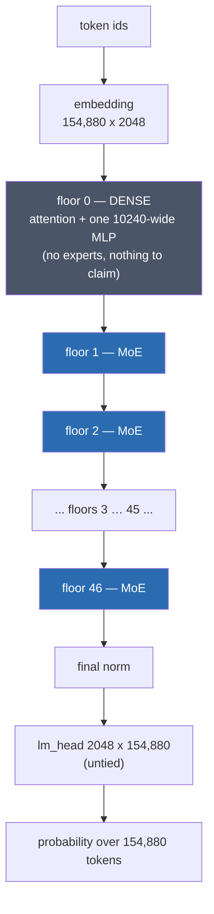
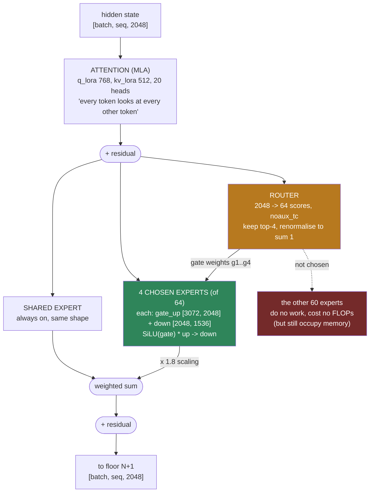
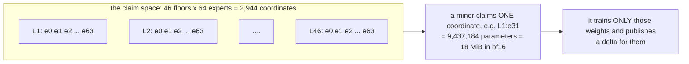
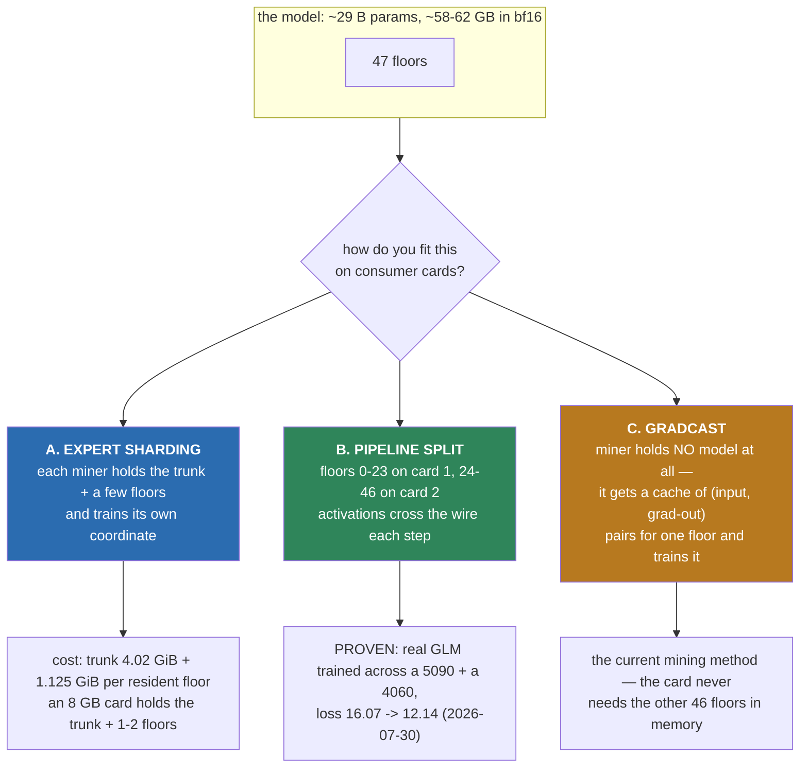
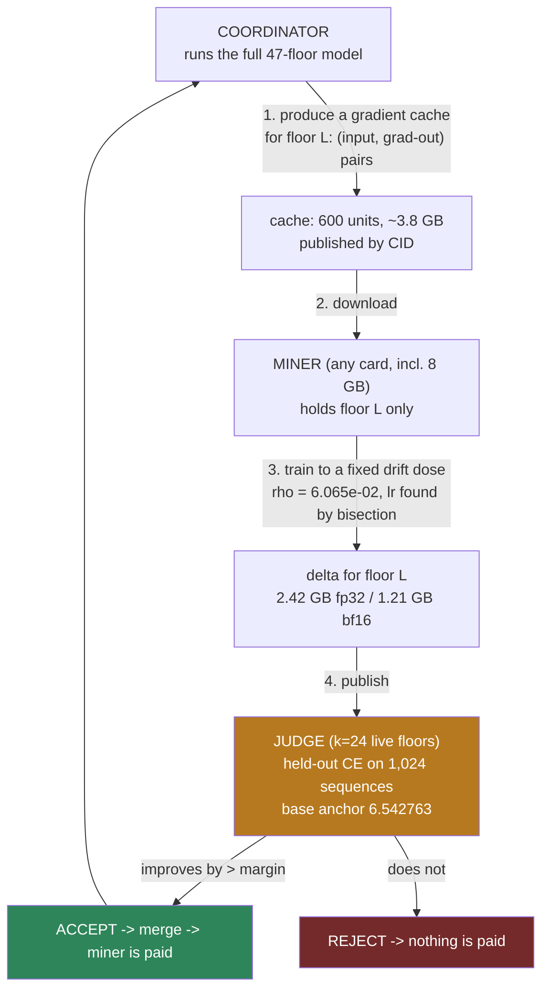

# NeuraHash Miner

The **miner client** for NeuraHash — a proof-of-useful-work network where the "work" is training a
shared Mixture-of-Experts model. Your GPU trains its assigned expert slots (compact LoRA deltas on
a frozen GLM trunk), signs each delta with your own locally-generated key, and publishes it —
**all-outbound** (works behind NAT, nothing to port-forward) and **decoupled** (fast GPUs never
wait for slow ones). What earns credit is not "the work ran": it is **measured improvement on a
secret, rotated held-out set** — a contribution that does not make the shared model better pays
zero, and on the trustless lane the payout itself is co-signed by a staked M-of-N validator quorum
rather than trusted to any single coordinator. (An earlier round-based pool lane, where the
coordinator recompute-verified each training step bit-for-bit, was the network's original design —
deprecated 2026-07-24; see the deprecation notice below.)

This repository is the **client half only**. It does not contain the coordinator, the consensus /
verdict logic, the ledger, or the emission/reward economics — you point it at a coordinator someone
else runs (or that you run from the full node package).

---

## ⚠️ Honest status — read this before you rely on it

- **This is the MINER CLIENT only.** It trains its assigned expert slot and publishes signed
  deltas outbound; it does not settle money on its own, does not run the coordinator role, and
  ships none of the reward/ledger/consensus server core.
- **No economic-security guarantees.** This is a working prototype for a testnet. Do not treat any
  balance it shows as real, redeemable value. The reward accounting lives on the
  coordinator/full-node side, which is not part of this repo.
- **The store write token is a PUBLIC demo credential.** It opens the shared content store but
  secures nothing (and doesn't need to): integrity comes from content-addressing + signatures, and
  the model is protected by the held-out gate. **Corrected 2026-07-28:** that protection held for
  *garbage* (random/forged deltas pay zero and are not folded) but it did **not** hold for
  *subtly harmful* work — run 5's accepted deltas passed the gate and damaged the model. See
  "What we found in run 5" below; the product-shaped judge is the fix.
- **Your wallet key is yours, generated locally.** The miner creates a per-node secp256k1 identity on
  your machine (gitignored, never uploaded). Back it up; losing it loses the address your work
  credits. No private key ships in this repo.
- **No fragile determinism requirement.** The GLM lane gates on measured held-out improvement, not
  bit-exact recompute across different GPU architectures — your card's ~1-ULP numeric quirks cannot
  false-reject honest work.
- **The gate cannot currently resolve one contribution (measured 2026-08-05).** One contribution moves
  about **1.6e-3 nats**; the gate's own margin measured **4.764e-03 → 5.927e-03** — roughly **3.7×
  coarser** than the thing it is being asked to judge. Accepted work has still not been shown to make
  the model measurably smarter. Run this because you want to help test a distributed-training network,
  not because you expect meaningful earnings. Numbers in the **2026-08-05 (later)** entry below.
- **The accepted work, at the dose actually applied, made the model WORSE (measured 2026-08-06).**
  Full-47 held-out CE **4.816991 -> 5.251066** and ARC-Easy **0.8237 -> 0.3375**. The same deltas at
  **1/8 dose BEAT the base** (CE 4.784680), so the work was **mis-scaled, not wasted** — but read the
  **2026-08-06** entry below before you draw any conclusion about earnings.

---

## 🧭 Where we are, and the plan from here (2026-08-15)

**The short version: the distributed-training machinery works. Turning it into a measurably smarter
model is the open problem, and this is how we're going after it.**

A real 30B-class model trains across an RTX 5090 and an 8 GB RTX 4060 **over the open internet**,
bit-exact against a single box, with signed auto-updates that a fresh install picks up on its own
schedule. That part is done and holding — it is the hard engineering, and it is behind us.

The part we haven't cracked yet is the one that counts: **turning training into a measurable gain in
what the model can actually do.** No method we've tried has managed it so far. The clearest example:
one change improved the language-modelling metric by 0.2375 nats at p=1.1e-4 — a strong signal — and
the reasoning benchmark came out *slightly worse*. Our most recent fine-tuning run moved the
benchmark by **exactly +0.000 pp** (37 items improved, 37 got worse).

That gap is the whole focus now, and knowing precisely where it sits is worth a lot — it means the
next experiments can aim at one thing instead of six.

Two results landed this week. Both are negative, and both usefully narrow the search:

- **Combining separately-trained contributions hasn't worked in five different setups** — merging in
  parallel, in sequence, at reduced dose, training jointly, and (as of today) with the best-known
  academic merging operator. The last of those made the model **worse**, and we can now say exactly
  why: the operator's update sits at **88.7 degrees** to the direction that actually helps. It
  doesn't shrink the update, it replaces it. That's a clean explanation, and it closes the question
  rather than leaving it open.

  A follow-up arm later the same day settled the last objection — that the operator had merely been
  applied too weakly. Re-run at **exactly the same update size as plain addition**, it still harmed
  the model (**+0.0260** nats) where plain addition helps slightly (**−0.0027**). So the operator
  itself is the problem, not the strength it was applied at. Worth noting against ourselves: we
  predicted publicly, before running it, that this arm would be *worse* than the weak one. It came
  out roughly **half** as harmful. The prediction was wrong and the record stands as written.
- **A "layer contribution" turns out to be, in magnitude, a single expert.** Of 64 experts, one or
  two carry 82.5–99.9% of the whole thing, and that one is nearly rank-1. So "many miners, many
  contributions, added together" isn't what the maths is doing — which tells us the fleet design
  has to earn its scaling somewhere other than weight-space addition.

### What this means for you

**Right now, mining here is closer to a network test than to model training,** and we'd rather set
that expectation than let anyone infer otherwise. Of 10,752 accepted contributions so far, none has
yet improved the held-out metric. The gate that accepted them has since been measured as unreliable
— in 6 of 7 audited cases it accepted work that didn't help the full model. Rebuilding it against
the full model is step E4 below.

So we're not advertising returns, and you shouldn't expect meaningful earnings while that's the
case. If you run a miner today, run it to help prove a real distributed-training network — that part
genuinely works, and the reliability data you generate is what makes the rest possible.

### The plan, in order

Each step decides whether the next is worth running. Nothing here is a promise of success.

| Step | What it answers | Cost |
|---|---|---|
| **E1** | Does our single best result carry through to reasoning? Our largest quality gain hasn't been checked against a reasoning benchmark yet. Either it moves — and single-contribution mining has real value — or we learn our quality metric isn't tracking reasoning, which is worth knowing early. Published either way. | ~1 GPU-hour |
| **E2** | Can we make judging a change cheaper than making it? Today it isn't, which limits how quickly we can referee results — ours and yours. | ~3 GPU-hours |
| **E3** | One final merging test to settle the question, then we close that line and move the effort somewhere with better odds. | ~3 GPU-hours |
| **E4** | The rebuilt gate, scoring against the full model, run in **shadow first** — scoring only, minting nothing — so its real pass rate is known before any coin depends on it. | 7 days |
| **E5** | **The real attempt.** Reinforcement learning on one narrow, checkable skill — the only approach whose effects are large enough for our instruments to detect. Two attempts maximum. | ~4–6 GPU-days each |
| **E6** | Does the winning recipe survive being run over the real internet? If yes, "a model made measurably smarter by consumer GPUs over WAN" is finally a true sentence. | ~3–4 GPU-days |
| **E7** | What we owe you before recruiting: published per-miner expected value from measured numbers, and honest uptime maths for a 10-card pipeline. | no GPU |

E5 gets two attempts. If neither lands, the result for 2026 is **"mechanism proven, instrument built,
capability not yet achieved"** — and we'll report it in those words rather than redefine success
around whatever we did manage. A clear negative is still a real result, and it tells whoever comes
next exactly where not to dig.

**On recruiting:** we'd rather grow this on evidence than enthusiasm. So we won't promote mining on
earnings until E4 shows the rebuilt gate has a pass rate above zero and scores against the goal
metric, E5/E6 land a real gain, and per-miner expected value is published from measured numbers.
Until then this is an open testing programme, and we label it as one.

*One correction while we're here: we've previously said an 8 GB card holds 6 layers, implying 9 cards
for the full model. The measured ceiling is **5 layers**, so it's **10 cards**. The earlier figure
came from a probe that was reading Windows paging as if it were real residency.*

---

## 🔒 Known security & operational risks (2026-08-14) — open by design during testing

**Read this before running the miner on a machine you care about.**

Every item below is **open right now and will be closed before public release.** They are listed
here because we would rather you decide with the full picture than discover it yourself. Several are
deliberate testing-phase tradeoffs — they make it easy to iterate quickly on an alpha where the only
participants are testers — and they are **not acceptable for a network handling real value.**
Where an item is already fixed, it says so and names the version.

Prompted by an external security review of this repo, 2026-08-14. We agreed with most of it, and
one of its points was already out of date.

### 1. The auto-updater runs by default, and the trust root cannot be revoked — OPEN

The miner self-updates: it fetches a signed release manifest, `git checkout`s the named commit, and
re-execs. It can also run `pip install`. This is a **supply-chain path onto your machine**, and it
is on by default.

- **Turn it off with `NEURAHASH_AUTOUPDATE=0`** (or `--no-auto-update`) and update by hand after
  reviewing the diff. The mechanism is designed to be disabled; nothing else breaks.
- **The deeper problem, which is ours to fix:** there is a **single pinned release key and no
  revocation mechanism**. If that key were compromised, there is currently no way to tell running
  miners to stop trusting it — we would have to reach every operator out of band. Key rotation and
  revocation are required before public release.

### 2. Dependencies are not pinned or hashed — OPEN

`requirements.txt` currently has **7 of 11 entries unpinned and zero hashes**. A fresh install can
resolve to versions we have never tested.

- `torch` is unpinned **deliberately** — you must install the build matching your CUDA/CPU, and we
  cannot choose that for you. That one stays.
- The rest (`numpy` and friends) should be pinned, and the file should ship hashes. That is on us.
- **Meanwhile:** install into a dedicated `venv`/`conda` environment, never system-wide.

### 3. Blast radius — run it isolated — OPEN (advice, not a bug)

The miner runs large ML workloads, downloads multi-GB blobs, and talks to an HTTP coordinator. Treat
it accordingly:

- Run it in a **VM, a restricted container, or a burner machine.**
- The host should hold **no credentials, SSH keys, cloud tokens, or wallets** other than the
  per-node `~/.neurahash/glm_miner_key` the miner generates for itself.
- Outbound-only is by design: **block all inbound.** If you allowlist outbound, include
  `raw.githubusercontent.com` (the **primary** release-manifest source), the Hugging Face domains,
  and the public content store — allowlisting only the latter two silently pushes update discovery
  onto the mirrors.

### 4. Wasted electricity on a dead lane — FIXED in 3.8.2

Previously the miner kept training when the coordinator was gone, burning power on work nobody would
ever score. **As of 3.8.2 it detects a lane whose event counter and accepted-record count have both
stopped moving for 3 hours** (`NEURAHASH_SD_STALE_LANE_S`, `--stale-lane-s`, `0` disables), prints a
banner, and **pauses training** while still polling — resuming by itself with `LANE RECOVERED`. It
never exits on its own.

Also use the VRAM cap (`NEURAHASH_VRAM_CAP_GB`) and run under a supervisor with CPU/memory limits.

### 5. A hostile or broken coordinator can waste your compute — OPEN

Corpus integrity is gated by `corpus_sha` and every delta is signature-verified, so a coordinator
cannot silently swap the model out from under you. But it **can** serve you training data that leads
nowhere, and you would burn GPU time on it. There is currently no miner-side quality check on the
work it is handed.

### 6. The self-update file-reclaim path — MOSTLY CLOSED, one residual

The updater can delete files that a release stops shipping. Its safety properties today:
deletion candidates come **only from an allowlist** (files a signed manifest previously declared),
never from scanning your disk; an **unset** `NEURAHASH_UPDATE_RECLAIM` is a **dry run that deletes
nothing**; an explicit `0` is a kill switch no caller can override; and wallet/keystore, `_data/`,
config and logs are on a never-touch list. There is exactly one `os.remove` in the module and it
only ever acts on an allowlist entry.

**Residual:** the *previous* half of that allowlist is read from an **unsigned local state file**, so
someone who can already write to your miner directory can influence the candidate set. Bounded by
every guard above, and such an attacker usually has write access anyway — but it will be closed by
binding each ledger entry to the manifest signature that declared it.

### 7. Untracked files can permanently block updates — MADE LOUD in 3.8.2

`git checkout` **aborts** when a commit adds a file that already exists untracked in your tree. Once
that happens, every future self-update fails. Before 3.8.2 this scrolled past as a single ~200-character
line. It now prints a full banner naming the exact blocking files, tells you to move them by hand,
and keeps mining on the code you already have. **It deliberately does not offer to run `git clean` or
`checkout -f`** — your wallet lives in that directory.

### 8. Earnings — see "Honest status" above, and take it literally

The economics are the weakest part of this system today, and the section above is not modesty:
**0 of 10,752 accepted deltas ever improved held-out validation**, and the accept gate was measured
**sign-inverted** — in 6 of 7 cases it paid for work that made the model worse. The GLM lane's judge
has been inactive since 2026-08-10, so nothing is being scored or paid at present.

**Treat anything the CLI shows as testnet points, not redeemable value.** Do not buy hardware or rent
cloud GPUs for this. Run it because you want to help test distributed training. An independently
auditable live ledger is a public-release requirement, and it does not exist yet.

### Fixed already, listed so the record is complete

- **Reward forgery on the RLVR lane (fixed 2026-08-14).** The reward is now derived from the
  `completion_ids` inside the signed blob and re-checked, so forging the extracted answer *and* the
  reward together no longer survives. Without a tokenizer the check **fails closed** rather than
  silently opting out.
- **Held-out contamination (fixed 2026-08-14).** 96 held-out evaluation questions were reachable as
  training data. The split is now authoritative and **raises** rather than filtering silently.

---

## 🔬 What we found in run 5, and what changes for you (2026-07-28)

**Read this if you mined run 5.** We measured, on a real benchmark, that run 5's *accepted* work
made the model **worse**: ARC-Easy accuracy fell **0.8107 → 0.6940 (−11.7 points**, McNemar
p=1.25e-40) and the full model's held-out cross-entropy worsened **+13.4%** — while the pool's
accept gate reported a 15.9% *improvement* and paid for it.

**No miner did anything wrong, and no miner could have noticed.** The cause was ours: the gate
scored a stand-in network with **1 of 46 expert layers switched on**, and that network is not the
model we ship. Every number visible from a miner's seat improved the entire time it was damaging
the real model — we reproduced that on a second GPU to be sure. This is the same lesson this
project learned once before (verified work ≠ useful work), reproduced against the very gate built
to prevent it.

### What is changing before the next campaign

1. **The gate now judges a product-shaped network.** We measured where a stand-in starts agreeing
   with the real 47-layer model: the verdict flips at **19 resident layers** and is stable above
   it, so the new judge runs **24 layers resident** (~36 s per accept check) and **fails closed** —
   if the judge cannot run, work is not accepted rather than waved through.
2. **The unit of work grows from one expert to one whole LAYER.** Training a single expert with a
   low-rank adapter turned out to be too small to be payable: its best honest yield was ~1/6 of the
   accept margin, and it was fragile (half the dose flipped the sign). Training **all 64 experts of
   one layer** (604 M parameters, full-rank) against **true gradients from the real model** measured
   **15.3× the accept margin** — and **93×** the per-expert yield at the same weight movement.
3. **Still 8 GB-friendly.** A layer claim needs the trunk (4.02 GiB) + one layer (1.125 GiB) — a
   consumer 8 GB card remains a first-class miner. That is a hard requirement here, not a
   nice-to-have.
4. **Doses will be specified as a drift target, not a learning rate.** We measured a razor-thin
   stability window: **+6.9% learning rate → 10× the weight movement; +14.4% → divergence (NaN)**.
   So the coordinator will hand out a target and your client will find the rate by local bisection,
   reporting the movement it achieved. This protects your GPU hours; the judge would reject a
   diverged dose anyway.

### What you should do

- **Expect a new signed release before the next campaign (run 6).** `3.5.2` predates all of the
  above; do not point it at the new campaign.
- **Keep your clone clean.** Self-update applies releases with a clean checkout — local edits make
  an update **silently do nothing** while the miner still looks healthy. If you patched files by
  hand, revert them before updating.
- **Nothing about your wallet, keys, or earned credit changes.**

### What we have NOT proven yet

The layer result above is measured on the **gate metric** (held-out cross-entropy). The
capability benchmark on that same dose is **still running**, and given this project already
measured one case where cross-entropy and capability disagreed, **the new trainer does not ship
until that benchmark confirms it.** We will publish the number either way, including if it kills
the approach.

### Where the science stands, and what remains (updated 2026-07-30)

Promised: publish either way. Here is the full ledger.

**Proven, with numbers:** a single miner-style contribution measurably improves the real 62 GB
model at three different step sizes, with **zero loss on a capability benchmark** — useful work
exists, is measurable, and is what gets paid. The judge rejects the damage class the old gate
paid for. The signed release chain is field-proven on real fleet hardware. An 8 GB card trains
as a first-class participant (measured, not claimed).

**Refuted, pre-registered, published here as promised:** combining *separately-trained* updates —
at every step size, in every order. A literature survey confirmed no published system anywhere
composes different parts of one model by summing; the field routes or stacks instead. Our next
architecture (the fleet-hosted pipeline: one live model chained across miners, everyone
contributing to the *same* training trajectory) has nothing to combine, so this failure mode
cannot exist there by construction.

**The remaining proof ladder, in order — each a measurable public gate:**
1. One real training step of the big model across two real machines (the pipeline's backward pass
   was built and independently verified bit-exact this week; the live two-box step is next).
   *First milestone landed 2026-07-30: a training step crossed between two real machines for the
   first time — small model, one step, total wire payload 2,500 bytes, and the result matched the
   single-machine answer to within one floating-point ULP. The tiny residual was traced to the two
   machines' different math libraries — measured proof of why this pool verifies* **outcomes**
   *rather than demanding bit-identical computation from heterogeneous hardware.*
   ***GATE 1 PASSED later the same day: the real model trained across two real machines.*** *Three
   optimizer steps of the actual 62 GB-class GLM (a 2-layer span — the honest current scope),
   split across an RTX 4060 (front) and an RTX 5090 (MoE layer + head), real corpus tokens, loss
   falling 16.07 → 13.29 → 12.14, and after one step the two-machine answer differed from the
   single-machine answer by exactly one bf16 bit. Also measured: the drift between different GPUs
   compounds step over step — which is why the design re-syncs weights periodically and pays on
   measured outcomes, never on bit-matching. Useful traffic: ~2 MiB per training step.*
2. Activation compression to the measured requirement (~19–37× on a 1.2 Mbps uplink; published
   systems measure 100×, and our wire is currently uncompressed — the headroom is real).
3. A chain that survives a miner leaving mid-run.
4. **The gate that matters:** a multi-step fleet training run where the full model's held-out
   score improves *and* the capability benchmark does not drop — the same double gate the
   single-contribution result already passed, now through the fleet.

One honest sentence on ambition: no published project has trained a model this size over
residential internet connections. There is no recipe to copy — and no incumbent to catch.

### The first LONG two-machine run -- 50 steps, and what it means for your disk (2026-07-30, night)

Gate 1 passed on 3 steps. Later the same day the same setup ran **50 optimizer steps** of the real
model across the two machines (RTX 4060 = front: embeddings + the dense layer, held under a **6.0 of
8.0 GiB** VRAM cap; RTX 5090 = the 64-expert MoE layer + the driver). **Training loss fell 15.993 ->
8.446.** A single-machine reference arm on the identical batches finished at **8.347**.

**The scope, before anything else:** this is **2 layers of 47**, bf16, plain SGD at **learning rate
1e-2 with no gradient clipping**, **128 tokens per step**, and the number quoted is **training loss
on that 2-layer slice -- not held-out cross-entropy, and not a capability benchmark.** It is a
transport-and-optimizer proof, not a "the model got smarter" claim. The double gate at the bottom of
the ladder above is still the one that decides that.

**The result that matters to you: your card does not have to agree with anyone else's.** We measured
how far the two machines' weights drift apart from the single-machine reference, step by step:

| step | front stage | MoE stage |
|---|---|---|
| 1 | 6.188e-04 | 7.042e-03 |
| 2 | 6.803e-03 | 7.042e-03 |
| 3 | 2.724e-02 | 1.961e-02 |
| 5 | 6.863e-01 | 1.462e-01 |
| 10 / 20 / 35 / 50 | 0.674 / 0.668 / 0.651 / 0.651 | 0.143 / 0.143 / 0.143 / 0.143 |

Three things follow, all measured:
1. **A 1-in-1000 agreement bar is already broken after ONE step.** So a coordinator can never check
   your work by re-running your steps and comparing weights -- which is exactly why this pool pays on
   **measured outcomes** (the judge) and never on bit-matching. Your card's quirks cannot
   false-reject you.
2. **The drift stops growing.** It **saturates** instead of exploding -- bounded, not chaotic -- and
   the plateau sits at the bf16 rounding floor. The MoE stage's worst absolute difference is
   **bit-identical (2.891e-01) at steps 10, 20, 35 and 50**.
3. **Even at ~65% divergence on the worst tensor, both arms are functionally the same model**
   (**8.446 vs 8.347 -- 1.2% apart**). Mismatched consumer GPUs training one model together is not a
   compromise we tolerate; it is measured to work.

**About the "30 GB" number, because it would scare the wrong people.** A 21-step run did write
**30.4 GB** and fill a disk -- that was the **coordinator's** content store on our own box, caused by
a **measurement-only** setting that ships every stage's full weights each step so we could compute
the table above. **It was never miner disk.** During the whole run the 4060 acting as a miner had
about **2.6 GB free** on its system drive and wrote **nothing per step**. **Your disk requirement does not grow with
how long the run lasts** -- but be aware of the real total before you start.

| what | size |
|---|---|
| base on disk (trunk + 12 expert pieces) | **6.34 GiB** |
| training corpus — **one part**, fetched on demand | **~0.25 GiB** |
| **steady total** | **~6.6 GiB** |

> **Updated 2026-08-04 — this table used to read 14.97 GiB / ~21.3 GiB total.** The corpus is now
> published as 60 shuffled parts and a joiner fetches **one**, so the requirement dropped **59.9x**.
> This is the production default: no flag, no environment variable. See the 2026-08-04 entry below.

An earlier version of this page said the requirement was *"4.02 GiB trunk + 1.125 GiB per resident layer"*. That was wrong -- it omitted the corpus entirely, and on Windows the HuggingFace cache cannot symlink, so the base was briefly stored **twice** (a ~27.6 GiB peak). A volunteer with 20.7 GiB free could not complete the install. The duplicate is now deleted automatically once the verified copy lands, and the numbers above are measured, not estimated.

**The corpus is the part that should not be this big, and we know it.** ~~A miner running 10,000 steps at batch 16 touches 160,000 sequences -- **0.25% of the corpus, about 41 MB**. Every joiner currently downloads ~400x more data than they will read, because the client memory-maps one file and there is no per-slice fetch yet. Fixing that is open work, not a settled design.~~ **FIXED 2026-08-04 — this is no longer open work.** The corpus ships as 60 shuffled parts and you fetch one (~268 MB). The measurement that motivated it stands: you really do read only a fraction, which is why the fix was worth building. Two fixes are filed off the back of it: production
lanes never ship per-step weights, and pipeline traffic becomes ephemeral in the store with
disk-full failing **loudly** instead of quietly dropping your connection.

**Also measured, and useful to know:**
- **The GPU was bored, not busy.** Single-machine throughput went **128 tokens/step -> 55 tokens/s
  at 2.31 s/step; 512 -> 249 tokens/s at 2.06 s/step; 2048 -> 1054 tokens/s at 1.943 s/step**.
  Sixteen times the work per step made each step **faster** -- the card was idling at **2-3%
  utilisation**. The per-step handshake was shipping **1.44 GB/step against ~2 MiB/step of useful
  traffic (99.85% overhead)**; capping it cut about **30% of per-step wall time (6.0 -> 4.2
  s/step)**. Expect throughput work, not new science, to be the next visible win.
- **bf16 alone is now a correctness problem, not just a speed choice.** At the weight sizes seen
  here (**|w| 1.1 to 3.5**) one bf16 step of precision is **3.9e-03 to 7.8e-03**, while actual
  per-step updates measured **0.5 to 1** of those -- so most updates are smaller than half a rounding
  step and **round away to nothing**. Keeping full-precision master weights moves from "nice
  optimisation" to "required for long runs".
- **One spike, and what it cost.** At step 4 the loss jumped **11.716 -> 35.495** (a single weight
  moved **3.303**, about **845** rounding steps), recovered by step 6, and descended cleanly
  afterwards -- but the drift plateau was set **exactly across that one step** (**2.724e-02 ->
  6.863e-01**). Per-stage gradient clipping now exists, **default OFF**, and whether it collapses
  the plateau is under test.
- **Restart-reproducible.** The two-machine arm was restarted three times that day and reproduced
  its losses **bit-identically** every time (steps 13/14/15 = **9.285496 / 10.463924 / 9.246750**).

**What it does and does not say about the full model.** All 47 layers need about **57 GiB of weights
against 29 GiB of usable VRAM** on these two cards -- so the full model needs **layer streaming or
roughly 10 cards**, which is a provisioning problem, not a physics one. Pipeline parallelism is what
makes the model **fit** across small cards; **data-parallel replicas with DiLoCo-style averaging**
are what make training **faster** as more of you join. And to be unambiguous, since older sections
below are kept as history and some predate this: **adding up separately-trained per-layer updates
stays refuted at every step size we tested.** Those sections remain the record of what we tried, not
a description of where the project is going.

### How many miners can win at once? We measured it: about 8 per layer (2026-07-31)

A fair question if you are thinking of joining: **Bitcoin hands every miner a lottery ticket — can
NeuraHash pay 10,000 of us at once?** We tested it properly, and the answer has two halves.

**Half one: yes, your single piece can genuinely improve the model.** We took one layer, split it into
its 60 expert pieces, and scored each piece **on its own** against a frozen held-out set your miner
never sees. **20 of the 60 pieces made the model measurably better.** The best single piece improved
it by **0.133** — and that one piece was worth *more than all 60 pieces combined*. So "one miner, one
piece, real progress" is not marketing here; it is measured.

**Half two: those improvements do not simply add up.** Merge all 60 and you keep **−0.088** out of a
possible **−0.636** — about **14%**. The other 86% is lost in the merge, because pieces trained
separately interfere with one another.

The useful part is *where* it breaks:

| pieces merged | how much of the improvement survives |
|---|---|
| 8 | **100%** (all of it) |
| 16 | 11% |
| 60 | 14% |

**Up to about 8 pieces, merging is essentially free.** Past that it falls off a cliff. That number is
our version of Bitcoin's difficulty: it sets how many miners can be paid for the same layer in the
same round. It is roughly **8 — not 64, and not 10,000.**

> **⚠️ CORRECTED the same day (2026-07-31): the real number is about 1–2, not 8.** We are leaving the
> table above in place because we said it publicly and you deserve to see what changed. Here is the
> mistake. In that first test we picked the 8 pieces by **how much traffic** they get, and it turned
> out only **one** of those 8 was actually a piece that helps. So "8 pieces keeps 100%" really meant
> *"one good piece survived being mixed with seven that do nothing"* — not "eight pieces combine
> well". When we redid it using the 8 pieces that **actually improve the model**, it looks like this:
>
> | pieces merged (the good ones) | result |
> |---|---|
> | 1 (best piece alone) | −0.133 |
> | **2** | **−0.134 — the best result we got** |
> | 4 | −0.112 |
> | 8 | −0.088 |
> | 20 | −0.089 |
>
> **Merging more good pieces makes the model worse, not better.** Two is the sweet spot, and two is
> barely better than one. The honest summary: **a layer only absorbs about one good piece's worth of
> improvement per round, no matter how many miners work on it.**
>
> **What this means for you, plainly.** It does *not* reduce who can mine — slots stay unlimited and
> anyone may join. It means the pool works like Bitcoin more literally than we first described:
> **most submitted work will not make it into the model**, exactly as most Bitcoin hashes never
> become a block. You get paid in **shares** for work we can verify you did, and the piece that
> actually lands each round earns the bonus. We would rather tell you that now than design a reward
> system on a number we already know is wrong.
>
> Still to come: we are re-checking this on the full 47-layer model (the numbers above come from our
> fast 24-layer judge). We will publish that result whichever way it goes.
>
> **✅ CONFIRMED on the full 47-layer model, later the same day.** It went the way the correction
> said, and it is sharper on the real model than on the fast judge:
>
> | on the real model | held-out score | vs untrained |
> |---|---|---|
> | the model as-is | 4.816991 | — |
> | **all 64 pieces of the layer** | 4.721827 | **−0.095165** |
> | **the single best piece alone** | 4.722758 | **−0.094233** |
> | the two best pieces merged | 4.722549 | −0.094442 |
>
> **One piece delivers 99.0% of what the whole layer delivers.** The other 63 pieces are worth one
> percentage point between them. So a layer really does contain **about one payable unit per round** —
> which, to be fair to the original idea, is exactly Bitcoin's shape: one block, one winner, and the
> rest of the work paid in shares.
>
> Two other things worth stating because they make the numbers trustworthy. The untrained baseline
> reproduced its published value to **0.0000003**, so this is the real product model and not a proxy.
> And our fast 24-layer judge predicted the merge ratio as 0.509 where the real model gives 0.5047 —
> agreement to **0.85%** — so the cheap check we use day to day is honest, which means we can keep
> testing quickly and only spend the slow one on the results that matter.

### Why the pieces don't add up — we may have blamed the wrong thing (2026-07-31, evening)

We told you above that pieces "interfere" — that miners' work cancels out. **Looking harder at the
same numbers, we think that may be wrong, and the real answer is more hopeful.**

Merging the two best pieces gave **−0.094442**, which is slightly *better* than the best piece alone
(**−0.094233**), and all 64 together is better still. If the pieces were genuinely fighting each
other, merging would come out **worse** than the best single piece. It doesn't. It comes out at the
best single piece **plus 0.2%**.

That points at something different, and simpler: **every miner is learning the same thing.** Not
cancelling each other — just all finding the same one improvement, over and over.

**Why that would be our fault, not yours.** Right now every miner trains on the same corpus and is
graded against the same held-out test, which is about **78% arXiv abstracts**. Same reading material,
same exam. Of course everyone arrives at the same answer.

**Why this is the better problem to have.** "Miners cancel each other" would be a deep architectural
flaw. "Miners are all given the same homework" is a fixable assignment problem — and we already know
the fix is available, because we previously measured that **different kinds of text genuinely route
to different experts** inside the model (0.148 overlap across subject areas vs 0.678 within). The
machinery to give different miners different work exists; we simply haven't been using it.

**What we're doing about it, right now:**
1. A measurement that settles it properly — scoring each piece sentence by sentence to see whether
   two miners improve the *same* sentences (everyone learning the same thing) or *different* ones
   (genuinely cancelling). We wrote down the rule for deciding before running it.
2. Building the fix on the assumption it's the first: split the training material into distinct
   subject areas and give different miners different slices, with each expert assigned by what the
   model's router actually sends it — not by a hash of your wallet.
3. Likely also needed: **different exams, not just different homework.** If everyone is still graded
   on the same arXiv test, they may converge on the same answer no matter what they trained on.

We are publishing this before we know the answer, including the part where we may have told you
something wrong this morning. If the measurement says "cancelling" after all, we will say so and the
fix becomes a different one.

> **✅ THE MEASUREMENT CAME BACK: everyone IS learning the same thing.** We scored every piece
> sentence by sentence. Result: **all of the improvement lives in about 10% of the test sentences,
> and two different miners improve those same sentences by almost exactly the same amounts** —
> correlation **0.9987**. The bottom half of the test set moves by nothing at all. The merged result
> sits 6× closer to "the best single piece" than to "both pieces added up". So it is redundancy, not
> cancelling, and the "pieces interfere" wording earlier on this page is retracted.
>
> **We were also wrong about the reason, and that one is on us.** We guessed the cause was our test
> set being ~78% academic abstracts, funnelling everyone toward the same subject. The data says no:
> the sentences that improve are **not** concentrated by subject (z = 1.35 against our own
> significance bar of 2). So the concentration is real, but it is not about topic. The likeliest
> explanation is plainer — at this point in training there is **one big available improvement**, and
> every miner's maths finds it.
>
> **This is not a NeuraHash defect, and that matters for trusting the number.** Published research
> measures the same ceiling. The closest study to our setup merged **58–72** independently trained
> models and beat the best single one by **0.22%** and **0.65%**; a 2026 study across many models
> found gains "generally less than 1%"; and a fitted curve puts **85% of everything you can gain at
> just 5 contributors.** Our result is the field's own number. Blunt version: "merging the two best
> gives what one gives" is a known effect with a known name — the merge is *rejecting* the second
> contributor because it has nothing new to add.
>
> **So what actually helps?** Where merging genuinely works in the research, it works by keeping
> **several different skills alive at once** — which points at giving different miners different
> material rather than a cleverer merge formula. That experiment is built and gated, and we will
> publish it either way.

## Alpha 3.8.2 (2026-08-14) — the miner now tells you when it is wasting your electricity, and stops

Both fixes in this release exist because of the same failure: **the miner stayed quiet about things
you would obviously have wanted to know.** Nothing about how work is trained, signed, or published
changes. No new dependency, no new network call, no config you must edit.

**1. Your GPU no longer trains for a lane nobody is judging.** Our own 4060 mined a lane whose
coordinator and judge had both been gone for **4.27 days**. It trained, it published, and nothing
on the other end scored or paid for a single delta of it. It never complained, because nothing in
the miner watched for *absence* — the one no-progress guard we had compares global model roots,
and on a shard-claim lane those are never comparable, so it was skipped forever.

The miner now watches the two counters a live coordinator cannot help moving (the pointer `event`
and the count of accepted records in the lane manifest). If **neither** moves for 3 hours, you get
an unmissable banner instead of silence:

```
!! NEURAHASH: THIS LANE LOOKS DEAD -- NOTHING IS SCORING YOUR WORK.
!! The coordinator's event counter has not moved for 214 min (threshold 180 min).
!! TRAINING IS PAUSED so your GPU is not burned on work nobody is paying for.
!! The miner keeps polling and RESUMES BY ITSELF the moment the lane moves --
!! do NOT restart it.
```

It **pauses, it does not quit.** A miner that exits because the pool was briefly slow would be a
worse bug than the one being fixed — it turns a 20-minute coordinator restart into a fleet that
never comes back without a human at every machine. While paused it keeps the cheap manifest poll
running and prints `LANE RECOVERED` and resumes on its own the moment a counter moves.

Why 3 hours: the slowest legitimate step we have ever measured on this project is ~660 s, and the
coordinator gives up on an idle lane after 600 s by its own configuration — so 10,800 s is ~16x
the slowest real cadence, and still fires **34x sooner** than the outage that prompted it. Change
it with `NEURAHASH_SD_STALE_LANE_S=<seconds>` or `--stale-lane-s <seconds>`; `0` disables the
detector entirely (the miner then says so at startup, so a disabled safety net is never silent).

**2. A failed self-update is now loud, complete, and actionable.** Previously an update failure was
one line, truncated to ~200 characters, printed between two loss lines — in practice it scrolled
past and was gone, and the truncation reliably kept the *least* useful part of the message. Update
failures now print a bordered `NEURAHASH SELF-UPDATE FAILURE` banner with the **full** diagnosis
(a real traceback, not `str(e)`), pure ASCII so a Windows console cannot turn your error report
into a *different* error. You can also ask at any time:

```
python tools/self_update.py --status
```

which tells you what happened the last time this miner tried to update itself.

It also names a specific trap. `git checkout` **aborts** when a file it must write already exists
untracked in your clone — and once that is true it fails on *every* future update attempt, forever,
silently. If that is why an update failed, the miner now says so and lists the offending files, so
the fix is obvious instead of mysterious.

**Unchanged and deliberate:** a failed update is still **fail-closed** — your miner keeps mining on
the code it already has, and only ever runs an update whose signature verifies against the pinned
release key.

### 2026-08-20 — **Your disk matters more than your GPU. We put an NVMe in our 8 GB test machine and the same training step went from 11 minutes to 2. Also: that 8 GB card now provably computes the same thing our big card does.**

**If you take one thing from this entry: do not mine from a spinning hard drive.** We measured our
own second machine — an RTX 4060 (8 GB) with a 7200 rpm SATA drive — and the disk, not the GPU, was
costing almost all of the time:

| | mechanical hard disk | 1 TB NVMe SSD |
|---|---|---|
| cold sequential read | 76 MB/s | 2,613 MB/s |
| reading the model's layer files once | 827 s (13.8 min) | 27.8 s |
| **one training step** | **681.8 s** | **119.0 s** |

Every training step streams roughly 44.5 GB of model weights off disk. On the hard drive that was
~660 seconds of pure waiting per step, which works out to **8–10 days** for a full run. On the NVMe
the same run is **5–9 hours**. Nothing about the GPU changed.

**We checked that the disk did not change the answers.** The first two steps after the swap returned
losses of `3.73041` and `4.49594` — *bit-identical* to the same steps on the hard drive. A faster
disk is not allowed to change arithmetic, and we verified it rather than assuming it. We also
measured the disk two independent ways, including one that bypasses the operating system's cache
entirely, because an earlier probe on this same machine reported 5,824 MB/s and was simply reading
memory rather than the drive.

**What to actually do.** An SSD (SATA or NVMe) is fine; the jump from *spinning* to *solid state* is
where nearly all of the gain is. You do not need a fast or expensive drive — ours is a budget
DRAM-less model and it was enough. Write speed is irrelevant here: the miner reads model weights and
essentially never writes them. Free space matters more than speed once you are on an SSD.

**Your 8 GB consumer card computes the same thing our big card does.** We ran 30 training steps on
identical data, identical seed and identical batch size on both machines and compared them step by
step. The average difference in loss was **−0.00570** against a step-to-step spread of **0.02678**,
with the differences split 12 up and 18 down. That is the signature of ordinary floating-point noise,
not of one machine drifting away from the other — and it holds despite the two boxes differing on
every axis: different GPU architectures, different CUDA versions, different PyTorch versions,
different Python versions.

Be precise about what that does and does not mean. It shows a small card **trains faithfully**. It is
30 steps — under 5% of one pass through the data — so it says nothing at all about whether the
resulting model is smarter.

**Why RTX 40-series and older cards carry a permanent memory penalty.** PyTorch's fast grouped
mixture-of-experts kernel requires a GPU compute capability of **SM90 or newer**. The RTX 40-series
is sm89 — just below that line — so it takes a fallback path that allocates an extra **768 MiB**
during the backward pass that is never used. We patched this in our own trainer without changing any
result. What is worth knowing: this is **not** something a future PyTorch update will fix for you.
The open upstream issue moves that requirement *up*, not down. If you are on a 40-series or older
card, that fallback is permanent, and any tooling that assumes it will go away is wrong.

**Honest status, unchanged.** Post-training on **one machine** still makes the model measurably
better (+2.4 percentage points, reproduced on a second seed). Mining still has **not** been shown to
do so. The experiment that would settle it — several machines training one shared adapter on
different slices of data and averaging their work — is written down in advance, with its pass and
fail thresholds fixed, and **has not been run yet**. While preparing it we found that its own
validity check was mis-specified badly enough that the experiment would have aborted on every
single sync and produced no answer at all; we caught that on a CPU before spending any GPU time on
it, and rewrote the check. We would rather tell you that than quietly fix it.


### 2026-08-16 (later) — **For the first time, post-training measurably made the model better. It happened on one of our machines, not through mining — and while checking it we found our own scoreboard is far noisier than we thought.**

**The good part.** We fine-tuned the model on one RTX 5090 for 8.4 hours and it got measurably
better at science multiple-choice questions: **82.17% → 84.45%**, on a held-out set that was frozen
before training started and scored exactly once, with the checkpoint chosen using a completely
separate set. That discipline matters — it is the difference between a result and a story. This is
the first time in this project that training produced a capability gain that survived a
pre-registered test.

**Be clear about what that is and is not.** It happened on **one machine**, not across the fleet. It
does not show that mining makes the model smarter, and we are not going to imply that it does. And
"better" here means better at multiple-choice science questions — not better at everything.

**We also corrected ourselves before publishing.** We initially described a second gain as
"transfer to a benchmark the training never targeted." That was wrong: that benchmark's training
split was part of the training data. There is no leakage — overlapping items were removed — but it
is ordinary generalisation, not the stronger claim we first made.

**The uncomfortable part, which affects how we judge everything.** Our safety check initially
**blocked** this model: one benchmark looked harmed, at odds of about 1-in-800 against chance. So we
tested the scoreboard itself, by scoring the *same unchanged model* several times while varying only
how test items are grouped into batches — something that should change nothing at all.

It changed a lot. **The same model against the same items gave results ranging from "clearly
harmed" to "no evidence of harm" — a 53-fold swing in the statistics, purely from batch grouping.**
Scored repeatedly with grouping held fixed, the harness is perfectly deterministic, so this is not
random flakiness; it is that the maths behind the model is sensitive to how work is batched, and
that flips about 2% of borderline questions either way.

Pooling several groupings together, the harm no longer meets our blocking threshold — though the
direction was negative every time, so we think there is a small real cost and we are calling it a
trade, not a clean win.

**What we are doing about it, including to our own good news.** We used that pooling on the number
that *blocked* us. We had not used it on the number that *flattered* us. That is exactly the kind of
one-sided testing that produces confident nonsense, so the headline result above is being re-scored
the same way right now, under a rule written down before the answer is known. **If it does not
survive, we will say so here first and plainly, and the result comes back off the board.**

**Nothing about your mining changes today.** No update, no new settings. The parked-miner issue in
the previous entry still applies and the restart workaround still stands.

### 2026-08-16 — **Your miner can silently stop earning and still look perfectly healthy. We found it, we fixed it — and the fix is NOT in the build you are running.** Restart your miner if it has been up a long time with nothing accepted.

**Read this part even if you read nothing else.** If your miner starts up at a moment when the
coordinator is down, it records the last position it saw on the lane and then waits for that
position to move before it will train. When the coordinator comes back, it normally resumes at
**the same position** — and because the message it publishes is byte-for-byte identical to the one
already sitting there, your miner cannot tell "just written" from "sitting here dead for a week".
So it keeps waiting. Forever. The position only ever moves when miners submit work, and your miner
is the one waiting to submit — so nothing breaks the loop.

**What this looks like from outside: nothing.** The process is alive. It is using no GPU, throwing
no errors, and writing no complaints. This cost one of our own cards **six days** of mining, and it
was only caught by sampling where the program was actually parked — not by any check that asks
"is it running?", all of which said yes.

**The fix is written but has not reached you.** It is in our private tree, not in the public
**3.8.2** you are running: the published message needs to carry a timestamp so a re-publish is
distinguishable from a stale one, and that is a change to both sides of the wire. Shipping it to
you means a reviewed sync of the miner tree, not a bulk copy — the public tree is a deliberately
reduced subset and a blind copy is how private code leaks. We would rather tell you the exposure
exists today than quietly ship a rushed sync.

**What to do right now:** if your miner has been running for a long stretch with no accepted work
while the pool is otherwise live, **restart it**. A restart clears the recorded position and it
reads the lane fresh. That is a complete workaround, not a partial one.

**The good news, and it is directly connected.** The reason the coordinator kept being down in the
first place is fixed. It had been dying roughly **every 25 minutes** on a bug in how it restored its
own slot list after a restart. Since the fix it has been up **15.5 hours and counting**, with **zero**
of those crashes, and the lane has moved from position 608 to **869** with **6** payouts. Set against
our 2026-08-14 note that nobody was judging or paying on this lane at all: **the judge is running
again, and your work is being scored.**

**Your pay bar no longer depends on which restart you happened to join.** The threshold your work has
to clear was being recalculated on every coordinator start, and it moved **38%** across a single one —
so the same work could be accepted or rejected purely on timing. It is now calculated once and kept.
We deliberately did **not** fix this by fixing the random seed, which would have made the bar
predictable and therefore gameable by anyone who wanted to tune submissions to it.

**Unchanged, and still the most important sentence in this file:** none of this makes the model
smarter. Everything above is about getting your work correctly judged and correctly paid. We still
have no accepted contribution that has been shown to make the model measurably better.

### 2026-08-14 — **Correction: we told you this morning that the pool is still paying against a broken scoreboard. That was wrong, and the truth is worse for you.** Nobody is judging or paying on that lane at all, and has not been for four days.

**What we got wrong.** Earlier today we wrote that the pool "is still paying against the
sign-inverted gate" and that "today's mining is still judged by the old gate." We checked the
actual running system while writing a deployment plan, and neither sentence is true. **There is no
judge running on the GLM lane.** Its last recorded event was 2026-08-09 — **over four days ago**.
Your miner may still be producing and publishing work, but nothing on the other end is scoring it
or paying for it right now.

We would rather correct this immediately and bluntly than let the earlier wording stand, because
the earlier wording made it sound like mining still earns. On that lane, at this moment, it does
not. The accept and mint totals shown on your miner card are historical — they are what you earned
previously, not evidence of current activity.

**Three more corrections to what we published today.**

1. We called the replacement scoreboard a "full-model gate". It is not — as built it checks **24
   layers, not 47**. Getting to the full model is more work than flipping a switch.
2. The replacement is a **veto only**. It can refuse to pay for a contribution that made the model
   worse, but the *amount* paid for the ones it accepts is still calculated from the same broken
   1-layer measurement. So turning it on would fix *who* gets paid, not *how much*. We did not say
   this earlier because we did not know it until we read the code.
3. We quoted two different numbers — "0 of 10,752 accepted contributions ever improved the model"
   and the 84-record analysis showing the scoreboard is backwards — as though they described the
   same run. They are **different campaigns**. Both are real; presenting them as one chain of
   evidence overstated the case.

**What we are doing about it.** A written deployment plan now exists for switching to the corrected
scoreboard, including what hardware it needs, how the pay threshold must be re-derived, the
rollback path, and what miners would see. Nothing has been switched on. We are not going to restart
paid judging on that lane and then discover the pricing is still wrong.

**What you should do.** If you are mining the GLM lane expecting to earn right now, stop and wait
for us to say the judge is live. We will say so here, and on the pool page, before it resumes.

### 2026-08-13 (night) — **We had our own experiment design reviewed, and it found a flaw that would have made us report a real improvement as a failure.** Fixed before any result existed. The review also changed our understanding of what would make mining economically real — and the honest answer is that the current task is too easy to pay anyone for.

**We wrote our pass/fail rule wrong.** Before running the experiment we fixed, in writing, what
would count as success. The rule had two conditions joined by "or" — and at the sample size we plan
to use, those two conditions trigger at almost exactly the same point. The effect is that **a
genuine, statistically solid improvement that happened to land slightly under our size threshold
would have been written down as a failure.** We caught it because we asked an outside reviewer to
attack the design, not to approve it.

It is fixed, and we fixed it the right way: the original rule is left visible, the change is
appended underneath with the reason, and we recorded that at the time of the change **no training
run, no trained model, and no evaluation existed** — so the change could not have been steered by a
result we had already seen. That ordering is the whole point of writing rules down in advance, and
it only counts if you can show it.

**The more important finding is about mining itself, and it is not comfortable.** We have been
saying the hard part of paying people for verified reasoning is proving a submission is genuinely
theirs. The review pointed out that this is solvable — give each miner different problems, pay only
the first correct solution, and keep the answer key private — and that we were holding this new idea
to a standard the OLD one never met either. Our weight-update mining never had working
pay-for-usefulness, which is exactly what this week's disclosure was about.

**The real problem is simpler: the work is not scarce.** One of our machines produced a complete
training set in under three hours, because the model already solves about 83% of these problems on
the first try. If the work is that easy to produce, there is nothing to pay a stranger for, no matter
how well we verify it. Mining only becomes economically real on problems that are **hard to solve and
easy to check** — where a solution takes real effort to find. Grade-school maths is the right
difficulty for proving the method works, and the wrong difficulty for a coin.

So we are being explicit about what this week is and is not: it is a test of whether the training
method makes the model smarter, and it **does not, by itself, fix mining**. We would rather label it
that way now than let a good result read as more than it is.

**One more check before we spend the week.** Our measure of how much room there is to improve was
taken on the practice problems, not the exam. The model does noticeably better on practice than on
the exam, and we know some exam questions leaked into its original training data. So the room to
improve may be smaller than it looks — and if it is small enough, the experiment cannot detect a
result either way and should not be run. That check is running now and costs about two hours. If it
says stop, we will say so here.

### 2026-08-13 (evening) — **The new direction passed its first real test: the model runs on a single card, and we can now train it on one too.** Two things we had believed for weeks turned out to be wrong, both in our favour. Nothing about your mining changes today.

**Short version.** Earlier today we told you we were abandoning "your GPU produces a weight update
that we merge" and testing something else: the model attempts problems with known answers, we keep
only the attempts that reach the right answer, and we train on those. That direction had two
possible show-stoppers. We checked both. **Both cleared.**

**Show-stopper 1: could our hardware even run the full model to generate text?** We thought this
needed roughly nine graphics cards. It does not. That "nine cards" number describes what training
needs at full precision, and we had been wrongly applying it to *generation*. A compressed 4-bit
copy of the model is about 18.5 GB and runs on **one** card. Generation rate measured on our own
machine: **74,616 verified-correct solutions per day**, against a threshold we had set at 300 before
running. We were not close to the limit; we were 249 times past it.

We checked the compression honestly rather than trusting it. The model's expert layers are 93% of
it, and a compression that quietly skipped them would look fine and be useless — that exact mistake
crashed one of our machines in July. The file is small enough that skipping them is arithmetically
impossible. We also measured what compression costs: on the same problems, the compressed model
solves **62.7%** versus **70.0%** for the full-precision one. So it is slightly worse, and we treat
that as a real cost rather than rounding it away. It only reduces how many good answers we harvest;
it cannot corrupt them, because an answer is kept or discarded on whether it is *correct*.

**Show-stopper 2: could we train the model on one card?** The full-precision model is 58 GiB against
a 32 GB card, so on the face of it, no. The insight that resolves it: a frozen model is never
*written to*, only read — so it can be streamed from disk a piece at a time and discarded, instead
of being held in memory all at once. We had also been quoting a "disk is 1,300x too slow" figure for
years. That measurement was taken on an old mechanical hard drive. On the solid-state drive the
model actually lives on, reading the entire 62 GB takes **24 seconds**. Training on one card is
feasible.

**What we honestly do not know yet.** Whether any of this makes the model *smarter*. The method can
only sharpen reasoning the model can already sometimes do — and we measured that headroom at **12.5
percentage points**. That is real and it is stable, but it is not large, and every previous attempt
in this project to turn a training gain into better answers has come back null. The experiment is
registered in advance with a fixed pass mark, and we will publish the result either way.

**We also found a second contaminated data file** — 1,249 rows of test questions sitting inside a
file whose name says "train". Training on it would have produced a fake improvement that looked
real. It is now blocked by name, along with the one we found earlier.

**For you, right now: nothing changes.** Your miner runs the same work, judged by the same gate
described below — the one we disclosed this morning as pointing the wrong way. That remains true and
remains unfixed. We are not going to switch what your GPU does without publishing the design first.

**And the honest gap.** Even if all of the above works, we do not yet have a design for what a
*miner* would do in this new direction. Generating attempts is easy to distribute; proving that the
attempt is genuinely yours, and deciding what it is worth, is not solved. We would rather say that
out loud now than let you assume there is a plan we have not written.

### 2026-08-13 (later) — **What we are changing next, and why: the kind of work we ask your GPU to do is going to change.** Paying for weight updates that get merged together is a dead end — we have now proved that to our own satisfaction. The next thing we test pays for something a machine can check exactly: reasoning that reaches the right answer.

**The short version.** For months the deal has been: your GPU trains a slice of the model, sends
back a weight update, and we merge everyone's updates together. We have now established three
things that, taken together, end that design.

1. **The updates do not add up.** We hand-picked the two best individual updates we had — each one
   genuinely improved the real model on its own — and combined them. Together they kept **1.8%** of
   what they should have. We then spent a week finding out why. The interference does not shrink
   when you make the updates smaller, which rules out the easy explanations and means there is no
   clever averaging trick waiting to fix it.
2. **The scoreboard was pointed the wrong way**, which is the disclosure in the section below.
3. **And here is the part that stings the most.** Suppose we had solved both of those perfectly.
   The thing all this work produces is a better score on a statistical measure called
   cross-entropy — roughly, "the model is less surprised by ordinary text". We finally tested
   whether that turns into the model *answering more questions correctly*. It does not. Not once,
   in this entire project. So we have been carefully building a delivery system for a payload we
   cannot show does anything.

We would rather tell you that than keep the mining running and stay quiet about it.

**What we are testing instead.** Have the model attempt problems that have known answers, keep only
the attempts that actually reach the correct answer, and train on those. Why this is different in a
way that matters to you: **the test is the goal.** Checking a contribution means checking whether an
answer is right. That cannot be subtly wrong in one direction the way our current scoreboard turned
out to be — the failure that this week's disclosure is about. It is also naturally parallel, and it
runs on modest cards, so the role for a stranger's GPU survives: **you would generate attempts, and
correctness decides what counts.**

**We are not claiming this works.** Published results for this method elsewhere are encouraging, but
this project has already watched strong outside evidence fail to reproduce on our own model, so we
are treating it as a hypothesis. Before anything else we are running a one-day check on a question
that could sink it immediately: **can our hardware even run the full model to generate text?** The
model is far too large for a single card — it needs roughly nine to hold all of it — and one path we
already measured is so slow at loading weights that generation on it would be pointless. If the
honest answer is "not on this hardware", we will publish that, and it will change the plan again.

**What this means for you, concretely, today.** Nothing changes yet. Your miner keeps running the
work it is running, judged by the gate described below, and nothing minted is affected. If the new
direction survives its feasibility check, we will publish the design *before* asking anyone to run
it, including what the new gate checks and how payment would work. **We will not quietly swap what
your GPU is doing.**

**And one commitment.** The result of the test above gets published here whether it succeeds or
fails. Everything in this changelog for the past week has been a negative result or a correction of
something we got wrong. That is not a comfortable pattern to publish, but it is the real state of
the work, and you are entitled to it before you decide whether to keep pointing a GPU at us.

### 2026-08-13 — **If the pool page said you were offline, that was two bugs on our side and you were mining fine.** Also: two claims we published earlier this week were wrong in the same way, and we are withdrawing both here.

#### 1. The pool page called every miner offline. No miner was at fault.

For a stretch this week `neoo.com/pool` showed **0 online** while the fleet was demonstrably mining
and minting. Two independent bugs, either one enough on its own:

- The page decided whether you were online by reading a flag that **nothing in our code has ever
  written**. The "missing" answer was therefore the permanent answer.
- Your miner published its status card once, at startup, and then never again. So even a reader that
  worked correctly would have seen a single stale timestamp for the whole life of the process.

Both are fixed. Your miner now republishes its card every **120** seconds, seeded at startup and
wired into both round loops, and the page counts you online if your card is younger than **600**
seconds, with **60** seconds of clock-skew tolerance so a slightly-off system clock cannot delete you
from the roster.

We checked it against the live page rather than a local file: the published status feed **22 s** old,
**miners_online 1**, an RTX 4060 at coordinate **L1,E20** with **27** accepts and **1.2179** minted.

Nothing about your earnings was affected — the page was reporting wrongly, not paying wrongly.

#### 2. Two withdrawals, one shared cause

This log is only worth reading if we retract in it as loudly as we announce. Two numbers published
earlier this week were wrong, and both were wrong the same way.

- **WITHDRAWN: "pinning the router lifts retention from 1.8% to 37.4%."** The correct like-for-like
  figure is **31.30%**, and most of that improvement comes from the intervention *restoring the
  individual contributions*, not from removing the thing we were blaming.
- **WITHDRAWN: "refreshing the cached training target alone costs +0.062 nats."** That was measured
  at **29.6%** of the reference dose and then compared against arms run at full dose. At matched
  dose it costs **+1.895626** — about **30x** more. Refreshing is not a mild tax; on its own it is
  destructive.

**The shared cause is worth naming, because it is the kind of error that flatters us.** In both
cases the *baseline moved* when we applied the change, and we compared against the baseline that had
not moved. The mechanical check that catches it: before dividing one number by another, confirm both
were measured under the same conditions. Every new experiment in this line now states that check up
front.

#### 3. Why contributions still do not add up — routing turns out to be a small part of it

Short version, because it is the least actionable item here. Two contributions trained on different
layers do not add up to the sum of their parts; that has been a dead end in weight space since
2026-08-10. The leading suspect was routing: change layer 1 and you change which experts fire
downstream, so a contribution trained at layer 5 lands on a model that behaves differently from the
one it learned against.

We tested it by replaying the base model's own recorded routing decisions, holding "which experts
fire" fixed, and re-measuring the same pair:

    layer 1 alone                 -0.095165   (helps)
    layer 5 alone                 -0.054498   (helps)
    the two together, predicted   -0.149663
    the two together, measured    -0.002736   (almost nothing survives)

Holding routing fixed shrinks the interference by **16.3%**. So **~84% of the failure-to-add is not
routing, and we have no mechanism for it.** One more result from the same run, in case anyone was
hoping for a cheap patch: pinning routing only at the layer supposedly being disturbed made things
**worse than not pinning at all**. Any remedy would have to be global.

Nothing here changes what your miner does. It changes what we are allowed to claim about why the
pool does not yet scale with participants.

#### 4. An ops failure we should own: a restart loop is not a health check

One of our own cards was dead for **~19 hours**. Its supervisor did exactly what it was built to do —
it restarted the miner **40** times — and every single launch died about **2 minutes** in because a
directory it needed no longer existed. An intact copy was sitting right beside it the whole time.

The supervisor's health signal was "I am restarting things", which in every log we watch is
indistinguishable from "work is happening". If you run a supervisor around your miner, make it check
that a launch got *past* startup, not merely that a launch happened.

### 2026-08-11 — **The gate that decides what gets paid is SIGN-INVERTED: most of what it accepted made the real model worse, not better.** The replacement is built, default-OFF, and NOT deployed — so this is a disclosure, not yet a fix. Also: capability came back NULL at a stated resolution, and your 8 GB card carries 6 expert layers, not 1.

**If you have mined here, read section 1 and section 2.** They are the most important thing we have
published about this pool.

#### 1. We have been paying against a proxy that is wrong in one direction

You are graded by a stand-in metric — one expert layer — rather than by the real 47-layer model.
We already knew that stand-in was imprecise. It is worse than imprecise. We scored the **same 84 paid
records** both ways:

    what the pay gate saw (1-layer proxy)     -1.8277 nats   BETTER
    what the real product did (full 47)       +0.4341 nats   WORSE

Per contribution the classification is the damning part: **6 were paid for damage, 0 were missed
gains**, 1 both ways agreed to reject. The proxy has never once rejected something the real model
would have accepted. It errs in exactly one direction — **it accepts damage.** No amount of
tightening the margin fixes a sign.

The real model can absolutely resolve this, which removes the last excuse. Its run-to-run noise floor
is **exactly 0.0**: **28** measurements across **22** independent processes returned the identical
number every time. One accepted contribution moves that metric by **+0.03451930322954677 nats**,
which is **5.77x** the accept margin the campaign was calibrated to.

#### 2. What this does and does not mean for you

**It is not deployed.** The corrected gate exists behind a switch that defaults to off, and with the
switch off the accept path is byte-identical to what it has always been. No live component was
changed, restarted, or reconfigured. **Today's mining is still judged by the old gate.**

**Nothing already minted is being clawed back.** Coins you earned are yours. What we are telling you
is that a majority of the work this pool bought did not improve the product it was bought for. That
is our design error, not yours, and we are not going to describe it as anything softer.

> **We are actively working on this, and it is not a closed book.** The replacement gate scores
> against the real 47-layer model and is already built and passing its controls in testing — what is
> left is the economic decision above, re-setting the accept margin, and putting the judging machine
> on a GPU. Alongside that we are running a pre-registered series to find out *why* separately-trained
> contributions do not add up, which is the underlying cause of the damage the old gate could not
> see; two of those experiments have run in the last week and the next is running as this is
> published. We will report each result here whether it goes our way or not. **What we will not do is
> switch the corrected gate on quietly, or tell you this is fixed before it is.**

**Turning the corrected gate on is not a flag flip, it is an economic decision, and it is the owner's
to make.** On this evidence, accepts go to roughly zero on day one and **miner payout stops until
training actually improves the 47-layer model.** It also needs the accept margin re-set (the old one
was calibrated against the proxy's noise, and the real metric's floor is zero, so the margin becomes
a policy choice rather than a measurement), and the judging machine needs a GPU and the full layer
pack — it runs on CPU today. We would rather say all of that out loud than quietly ship a gate that
zeroes your income overnight.

#### 3. Capability came back NULL, and the one significant result points the wrong way

The decisive test: three paired benchmarks, both models scored in one process over identical batches,
registered in advance and unedited since.

    GSM8K, N = 1110
      cross-entropy   +0.050628 nats   95% CI [-0.0189, +0.1202]   p = 0.154
      accuracy        +0.45 pp         95% CI [-1.271, +2.172] pp  p = 0.682
      resolution      MDE 2.46 pp

    ARC-Easy, N = 2376
      cross-entropy   -0.043999 nats   95% CI [-0.0736, -0.0144]   p = 0.0036
      accuracy        -0.4630 pp                                   p = 0.152
      resolution      MDE 0.8254 pp

Every GSM8K number leans the way the cross-entropy win predicts, and **none is significant.** After
correcting for multiple tests, **the single significant result in the whole study is the ARC-Easy
regression, and it points the wrong way.** That regression carries its own caveat: scored one way it
is -0.0440 (p = 0.0036), scored another it is +0.0049 (p = 0.37), so part of it may be a shift in
length preference rather than in real discrimination. What is unambiguous is that **no ARC number
moved positively at significance, under either scoring.**

**The effect has shrunk every time we grew the sample**: +1.68 pp at 119 problems, +0.85 pp pooled at
235, and now **+0.45 pp at 1110**. That is what a fluctuation collapsing toward zero looks like. And
the honest arithmetic on the remaining hope: the smaller of our two predictions is **+0.26 pp**, which
would need **N = 138,547** paired problems against a 1319-item test set — that is not underpowered,
it is **permanently unresolvable at this scale**.

One asymmetry is now confirmed across the whole record: **damage transfers, improvement does not.**
Breaking the model is easy; improving it measurably is not.

#### 4. Benchmark contamination, disclosed

We scanned our **2,009,771,008-token** training corpus for verbatim overlap with the benchmarks we
score on:

    GSM8K test set (1319 items)      169,728 fragments    35 hits, in 6 distinct corpus regions
    ARC-Easy (2284 items)             39,746 fragments    59 hits
    held-out control, same scan       32,698 fragments     0 hits

The zero-hit control is what makes this a real finding rather than scanner background. At **0.021%**
of GSM8K's fragments it is far too small to explain the cross-entropy movement we saw — but it is the
same order as the leftover accuracy lean, which **strengthens the null above rather than weakening
it**. Separately, we found 120 rows lifted straight from a benchmark test set sitting in a
reinforcement-learning task bank. It is disjoint from the training lane above and touched none of
these numbers, but it is a real cleanup debt and we are naming it rather than waiting to be caught.

#### 5. Your 8 GB card carries 6 expert layers, not 1 — so the full model needs 9 cards, not 47

This is the good news in this entry. Under the enforced **7.356 GiB** cap, the old stage loader ran
out of memory at **2** resident layers and only ever managed **1**. The fixed loader reaches **6**,
with a genuine out-of-memory at 7. Peak usage fell from **11.9531** to **5.9485 GiB**.

Two causes, and the second one surprised us. The loader built the whole model and trimmed afterwards,
materialising the entire **4.0239 GiB** trunk before throwing most of it away. And **37 of the 602**
expert pieces straddle two layers, so a stage would drag in a neighbouring layer at a full **1.125
GiB** each, only to discard it moments later.

It is bit-exact: all 80 state tensors hash identically, and stage outputs match the old path at
`max|diff| = 0.0` over 1,048,576 elements and 79,298,560 head values. **Practically: a 47-layer
model is a 9-card job, not a 47-card job.**

#### 6. Evaluation got 43.4x cheaper, bit-exactly

Reading each layer once per group instead of once per batch takes a full 47-layer evaluation from
**91.3 min to 2.1 min** — a **43.4x** wall-clock speedup, and a separate **110x** reduction in bytes
read, which is a different multiplier and not a speed claim. It is an exact reordering, not an
approximation: **0 of 1280** per-row values differ, `max |diff|` exactly **0.000e+00**, and 0 items
changed prediction.

Honest asterisk: this was applied to the **evaluation** loop only. The **training** loop still sweeps
the model many times per step, so the disk-bound problem has moved, not gone. This tooling is
operator-side and is not part of the public miner, so nothing on your machine changed.

#### 7. What you should do

Nothing today. No release, no config change. Keep mining if you are mining; you are being paid under
the same rules as yesterday. The decision that could change your income — turning on the corrected
gate — will be announced here before it happens, not after.

### 2026-08-10 — **Alpha 3.8.0 is live and a real clone updated itself to it.** Stacking contributions in weight space is now a closed dead end, and a speedup we quoted at 64x is really 4.58x.

#### 1. The update path is proven end to end

A genuine fresh clone running 3.7.2 upgraded itself to **3.8.0**: signature verified before anything
ran, the new dependency installed, landed on the signed commit, correctly declined to update a second
time, and — the part that matters — **the resulting tree started**. That last check exists because
3.7.1 passed 697 tests and still bricked every miner who took it.

Two update defects surfaced while proving it, and both can affect you:

- The update rate-limit file is keyed per **user**, not per clone, so one clone checking for updates
  can starve every other miner on the same box for **6 h**.
- An update check that decides to do nothing logs nothing at all — which is why a miner that *could
  never* update looked exactly like a miner that was already current.

Both are recorded and being fixed. If you run several miners on one machine, that is the behaviour
you have been seeing.

#### 2. Stacking contributions in weight space: closed, not open

We had been carrying a sentence saying composition "has never been tested with an honest gate". That
sentence was false when it was written — the test had already been run under a different name. Both
layers were chosen *because each one individually improved the goal metric*, the damaging layer was
excluded, and both were far above measurement resolution:

    layer 1 alone            -0.095165    (9.5x the resolution bar)
    layer 5 alone            -0.054498    (5.4x)
    clean prediction         -0.149663
    the two together         -0.002736    retains 1.8%

Applying them one after another instead of together fails too, at every dose we tried. So none of the
three things we used to blame — scale, subject matter, resolution — explains it, and **no gate design
repairs it**: a perfect gate would correctly pay about one contributor and zero-pay everybody else,
which is not a pool.

**What this does not say.** Our earlier five-way fleet result (51% → 100%) still stands, and so does
the two-box WAN run (loss 16.07 → 12.14). Reading across the whole record, the distinguishing variable
is now visible: **every unambiguous success we have had was synchronized** — contributors gated
against a moving, shared best-so-far — **and every failure was independent parallel merging.**
Synchrony is the variable, not unit size and not gate quality.

#### 3. Correction: the speedup is 4.58x, not 64x

Layer-major scoring is bit-exact against the old ordering — 0 mismatches, `max |diff|` exactly
0.000e+00, with a self-control proving the scorer agrees with itself first. Measured throughput:
**198.0 GiB / 94.1 s → 49.5 GiB / 20.6 s**, a **4.58x** wall speedup. We had been quoting **64x**;
that was a bytes-read ratio repeated as if it were a time. The measured wall clock is the number.

Also measured: our host-RAM tier does not change what it measures — held-out cross-entropy is
bit-identical with it on and off at 4.8100134711111746 over 256 sequences — so it is a pure **1.51x**
speed win and every measurement taken with it on is clean.

### 2026-08-09 — **If you run an 8 GB card shared with your desktop, your miner could park forever. Fixed.** And the accuracy test came back NULL: the cross-entropy win does not turn into correct answers.

#### 1. The 8 GB parking bug, and why it was invisible

The safety bar that pauses your miner when free VRAM runs low was computed from the cap alone —
`(total - cap) x 0.5` — which models exactly two consumers: us, and a hypothetical intruder. It
missed the third and most common one: **an ordinary desktop already holds ~1.07 GiB before your
miner starts.** On a shared 8 GB card that put the bar at **0.80 GiB** while the steady state was
**0.53 GiB**, permanently below it. Your miner parked forever and its supervisor reported it healthy.

The external baseline was already being measured and then thrown away. It is now subtracted, moving
the bar to **0.265 GiB**. Large cards are untouched — a 32 GiB card with a 24 GiB cap still yields
exactly 1.0.

Proven both ways: restoring the old arithmetic fails 7 tests and reproduces the field log verbatim,
and clamping the bar to zero fails 7 tests for neutering the guard. **1205 tests pass** across
everything that imports it. Two further changes you will notice: a silent park now **re-announces
every 20 checks** instead of going quiet, and an idle miner no longer holds its whole cap.

A belief we had recorded was refuted along the way: the VRAM cap does **not** subtract a constant
8 GiB. It sizes from *free* memory, which is precisely why it already degrades correctly from 32 GiB
down to 8 GiB. Left alone and pinned with tests instead.

#### 2. The accuracy test: NULL

    N                base      alpha 0.125    change      p
    119 (previous)   84.03%    85.71%         +1.68 pp    0.754
    180 (complete)   78.33%    78.89%         +0.56 pp    1.0000
    55 (all new)     69.09%    70.91%         +1.82 pp    1.0000
    235 pooled       76.17%    77.02%         +0.85 pp    0.8506

**The estimate halved as the sample doubled.** That is a fluctuation regressing toward zero, not a
real effect coming into focus. Pooled disagreements are 13 against 15 — a coin flip. So the
**-0.2375 nat** cross-entropy gain (p = 1.1e-4) **does not convert into correct answers** at any
sample size we can currently afford.

Two caveats stated rather than buried: the runs are not independent folds (only 55 of the second
run's problems were new, so the pooled row is over 235 *unique* problems), and resolution at 235 is
still ~6 pp — this rules out a large effect, not a small one.

#### 3. A reproducibility floor we had never measured

The 55 overlapping problems were scored twice by both models with identical weights and prompts — 110
scorings that should have been byte-identical. **8 disagreed (7.3%).** The only difference between
the runs was *batching*, and this model's expert math is sensitive to which sequences ride along
together: different neighbours, slightly different scores, occasionally a different chosen word.

For comparison, the difference between the two *models* was 11.9%. Those are uncomfortably close.
This does not invalidate within-run comparisons — both models share the batching inside a run — but
**no accuracy claim below ~7 pp should be believed without a re-run control printed beside it.** We
have had a bit-exact control for cross-entropy for months; answer generation never had one.

#### 4. Throughput: batch width is the lever

    batch    s/step     s/sequence/step    peak
    8        27.561     3.445              9.59 GiB
    16       28.606     1.788              11.75 GiB
    24       28.426     1.184              13.95 GiB

Step time is flat while the batch triples, so per-sequence throughput is **2.9x**: one generation step
is a full sweep of the streamed weights however many sequences ride along. Two earlier calls were
wrong and are corrected here — pinning more layers is **not** a null (at 8 pinned it is 1.22x scoring,
1.19x generation; the curve is flat and then improves), and the layer-major speedup is **not** the
unlock for benchmark measurement, because it speeds up scoring while accuracy is generation-bound.

### 2026-08-08 — **Joining now costs 5.08 GiB instead of 6.34, with no client update.** And accept counts turn out to measure *when* a coordinate registered, not what it is worth — so stop using them to pick one.

#### 1. The smaller download is live, delivered without a release

The coordinator now serves a stripped trunk on a fresh campaign, `34f6b309d1204861`. **No miner
release was needed and none should have been cut** — your miner fetches the trunk by a fixed name,
and that name now resolves to the smaller file, so the saving arrives entirely from the data side to
the signed **3.7.2** client you already have.

    trunk, stripped     4,320,733,320 B    what a joiner gets now
    total base pulled   5,453,562,255 B    5.08 GiB, against 6.34 GiB before

**Proven on the path a stranger actually walks**, not on our own box: a fresh clone of the public
repo with every project environment variable cleared, base fetched with **no token**, 13/13 pieces
good, then join → claim a coordinate → 60 training steps in **83.5 s** → publish → **the coordinator
judged it** (a reject, at held-out CE 7.83578). A judged reject is the right proof; an unjudged
publish would prove nothing. Deleting the old base freed **6,801,794,367 B**.

#### 2. Accept counts cannot tell you which coordinate is worth claiming

You pick your own coordinate, so this one changes what you should do. We measured the relationship
between how *early* a coordinate registered and how often it gets accepted:

    campaign 34f6b309d1204861   (9 coordinates)     rho = -0.888
    campaign 31627ec8f184cfd6   (59 coordinates)    rho = -0.301

At **-0.888** that is not a hint, it is mostly the whole story. The mechanism is our own gate: it is a
best-so-far ratchet. At the start of a campaign the model's score is poor (8.19741) and a modest
contribution clears the margin easily; as the ratchet drags the score down, the bar rises for
everyone, so **a coordinate that registers later faces a strictly harder gate for identical work.**
The obvious alternative explanation is ruled out — the correlation between expert id and registration
time is 0.067, so coordinate assignment really is time-independent.

Two consequences:

- **For you:** "coordinate X has more accepts, so X must matter more" is not a valid inference, and
  neither is picking a coordinate by its accept count. It is largely a clock reading.
- **For us:** a miner joining later earns less for the same work. The ratchet is correct and stays,
  but who it advantages should be a stated policy rather than an accident, and it sits badly with
  open unlimited slots.

**Correction to something we said earlier in the same week:** one coordinate took 9 of 18 mints and
we read that as agreeing with our earlier finding that one coordinate supplies most of its layer's
gain. It does not agree with anything — that coordinate also registered first, and that alone
explains the concentration.

#### 3. Release blocker found on the same walk: a desktop-shared 8 GB card parks forever

Running as a real stranger does — with the machine-wide VRAM cap variable cleared — the miner sat for
**9+ minutes** of five-second heartbeats entirely inside the low-VRAM pause: zero log growth, zero
contributions, and a supervisor reporting it alive and therefore fine.

    capped to 6.40 GiB   (80.0% of the 8.00 GiB card; 6.93 GiB was free)
    pause bar            (8.00 - 6.40) x 0.5 = 0.80 GiB     from the cap alone
    steady-state free     8.00 - 6.40 - 1.07 = 0.53 GiB     permanently below the bar

**The bar ignored memory already in use.** Deterministic, not flaky, and it is exactly the population
we recruit — our own 4060 only ever worked because a cap we had set by hand incidentally pushed the
bar down to 0.30. See the 2026-08-09 entry above for the fix. **A miner that never earns and never
errors is worse than one that crashes, because nothing escalates.**

#### 4. Training the "math expert" does not work — measured, negative

The intuition is reasonable: there are many experts, so train the math one and the model gets better
at math. Testable, and the answer is that **this is not what our mining is doing.** The three layer-1
experts our frozen router distinctively prefers for math were accepted at **3/90 = 0.0333**, *below*
the **83/1344 = 0.0618** rate of every other coordinate — the effect runs backwards. The one
positive-looking contrast (**29/209 = 0.1388** against **57/1225 = 0.0465**, p = 0.0303) is carried
entirely by three high-traffic *generalist* experts, dies once you correct for multiple tests
(adjusted p = 0.182), and reverses sign under two stricter definitions of "math expert".

Resolution is 2.5x at 80% power, so a large math effect is ruled out and anything below 2x remains
unresolvable — we are labelling that rather than claiming zero.

#### 5. Live campaign state, stated honestly

One 4060 was carrying the campaign alone: **195 rounds** at **86.3 s/round**, **140 judged events**,
**17–18 accepted (12.1% goodput)**, gate score **8.19741 → 7.78145 (−0.416 nats)** across 9 layer-1
coordinates, with evict-and-reclaim working unsupervised.

**That is the gate metric, and the gate is measured not to predict capability.** So the correct
reading is "the mining loop is healthy and earning under its own rules" — **not** "the model
improved". The 2026-08-11 entry above is what happened when we finally scored those same accepts
against the real product.

One more disclosure about the public page: it was pairing two different experiments. It showed an
ARC number (0.8237 → 0.8190, near-flat) from the 1/8-dose fold next to a cross-entropy number
(4.817 → 5.251, much worse) from the full-dose fold. Nothing was mislabelled and the verdict still
computed "worse", but the two headline numbers did not describe the same object, and the mismatch ran
in the flattering direction.

### 2026-08-07 — **We tested whether the crippled training target was the problem. It was not.** Training against the real, complete model came out slightly *worse* than the broken one it was meant to replace. And at the good dose, your work leaves the model intact but no smarter.

**Yesterday's hopeful reading survives — it just buys less than we hoped.** Three measurements landed
overnight. None of them is the one we wanted, and all three are below.

#### 1. At 1/8 dose the model is intact — and no better

Yesterday we reported that the 84 accepted deltas at alpha 0.125 beat the base model on held-out CE,
but we had no benchmark score at that dose. Now we do. MEASURED:

    ARC-Easy         base         alpha 0.125     change
    acc              0.8236532    0.8190236       -0.46 points
    acc_norm         0.8118687    0.8097643       -0.21 points
    agreement        --           0.9739          (it was 0.402 at full dose)

The number that matters is **agreement 0.9739**. At full dose the folded model agreed with the base
model on only 40.2% of answers — it had become a different function. At 1/8 dose it agrees on
**97.4%**: it is still the same model. The damage is gone.

But **capability is flat, not better** — both scores move slightly *down*. So "your work is recoverable
at a lower dose" is confirmed in the sense that it stops hurting the model. It is not confirmed in the
sense of making the model smarter. We are not going to describe a −0.46 point move as a win.

#### 2. The experiment we said would settle it came back negative

Background in one sentence: miners have been training against a stand-in version of the network in
which 45 of its 46 expert layers return exactly zero, and we suspected that stand-in was what was
holding your contributions back.

So we ran the direct comparison. Same expert slot, same **7,680-token** training budget, one published
contribution each, both folded into the real 47-layer model at full dose. MEASURED:

    base                          4.816991313811272
    trained on the REAL network   4.815933404430265    -0.00105791
    trained on the stand-in       4.815606086484848    -0.00138523   <-- BETTER

**Training against the real, complete network was marginally worse than training against the crippled
stand-in.** We registered this test in advance with a stated failure condition — "does not beat a
merely-rescaled stand-in delta" — and that is the condition that fired. We are reporting it that way
rather than looking for a reading that saves the theory.

What this means for you: the stand-in was **not** what was limiting the value of a single contribution.
The accept gate still has to move onto the full model — you cannot grade a product against a different
model — but "train on the real network and each contribution gets better" is now a measured negative,
not an open opportunity.

#### 3. The reframe: one contribution is fine, it is the stacking that hurts

Put §2 next to yesterday's headline result and the shape of the problem changes completely:

    1  contribution  at full dose  ->  -0.00139 nats    (helps)
    84 contributions at full dose  ->  +0.434   nats    (destroys the model)

**A single contribution at full dose is fine. It is the accumulation of many that does the damage.**
That moves the problem: we had been treating this as a dose/scaling bug in each contribution, and the
evidence says each contribution is healthy while the rule for combining them is what fails.

It also gives an honest size for what one accepted contribution is currently worth: **about 0.001 nats
of full-model CE** — and per §2, that number does not depend on how it was trained.

This lines up with two earlier results already published above rather than being a new claim: our merge
width measurement (2026-07-31) found that merging 2 different experts yields about what merging 1
yields, and layer composition (2026-07-29/30) failed at every dose we tried. Three separate
measurements now point at the same wall, and it is the one we have to get through.

#### 4. The dose curve is jagged, not a smooth bowl — so 1/8 is not a safe setting

We added a point below yesterday's lowest. MEASURED:

    alpha     full-model CE     vs base
    0         4.816991           0            control, bit-exact
    0.0625    4.948256         +0.131264      WORSE than base
    0.125     4.784680         -0.032311      better
    0.25      4.994049         +0.177058
    0.5       5.219627         +0.402636
    0.75      5.160449         +0.343458      better than 0.5
    1.0       5.251066         +0.434075      control, bit-exact

Between alpha 0 and alpha 0.125 the score **rises 0.131 then falls 0.163**. Our evaluation is bit-exact
deterministic — both controls reproduce to the digit — so **this jaggedness is real, not noise in the
measurement**.

That matters practically: **alpha 0.125 is not a robust optimum.** Half that dose is 0.131 nats *worse*
than applying nothing at all. Yesterday we said we would put a dose search into the accept path; on a
surface this bumpy, a simple search can walk straight into a bad setting, so that plan goes back to the
drawing board before anything ships.

INFERRED, **not measured**: scaling a contribution shifts the router's scores across the boundary where
it picks its top experts, so the response comes in steps rather than a smooth curve. That would explain
the shape. It is a hypothesis, and we have not tested it.

#### 5. What we have NOT measured

- **The experiment in §2 is a single sample** — one expert slot, one contribution. On its own it does
  not generalise.
- **Everything between 1 and 84 contributions is unmeasured.** A sweep is running now. We are not
  reporting or predicting its result here; it gets its own entry when it lands.
- **The benchmark in §1 was only run at alpha 0.125.** No other dose has a capability measurement.
- **The router explanation in §4 is an inference, not a measurement.**

#### 6. What you should do

Nothing changes for miners today. No release, no config change, no re-pull required beyond yesterday's
`git pull`. Nothing already minted is affected. The open work is on our side: the combining rule, not
your GPUs.

### 2026-08-06 — **The accepted work made the model worse — and the exact same work makes it BETTER at 1/8 the dose.** Your mining was not wasted. The number we multiplied it by was wrong, by about 8×.

**If you mined the last campaign, read this whole entry.** We finally scored the accepted work against
the real, full 47-layer model. The result is bad, and the follow-up measurement is genuinely hopeful.
Both are below, worst first.

#### 1. The bad news first: as applied, the accepted work damaged the model

Campaign `31627ec8f184cfd6` — **84 accepted deltas**, folded into the real full-47 model and scored
against frozen held-out data and a real benchmark. MEASURED today:

    held-out CE        4.816991  ->  5.251066     (+0.434 nats, WORSE)
    ARC-Easy accuracy  0.8237    ->  0.3375       (chance on 4 choices is ~25%)

This is not "a bit noisier". The two models agree with each other on only **40.2%** of answers — the
folded model is a **different function**, not a degraded version of the same one. At 0.3375 on
ARC-Easy it is close to guessing.

**Which ARC number, and why it differs from older entries.** ARC-Easy has two standard scores and we
report both, because picking one after seeing the results is how you fool yourself. `acc`
**0.8237 → 0.3375** (−48.6 points); `acc_norm` **0.8119 → 0.3354** (−47.6 points). The collapse is
the same on either — this result does not depend on which score you prefer. If you compare against
the **2026-07-27** entry above, note it quotes **0.8107**, which is the length-normalised `acc_norm`
on a different subset size; today's headline **0.8237** is plain `acc` over n=2376. Both entries are
correct; they are simply not the same statistic, and we have left the older one untouched rather
than rewrite history.

#### 2. The good news, from the exact same deltas: at 1/8 dose they help

We then swept the dose — same 84 deltas, same fold, the only thing that changes is the scalar they
are multiplied by. MEASURED:

    alpha 0.000   CE 4.816991    0.000000   control; bit-exact against the published base
    alpha 0.125   CE 4.784680   -0.032311   <-- BETTER than base
    alpha 0.250   CE 4.994049   +0.177058
    alpha 0.500   CE 5.219627   +0.402636
    alpha 0.750   CE 5.160449   +0.343458
    alpha 1.000   CE 5.251066   +0.434075   control; the dose actually used

**The signal in your work is real. We applied it roughly 8× too strongly.** That is the whole story of
this entry: mis-scaled, not wasted.

Two things we are not going to dress up. The gain at the best dose is **small** — 0.032 nats, **0.67%**
of base — while full dose costs **9.01%**. And the curve is **not a smooth bowl**: alpha 0.750 scores
*better* than 0.500, so we do not yet understand its shape.

#### 3. Why nobody caught it: the gate was grading a model that is 1/46 alive

Training and the accept gate both ran on a network where **45 of 46 MoE layers output exactly zero**.

Every mechanical check we had was HONEST, and every one of them passed: the held-out yardstick was
sha256-verified and frozen, the fold reproduced the coordinator's own advertised root, and the alpha
0.000 arm reproduced the published baseline to six decimals. Nothing was broken. **The gate was
measuring the wrong thing** — a model missing 45 of its 46 expert layers.

INFERRED — plausible and consistent with the numbers, but NOT measured: on that crippled network an
expert gets rewarded for partly reconstructing what the 45 missing layers would have contributed. Put
those layers back and the same contribution is counted twice. That is what an ~8× overshoot looks
like.

#### 4. The three questions you are actually asking

**"Was my work wasted?"** No. At alpha 0.125 the same deltas beat the base. The work carried real
signal; the scalar applied to it was wrong.

**"Will I still get paid?"** Nothing already minted changes. And nobody was overpaid for the damage:
on the events that worsened held-out, **`attribute_minted` paid 0.000000** — the gate refused to pay
for them. What went wrong is that the **model** kept the damage anyway, because the rollback did not
fire. That is fixed in the working tree (§6), not yet deployed.

**"What do I have to do differently?"** Right now: **`git pull`** — and nothing else. That picks up
the quickstart fix in §5. Moving the mint gate onto the full model is planned but **NOT deployed**;
when it happens it gets its own entry here before it ships.

#### 5. Already live: `git pull` if your install died at "No module named 'accelerate'"

`accelerate` was missing from `requirements.txt` even though `piece_loader.build_partial_model`
imports it unconditionally. MEASURED on a rented RTX A4000: clean image, followed the two published
commands, **49 packages installed**, then the run died at

    ModuleNotFoundError: No module named 'accelerate'

**after a 5.67 GB download.** Every new miner hit this, at the last step. Fixed and pushed today —
commit `c2e31a9`.

This is the **third** time an undeclared import has killed the quickstart at its final step, after
`transformers>=5.8.1` and `pytest`. The recurrence is on us.

#### 6. Fixed today, NOT yet deployed (the running coordinator still has the old code)

Restarting the live coordinator is an operator decision, so these are in the working tree only:

- **The held-out rollback tolerance was ~590× too loose.** It was borrowing the **probe's** noise
  floor — but the probe is 128 rows drawn with replacement, while held-out is a fixed set that
  re-reads bit-identically and needs no such slack. MEASURED cost: **16 live events worsened held-out
  and all 16 escaped rollback**, leaving **+0.032629 nats** of damage folded into the model.
- **Damage could ratchet.** The gate compared each event only to the previous one, so every event
  could give back a little and it compounded. It now gates against the **best held-out ever seen**.
- **The accept bar moved +24.4% across a single coordinator restart** — so what you earned depended
  on which restart you happened to join. Calibration trials go **30 -> 300**.
- **The frozen probe/held-out files carried no content hash**, so an absent file was silently re-cut
  — the yardstick could move without anyone noticing. They are now sha256-fingerprinted and verified
  at coordinator boot.

#### 7. What an 8 GB card can and cannot do (MEASURED on a real RTX 4060)

This decides what small cards can ever be asked to do, so it belongs here:

- An 8 GB card holds the stripped trunk plus **5 MoE layers** (marginal cost **1.1838 GiB/layer**);
  **k=6 OOMs**. A full-47 pipeline therefore needs **10-12 cards**.
- At 5 layers, checkpointed forward+backward runs at **4,521 tok/s**.
- **Keeping the model on disk and streaming layers in per step is not viable.** On that box: **0.96 s**
  of compute against **1222-1561 s** of weight IO per step — about **1300×**. Even on NVMe it is
  still roughly **50×**. Layers have to be resident.
- A pipeline stage must push **8 KB per token** upstream, which is **296 Mbit/s** to stay
  compute-bound. ASSUMED, not measured — we have never measured real volunteer uplinks: on a
  20 Mbit/s home upload that works out to **6.8%** of the card's own compute. For comparison, the
  shardDiLoCo lane running today costs **36.3 B/token** upstream.

#### 8. What we have NOT measured

- **ARC at the good dose (alpha 0.125) is still running.** We have CE there; we do not yet have the
  benchmark.
- **The true optimum may be below 0.125.** That was simply the lowest non-zero point we tested.
- **This is ONE campaign**, one fold, one held-out set. It is evidence, not a law.

Yesterday's entry registered a prediction in advance for exactly this measurement: *"ARC within ±1 and
no full-CE gain."* Half of it held. There was no full-CE gain — it was **0.434 nats worse**. ARC did
not stay within ±1: it fell **48.6 points**. We are leaving that prediction on the page where we wrote
it.

### 2026-08-05 (later) — **The 8 GB fix is holding: 14 hours crash-free.** Your paid work now has a second copy. And the straight answer about what mining currently buys you: the gate cannot yet tell your contribution apart from its own noise.

**Two pieces of good news and one piece of bad news, and you should have all three.**

#### 1. The stability fix is holding — 14 hours, not one

Earlier today we shipped two fixes for 8 GB cards (see the entry below). Here is the follow-up
measurement, because a few hours of uptime was not enough to call it.

The reference 8 GB miner has now run **14 hours crash-free, at round 412**. Before the fix, the same
card died **25 times at an average of 55.8 minutes** — so this is **15× the old average** and **4.9×
the longest run it had ever managed**. The fix is in the current public build; if you are on it, you
have it.

If you are still seeing hourly deaths with Windows exit code `3221225477`, you are on an older
build — update.

#### 2. Your paid work now has a second copy

The record of what you have been paid used to live in exactly one place. It is now **mirrored
durably**, and we rehearsed the restore rather than assuming it: with the primary store
**unreachable**, a restore returned records **byte-identical, 0 failures**. The mirror pass itself
covered **1,985 records with 0 corrupt and 0 unfetchable**.

Nothing changes for you operationally. It means a single machine going down no longer takes the
payment record with it.

#### 3. The honest part: what mining currently buys you

We audited our own pay path today, and it did not hold up. This is the same list we have been
publishing since run 5, updated with today's numbers.

- **Accepted contributions still have not been shown to make the model measurably smarter.** That
  has been on this page since 2026-07-28 and today's audit did not change it.
- **The gate cannot currently resolve a single contribution against its own noise.** Measured: the
  gate's own margin was **4.764e-03** and then **5.927e-03** nats, while **one contribution moves
  about 1.6e-3 nats** — roughly **3.7× below the resolution the gate itself states**. Our own
  coordinator log says it in as many words: gains below that margin are indistinguishable from probe
  noise.
- **Some accepted work was folded in while held-out got worse.** **13 of 74** accepts landed while
  the held-out score moved the wrong way. All 13 paid **zero**, which is the gate working as
  designed — but the damage stayed folded in, because the "keep the best version" revert **does not
  exist yet** in either lane.
- **The accept rate is falling as the campaign runs on:** **19.6% → 7.9% → 7.4% → 4.2%**. The last
  quarter of the campaign minted **0.6%** of the campaign total, and the **top 3 of 61 accepts hold
  48.3%** of everything ever minted. If you joined late, that is what you are joining.

**What this means in practice, said plainly:** right now the honest reason to run this miner is that
you want to help test a real distributed-training network and prove a consumer card can join one. It
is not a reason to expect meaningful earnings. We would rather you decide that with the numbers than
find out later.

**What we are doing about it.** The size of the payable unit is the problem, not the gate's honesty —
so we are testing whether the unit itself can ever work. That measurement is queued with its
prediction **registered in advance** (we expect the benchmark not to move), and we will publish the
result either way, exactly as we did with the run-5 finding and the merge-saturation finding above.

### 2026-08-05 — **If you have an 8 GB card, your miner was probably doing nothing.** Two bugs fixed: one parked it forever, the other crashed it every hour — and the second one was quietly corrupting the accept decision.

**Update if you are mining. Both bugs hit 8 GB cards hardest, and neither announced itself.**

#### 1. Your miner may have been "running" while doing zero work

If your GPU also drives your desktop — Chrome, a video, anything — you may have seen this and had no
way to know it was a bug:

    VRAM starved: only 0.24 GiB free, want >= 0.30 GiB -- PAUSED (re-checking every 15s)

The miner then waits for VRAM to free up. Except it was waiting for **itself**. PyTorch keeps freed
GPU memory reserved to the process, and nothing gave it back between rounds — so the pause polled
free VRAM while the biggest reclaimable block on the card was its own. On our reference 8 GB card it
sat there **~90 minutes after a single round**, and every health check said it was fine.

Fixed by returning our own cached VRAM before each measurement. **We did not lower the safety bar** —
that bar is what stops the out-of-memory crashes, and lowering it would trade a stall for a crash.
(For the curious: the bar is `(card_total − vram_cap) × 0.5`, so *lowering* your cap actually *raises*
it. Neither knob was the problem.)

Measured after the fix: **0 starvation events in ~11 hours**, held-out CE **6.86 → 6.51**.

#### 2. It crashed hourly with no error — and the crash was the *good* outcome

Miners were dying about once an hour with Windows exit code `3221225477` (`0xC0000005`, access
violation) and **no traceback at all** — that class of fault kills the process below Python, so
roughly 20 crashes produced nothing but a number.

We found it by recording every thread's stack every 5 seconds and flushing to disk, so the last line
survives a process that dies without unwinding. Overnight that captured 15 crashes; **9 of the 13
usable captures were the same stack.**

The cause: the code that re-scores your work against held-out data captured the corpus as a
memory-mapped array. A periodic resync closes that mapping and re-opens it — but the scorer was only
rebuilt when the corpus *content* changed, which is almost never. So it kept pointing at a mapping
that had been closed underneath it, and the next accepted contribution read freed memory.

**Why this matters beyond the crash:** if that freed memory gets reused by something else, there is
no crash — the scorer just reads **garbage** and returns a held-out score computed from it, into the
accept/reject decision on your work. So this was a correctness bug wearing a stability bug's
clothes, and some fraction of past accept/reject calls on 8 GB miners are suspect.

Fixed by rebinding the scorer whenever the mapping is re-opened. The held-out score is proven
**bit-identical** before and after (`==`, not a tolerance) — the fix changes when the scorer is
rebuilt, never what it computes. The regression test fails on the old code; on the first such run the
bug reproduced *inside pytest itself*.

*Still open and unrelated, despite sharing the exit code: an access violation in our internal cache
producer. Same Windows error, different cause — it does not affect miners.*

### 2026-08-04 — **Joining now costs 0.25 GiB of corpus instead of 14.97, by default.** And a coordinator crash no longer wipes everyone's progress.

**The 16 GB download is gone.** Yesterday's page told you a joiner "still downloads 16 GB once" and
called per-slice sharding open work. It shipped. The corpus is published as **60 shuffled parts of
~268 MB**, and your miner fetches **one**:

| | before | now |
|---|---|---|
| corpus you download | 14.97 GiB | **~0.25 GiB** |
| steady total install | ~21.3 GiB | **~6.6 GiB** |

This is the **production default** — no flag, no environment variable, nothing to configure. If you
were told earlier to set `NEURAHASH_GLM_DATA_RECORD=sharddiloco/glm/data-parts-test`, **remove it**;
the production record now advertises the parts and that staging name is no longer needed.

Two things that did *not* work, recorded so nobody repeats them. **HTTP range requests are useless
here**: the training batch draw is a uniform scatter over the file, so at 1 MiB granularity a run
touches **99.99%** of it — you would "stream" almost the whole corpus anyway. And **a contiguous
slice is not the same corpus**: it is a measurably different data distribution (total-variation
distance **1.274** against the shuffled floor). The shuffle happens once at publish time, which is
what makes one part statistically stand in for the whole. The split was verified lossless at full
scale — **62,805,344 rows / 2,009,771,008 tokens**, checked by row count and full token histogram,
because a checksum comparison is meaningless when shuffling changes it by design.

*Honest limit: a 16-run sweep (3 replicates) found the smaller row space costs nothing measurable —
p256 mean CE **7.871606** vs full-corpus **7.887114**, every arm inside seed noise. That is "no
penalty detected at this scale", not "no penalty exists".*

**Your accumulated work now survives a coordinator restart.** Previously, if the coordinator
crashed and came back, it replayed the accepted records, failed to reproduce its own state, and
published a fresh genesis pointer at event 0 — resetting the campaign. Every miner's contributions
to that point stopped counting. Fixed, and proven by crashing a live coordinator on purpose: it
now resumes at the exact event and model root it left, or refuses and starts clean, never silently
half-way.

**A reject that was not your fault no longer counts against you.** If the coordinator merged your
coordinate at an event but processed *another* miner's delta — you lost the race — the client used
to score that as a rejection. Consecutive rejections shrink your dose and eventually release your
layer, so someone else's event could walk your good layer into a damaging dose (the dose response
is non-monotone: layer 1 improves at rho and *damages* at rho/3). The client now distinguishes
"rejected" from "no verdict on me". Pull the latest to get it.

**Still not proven, and we would rather say so.** None of the above is evidence the model is
getting smarter — it makes joining cheaper and restarts survivable, which is not the same thing.
The full 47-layer held-out CE and ARC-Easy measurement against our frozen baselines (**4.816991**
and **0.810716**) is queued and blocked on GPU memory, and when it lands it will speak for **3
expert coordinates of one layer**, not for the model as a whole. Separately, the 8 GB reference
miner still dies of a Windows access violation roughly once an hour and is kept alive by a restart
supervisor; if your miner stops silently, that is the known cause and it is being worked.

### 2026-08-03 — **The capability question is answered, and the answer is no: a bigger contribution does not make the model smarter.** Plus the corpus is finally published, and the first outside miner found three real bugs.

#### 1. Three doses, three flat results — layer-1 training does not buy capability

The frozen dose was already known to leave ARC-Easy unmoved. The open question was whether the
contribution was simply too *small*. So we trained the same layer at 0.5x, 2x and 4x the frozen
drift dose on an 8 GB card — all three converged, with delta magnitude tracking the target almost
exactly (0.504x / 2.003x / 4.024x) — and scored the extremes against the **full 47-layer model**:

| contribution | ARC-Easy acc_norm | change | McNemar p |
|---|---|---|---|
| base | 81.07% | — | — |
| frozen dose (2026-07-28) | 81.17% | +0.10 pp | 0.888 |
| frozen dose, larger corpus | 80.52%* | −0.05 pp | 1.00 |
| **4× dose** | **80.52%** | **−0.55 pp** | 0.207 |

\* different arm, same base.

**Every one is indistinguishable from noise, and the point estimate trends *downward* as the dose
grows.** Meanwhile the same class of contribution beats the accept margin on the gate metric by 15×.

That is as clean as a negative result gets: **the size of a miner's contribution is not the lever.**
Combined with the earlier finding that different training data does not decorrelate miners either,
two of the three obvious levers are now measured and dead. What remains untested is the *target* —
every one of these measurements trains layer 1, and nothing yet says layer 1 is representative.

A methodological note we are keeping honest about: ARC-Easy at N=1997 produced 43–63 discordant
items per comparison. A benchmark that discordant is not powerful enough to resolve small real
effects, so "flat" here means *"this benchmark at this sample size cannot see it"* rather than
*"there is provably no effect"*. The right response is a larger or harder benchmark, not a louder
claim about this one.

#### 2. The corpus is published — every new joiner was hard-blocked before this

An outside miner hit this and died before its first training step:

```
[glm-contrib] data seed unusable .../glm_data/o/41663428e560c1e5… (HTTP Error 404: Not Found)
[glm-contrib] FATAL: cannot verify data file ids_daily_train.npy … Refusing to train on
              unverified data (rc9)
```

The advertised record was correct and the miner's fail-closed behaviour was correct. **The object
had simply never been uploaded** — 16,078,168,192 bytes sitting on one local disk while every
joiner was told to fetch it from a URL that did not exist.

Now published and verified at the exact failing URL: `HTTP 206, bytes 0-0/16078168192`. The tiny
validation object was uploaded and round-tripped *first*, to prove repo, path shape, token and
permissions before committing hours to 16 GB. Nothing in the repo was modified to do it, and the
source directory was never touched — reality was moved to match the record, not the other way round.

Honest limitation *(as written on 2026-08-03 — **SUPERSEDED 2026-08-04**, see that entry above)*: a
joiner still downloads 16 GB once. The client memmaps a single `.npy`, so there is no multi-part
reader to fetch only the slice a miner trains on. Per-slice corpus sharding is real work with a
correctness surface (the integrity gate hashes the whole file today) and is not something to bolt on
quickly.

> That limitation lasted one day. The multi-part reader was built, the correctness surface was the
> hard part exactly as predicted, and a joiner now fetches **0.25 GiB instead of 14.97**.

#### 3. The first outside GPU found three bugs in one evening

An RTX 3070 — the first machine outside this project — joined and immediately surfaced three
defects, all on the published quickstart, none reachable from our own two boxes:

- **`--pieces 0-11` raised `ValueError`.** Our own step 1. The README publishes the range form and
  explains it as "every expert of one MoE layer"; the parser only ever split on commas. Also
  `--dest ~/glm_base` silently created a literal `~` directory on Windows.
- **The signed self-update applied, then the miner died** on any Python installed to a spaced path.
  The Windows CRT `exec` family joins the argument vector without quoting, so the default
  all-users install at `C:\Program Files\Python311\python.exe` makes the child re-parse itself as
  `argv[0]='C:\Program'`. The update *succeeds* and then the process exits — unattended, a miner
  silently stops at whichever update check first sees a new release. **Our own 3.6.1 release is what
  triggered it.**
- **The data-seed 404** above.

The first two are fixed and shipped. The reporter diagnosed the second to the line and supplied the
fix; we verified the mechanism independently (`list2cmdline` quotes the spaced path, the CRT join
does not) rather than taking it on trust.

Neither of our machines could have found any of them: both had warm clones, and neither has Python
under `Program Files`. **One outside card was worth more than a week of our own two-box testing** —
which is the strongest argument yet for opening this up.

#### 4. Release 3.6.1: the mining floor drops to ~4 GB

Published, signed against the pinned root, and verified end to end — a fielded miner self-updated
onto the signed commit on its own. The card requirement drops from 8 GB+ to roughly 4 GB+, because
the finite-delta guard no longer materialises a full-tensor mask (and its fp32 temporaries) on every
bisection pass: 2,688 MiB of transient becomes 336 MiB, an 8× reduction.

#### Where this leaves the project

The engineering keeps working: consumer cards train a real slice of a 29B-parameter model, an 8 GB
card matches a 24 GB card to fp32 epsilon, two machines train one model over the open internet, and
the floor is now low enough for most gaming GPUs.

The economics still do not close. **Nothing we have measured shows that a miner's accepted work makes
the model measurably smarter** — not at any dose, not with diverse data, and not in the live pool,
where 0 of 10,752 accepted contributions ever improved held-out. We would rather publish that
plainly and keep looking than keep optimising a metric that has not been shown to cash out.

### 2026-08-02 (later) — **Release 3.6.1: the mining floor drops to ~4 GB.** And the capability question got its answer: the gate moves, the benchmark does not.

#### Shipped: 3.6.1, and a fielded miner picked it up on its own

The chunked finite-delta guard is now in the miner people actually run, signed and published.

| step | evidence |
|---|---|
| fix ported to the public miner | the two copies were byte-identical beforehand, so the diff is the same 3 hunks |
| `VERSION` → 3.6.1 | written with `printf`, confirmed ASCII by `xxd`: `332e 362e 310a` |
| signed | `pinned match : YES`, signer `0x5168F6…DC66`, commit recorded as **full 40-hex** |
| published + fetched from the live URL | version 3.6.1, signer matches the pinned root |
| **a real miner self-updated** | `verified signed release v3.6.1 (commit 2c3ddfb2e82b) > local v3.6.0; applying` → landed on `VERSION 3.6.1` at the signed commit |

**Card requirement: 8 GB+ → roughly 4 GB+.**

Two near-misses caught during the cut, both of which would have shipped a broken release:

- **The fix was not in the public repo at all.** It had gone to the private repo that morning; only
  docs went to the miner. A release cut at that moment would have shipped without the one change
  that justified it. Found by grepping the public copy for the fix instead of assuming propagation.
- **`echo 3.6.1 > VERSION` in PowerShell writes UTF-16**, which `read_local_version()` cannot parse.
  That is the exact mechanism behind the 2026-07-25 incident where a manifest declared 3.4.0 while
  the commit it pointed at said 3.3.2 — and printed `pinned match: YES`, because the *signature* was
  perfectly valid. The artifact was verified four ways this time, including
  `git show <commit>:tools/glm_grad_cache.py | grep -c` returning 1.

Also worth recording for anyone scripting the remote agent: `control_client.py --cmd` returns
**HTTP 500 on backslash paths** and works with forward slashes.

#### The capability answer: CE moves, ARC does not

The goal metric was already measured on 2026-07-28 and we had not been citing it prominently enough.
Scoring the full 64-expert layer-1 contribution on **ARC-Easy against the full 47-layer model**:

| | base | with the contribution |
|---|---|---|
| acc_norm | 81.07% | **81.17%** |
| acc | 82.87% | 82.52% |

**+0.10 points, McNemar p = 0.888 over 50 discordant items — indistinguishable from noise.** That
contribution's CE gain was 0.0914, *15× the accept margin*. The pool would have paid well for it.
The model got no smarter.

The one genuine improvement over run 5: CE and capability now **agree**. Run 5's accepted deltas
moved CE the right way while costing −11.7 ARC points; the k=24 judge stopped the lying. It did not
make the work valuable.

#### Dose ladder: bigger contributions scale perfectly — in magnitude

An 8 GB card trained the same layer at 0.5×, 2× and 4× the frozen drift dose. All three converged,
and delta magnitude tracks the drift target almost exactly:

| dose | achieved rho | delta L2 vs frozen |
|---|---|---|
| 0.5× | 0.0304 | **0.504×** |
| 2× | 0.1211 | **2.003×** |
| 4× | 0.2434 | **4.024×** |

Every rung peaked at **3.799 GiB** — the new floor doing real work, not a synthetic probe.

Magnitude is not merit, and the ladder's own report says so: *"L2 growth alone is not a gain."*
Whether a 4× contribution is a *better* contribution is being scored against the full model now. If
it moves ARC, the payable unit is simply under-dosed and dose is a lever we control. If it is also
flat, then training this layer does not buy capability at any dose — which would redirect the
programme toward the pipeline path rather than toward more miners on layer 1.

#### Where that leaves the thesis

The infrastructure is real: consumer cards train a genuine slice of a 29B model, two machines have
trained one model over the open internet, and the floor is now low enough that most gaming GPUs
qualify. What is not yet real is the economics — **the thing being paid for has not been shown to
produce the thing being sold.** We would rather publish that plainly than keep optimising a metric
that may not cash out.

### 2026-08-02 — **Different data does NOT make miners add up. Different COORDINATES do.** And an 8 GB card is proven — the real floor is 3.60 GiB.

Two overnight campaigns, roughly 15 GPU-hours across the 5090 (3.6 h of judged arms) and the 4060 (an ~11 h training campaign). One hypothesis died, one
replaced it, and the hardware floor for joining dropped by half.

#### 1. The hypothesis that died: "give each miner different data"

The idea was that if two miners train the same layer on *different* corpora, their contributions
should point in different directions and therefore add up. We measured it properly: four corpora
(`arxiv_abstracts`, `arxiv_papers`, `gutenberg`, and a deliberately mixed `mixed_control`), one
full-rank layer-1 delta each, **all trained to the same frozen drift dose** (rho 6.065e-02, learning
rate found by bisection), scored on the k=24 judge against base CE 6.542763. Every pairing was run
twice: **CROSS** (two different corpora) and **CONTROL** (one corpus, two different expert rows).

**The control is what saved us from publishing a false positive.** The first cross pair came back at
R = 1.0003 — against a same-corpus baseline of 0.5090 — which looks like a decisive win. Its own
control scored **1.0060**, i.e. *higher*.

The reason is a flaw in the statistic itself. `R = d_merged / (d_A + d_B)` is a monotone function of
the **ratio between the two contributions**, not of where the data came from:

| d_a : d_b | R | corpora |
|---|---|---|
| 1.00 | 0.5025 | **same** |
| 1.01 | 0.5013 | different |
| 4.26 | 1.0081 | different |
| 4.28 | 1.0003 | different |
| 7.87 | 1.0060 | **same** |

Sorted by that ratio, cross and control interleave perfectly. When `d_B << d_A` and B does not
interfere, `d_merged ≈ d_A + d_B` so R → 1. When the two are comparable and redundant,
`d_merged ≈ d_A` so R → 0.5. **The "R ≥ 0.80 → non-redundant, N miners approach N× gain" verdict
fires on any lopsided pair, including a same-corpus one where nothing was decorrelated at all.**

We now report the un-gameable number instead: the merged gain as a multiple of the **best single**
contributor. At the frozen settings that is **1.00× to 1.26×**. Two miners never bought close to two
miners' worth.

#### 2. What actually decides whether two miners add up

Looking at the six pairings, the structure is unmistakable:

| pairing | d_A | d_B | merged | vs best single |
|---|---|---|---|---|
| abstracts + gutenberg | 0.1338 | 0.1324 | **0.1335** | 1.00× |
| gutenberg + mixed_control | 0.1330 | 0.1293 | **0.1335** | 1.00× |
| abstracts + mixed_control | 0.1338 | 0.1293 | **0.1354** | 1.01× |
| abstracts + arxiv_papers | 0.1338 | 0.0313 | **0.1651** | 1.23× |
| arxiv_papers + gutenberg | 0.0313 | 0.1330 | **0.1656** | 1.24× |

Every **strong + strong** pair merges to ~0.1335 — *less than the better miner achieved alone*. Three
different corpus combinations, same answer. They are fully redundant because they all converge on
the **same best coordinate**, and averaging two attempts at the same thing gains nothing.

The pairs that do add are the ones where the two miners were pushed onto **genuinely different
coordinates**. That is not a property of the data — it is a property of the assignment.

#### 3. The lever that works: give miners more coordinates to try

We re-ran the whole experiment probing 16 candidate rows per corpus instead of 6. **Exactly one
number changed**: `arxiv_papers`, the weak corpus, found a row worth 0.0772 instead of 0.0313. Every
other corpus's contribution was byte-identical.

| merged gain | 6 candidates | 16 candidates | change |
|---|---|---|---|
| abstracts + arxiv_papers | 0.1651 | **0.2113** | +28% |
| arxiv_papers + gutenberg | 0.1656 | **0.2115** | +28% |
| arxiv_papers + mixed_control | 0.1633 | **0.2089** | +28% |
| *(pairs not involving arxiv_papers)* | 0.1335 | 0.1335 | unchanged |

**A wider search rescued the weak miner, and every merge involving it gained ~28%.** Best single
contribution: unchanged at 0.1338. So the gain came entirely from the *second* miner finding a
better coordinate — not from more training, not from better data.

The practical reading: a miner's value is capped by how many coordinates it gets to try, and the
fleet's value is capped by how well miners are *spread* across coordinates. Both are scheduling
decisions we control.

One more measured caution: **equal drift is not equal quality.** The four corpora needed learning
rates spanning 11× to reach the same drift, and the outcomes diverged wildly — gutenberg improved
6 of 6 probed rows, `arxiv_abstracts` 5 of 6, `arxiv_papers` only **1 of 6**, with a worst row that
cost +0.639 CE. A corpus can pass the drift gate and still be actively harmful.

#### 4. An 8 GB card produces the payable unit — and the floor is really 3.60 GiB

Until now the only working trainer built the whole 47-layer model, which needs a 24 GiB cap and
excluded every 8 GB volunteer. It turns out that was never necessary: a gradient-cache unit already
contains the layer's inputs and grad-outputs, so training a layer needs the layer and its cache and
nothing else.

The 4060 trained the full-rank layer-1 unit, and the result is numerically indistinguishable from
the 5090's 24 GiB reference:

| | |
|---|---|
| cosine (gate_up / down) | 0.9999999999999971 / 0.9999999999999978 |
| max abs difference | **5.96e-07** (= 2⁻²⁴, fp32 epsilon) |
| achieved rho | 0.06038559627 vs reference 0.06038559325 |

That is **436× tighter** than this project's own cross-architecture precedent (2.6e-4).

**Then the floor turned out to be far lower than 8 GB, and what was holding it up was not training
at all.** The `assert_finite_delta` guard evaluates `torch.isfinite(t).all()` over all 402,653,184
elements at once, on *every* bisection pass. The chunk-size knob governs a ~300 MiB working
set, so shrinking it could never help; a first sweep at chunk 4, 2 and 1 hit the identical wall
every time.

**The cost is not the boolean mask, which is what we first assumed — it is ~7× worse than that.**
Measured directly on a 5090 with a real `[64, 3072, 2048]` fp32 delta, transient *above* the
resident delta:

| | transient |
|---|---|
| `torch.isfinite(Dgu)` | **2,688 MiB** |
| `Dgu.abs()` alone | 1,536 MiB |
| chunked, K=8 (shipped) | **336 MiB** |

`isfinite` on a float tensor materialises fp32 intermediates *before* producing the mask, so the
peak is ~1.75× the delta itself and the 384 MiB boolean it returns is the smallest part of it.
The real saving is **8× — 2,352 MiB**, not the 1.5× the mask alone would predict.

Evaluating that check in chunks — mathematically identical, since `all()` over a tensor is the AND of
`all()` over any partition of its rows — walks the cap down to **3.60 GiB (peak 3.59)**, versus
6.25 GiB with the stock guard. All nine cap steps produced the *identical* drift, and the 3.60 GiB
delta is **bit-identical** to the 7.0 GiB one (max |dw| = 0.0). The small-chunk setting costs nothing
in throughput (0.10 s/unit).

**Status: applied and tested (2026-08-02).** The chunked guard is in `tools/glm_grad_cache.py`;
283 tests pass across the four suites that import it, including new coverage that puts a NaN in
the first, a middle and the last expert row at chunk sizes 1, 4, 8 and 16 — verified by mutation
(a chunker truncated to its first chunk lets the NaN through, so the tests discriminate).

~3.4 GiB is a hard floor no knob goes under (1.125 GiB expert slab + 2.25 GiB fp32 delta). **This is
the difference between "8 GB cards can mine" and "4 GB cards can mine"** — for a fix on the
validation path that cannot alter any result. Not yet applied to the shipping code; it is queued as
a reviewed change rather than something that happened unattended.

#### What this changes

- **Do not** build a per-miner web-scraping data pipeline to decorrelate contributions. Measured: it
  does not decorrelate them.
- **Do** spread miners across coordinates and let each one probe more candidates before committing.
  That is where the measured 28% sat.
- **Do** lower the VRAM floor — it roughly doubles the population of eligible cards.
- Still unsolved, and stated plainly: merging N miners does not yet buy N miners' worth of
  improvement, and 0 of 10,752 accepted deltas in the live pool ever improved held-out.

### Your miner will no longer die on an out-of-memory error (2026-08-01)

This one is for you rather than for the science. Your miner already capped how much VRAM it would
take and already recognised an out-of-memory error. Three things were still wrong, and all three
are fixed:

**1. It used to retry the exact same thing.** After an OOM the miner freed memory and tried again
next round — with the same batch size. If your card genuinely could not fit that batch, it would
fail identically, forever. Your miner never crashed and never earned anything, which is the worst
of both worlds: from the outside it looks perfectly healthy. It now **halves the batch size**, then
the step count, and **refuses to retry a configuration that just failed**. If it runs out of things
to shrink it says so loudly instead of quietly skipping every round.

**2. The VRAM cap was never checked.** The miner set a hard ceiling on how much of your card it
would use and printed a confident message — without ever confirming the ceiling worked. We had
already been bitten by this: an earlier test ran out of memory *twice while supposedly capped*. An
unenforced cap is worse than none, because instead of failing cleanly it spills into your system
RAM and can hang the whole machine. The miner now **proves the cap works before using it** — it
briefly sets a deliberately tiny 64 MB ceiling, asks for 256 MB, and requires that request to fail.
If it succeeds, the cap is not real on your setup and **the miner refuses to start** rather than
risk your desktop. Verified on a real RTX 5090.

**3. "Pause instead of spill" was switched off for almost everyone.** The design promised that a
starved card would wait rather than push into system memory. That behaviour lived behind an opt-in
flag nobody set, so in practice the miner walked straight back into the allocation that had just
failed. It now waits for memory to come back by default.

**What this means for you:** on an 8 GB card the miner should now degrade to a smaller batch and
keep contributing, instead of either crashing or silently idling. 11 new tests cover it; 3730 tests
pass overall.

### We found the math expert. There is no science expert. (2026-08-01)

Inside the model are thousands of small sub-networks called experts, and a router decides which
ones see which text. If different miners are going to do genuinely *different* work, we need to
know who handles what. So we measured it — we fed the router grade-school maths problems, science
questions, research papers, educational web text, code and literature, and recorded which experts
lit up.

**Maths has its own experts.** Arithmetic word problems route to experts that **no other kind of
text touches at all** — zero overlap with the other five categories, at three separate layers.

**Science does not.** Science questions land almost exactly where general educational web text
lands — 23 to 31 times more overlap than chance. At one layer, research papers and educational web
text are *identical*, and science is entirely contained in both. The model never learned a
"science" division. It learned a **maths** division, and files science under "educated prose".

The comparison is fair in a way our earlier one was not: both the maths and science sets are short
exam-style question-and-answer items, so the *format* is identical and only the *subject* differs.
Our previous test compared research papers against code against novels — which differ in
punctuation, vocabulary and topic all at once, so it could not tell whether the router was sorting
by meaning or just by surface appearance.

**Why it matters for mining:** it tells us the model's real internal divisions are about **four**,
not one per category — maths, code, general prose, and literary. It also names a mistake we were
about to make: giving one miner "science" and another "web text" would hand them **the same
experts**, which is exactly the duplicated work we are trying to avoid.

**What we are NOT claiming.** This shows where text *goes*, not that training there *helps*. This
project has already paid out ~900 rounds of work that passed every mechanical check while the
model's real score got worse, so we are treating this as an input to the next experiment, not a
result. It also covers only 6 of the model's 47 layers.

### We audited our own result, and it held (2026-08-01)

Before building anything on the number above, we checked whether it was real or a rounding artifact.
Model weights are stored in a compact 16-bit format, and small updates can vanish into it — so the
worry was that miners' contributions were being *silently discarded by the maths* rather than
genuinely failing to add up.

**They weren't.** Measuring how much of an intended update actually lands, at the dose we really
use: **95% to 100%**. The result stands. Contributions are being applied faithfully; they just
overlap with each other.

Two things worth telling you honestly:

**We corrected ourselves again — that's four times now on this page.** We previously wrote that a
scaled-down update lost "86%" of itself. That was the wrong measurement: 86% of the individual
*numbers* stopped moving, but roughly *half* the actual step still landed, and only in a
small-dose test we no longer plan to use. Two separate expert reviews of our own data disagreed
with each other about this, so we settled it by measuring rather than arguing.

**We tested fp8 — a smaller number format that would let the whole model fit in one graphics card —
and ruled it out.** Two reasons: every serious training system keeps its master copy of the weights
in a *larger* format anyway, so fp8 saves nothing on storage; and fp8 is so coarse it would retain
**0%** of a contribution like ours. There is a format that works (NF4), which would shrink the model
from 55.8 GB to **14.4 GB** — enough to fit entirely in one card and stop the constant disk reading
that currently leaves the GPU idle 96% of the time. We already have the code for it, and an earlier
test measured it within **0.02%** of the full-precision model.

**And a hypothesis of ours died cleanly.** We thought keeping each miner's contribution as a
separate "adapter" instead of merging it might let contributions stack. It cannot — the algebra is
identical to adding them, and the one published experiment that tried it with 20 contributions
scored *worse* than using a single one. Carrying them separately also costs memory that grows with
every miner, which is incompatible with unlimited slots.

**Pool status.** The coordinator now runs with a proper noise guard on the accept gate for the first
time, and a fix that stops slow connections being dropped mid-transfer — since applying it, model
transfers to the miner complete instead of restarting. A corpus mismatch that was silently rejecting
*every* contribution has been fixed at the source. **If you are joining: do not use `--sync-corpus`
right now** — our content store is serving a different corpus version than the coordinator expects,
and syncing to it will get your work rejected. We are fixing the store separately.

### Two machines really did train together over the internet (2026-07-31)

Separately from the above, and good news: an RTX 5090 and an RTX 4060 trained one model **across the
public internet**, loss **15.638980 → 14.243052**, both halves moving. That is the lane meant to let
small cards hold a model no single card can fit.

It is slow — about 11 minutes per step — and honestly **we do not yet know why**. Bandwidth accounts
for ~16 seconds and network round-trips for ~1 second, so **97% of that time is unexplained and is
not the network.** An earlier explanation we gave ourselves ("too many round trips") was wrong and we
have retracted it rather than guess again. We are timing each individual exchange to find the truth.

One thing we did find: our two machines currently talk to each other by routing through a server in
**Singapore** — even though they sit in the same room — because a home connection has no public
address for a miner to dial. That is a real design flaw for a global network, and fixing it (direct
peer-to-peer, with the server used only for introductions) is now queued.

**What this means for you.** We are not going to pretend a round can pay unlimited winners when the
measurement says otherwise. Expect work to be organised as **small coalitions** — a handful of miners
finishing one layer together and sharing what that layer actually gained — rather than thousands of
miners merging into the same model and quietly cancelling each other out. To be clear about the thing
people ask next: **slots stay unlimited and anyone may join.** What this bounds is how many pieces
merge *per round*, not how many people can mine.

**What we have not proven.** One layer, one step size, scored on our fast 24-layer judge — which we
checked inside the same run against the full 47-layer model and found pointing the same direction at
93% of the size. We have **not** yet tried merging *only* the 20 pieces that improved; that could push
the number up, and it is the next test. We will publish it either way.

---

## Which sections below are still current? (status guide, 2026-07-28)

This README keeps its full dated history (nothing is deleted), so here is what still applies after
the run-5 findings above. **Current** = works as described. **Changing at run 6** = the feature
stays, its granularity or inputs change. **Historical** = kept as the record, not a roadmap item.

| Feature | Status at 2026-07-28 |
|---|---|
| shardDiLoCo lane (per-slot sharding, all-outbound, signed deltas) | **Changing at run 6** — a claim becomes one *layer* instead of one expert; transport, records and lineage unchanged |
| Shard Claim (claim / advance / evict / cooldown) | **Changing at run 6** — same mechanism, coarser coordinate; cooldowns and the walk cursor carry over |
| Truly-decoupled per-slot event clocks | **Current** — matters more, not less (cache refresh and training are asynchronous) |
| Corpus automation (daily extract + auto-resync, no restart) | **Current** — proven live; the 2.01 B-token corpus builds on it |
| VRAM cap guard / elastic good-neighbour | **Current** — now structural; every measurement this week ran under a per-process cap |
| `NEURAHASH_CAPACITY_AWARE` | **Current, gaining a job** — it will also classify your node: gradient-cache producer (~20 GB VRAM) vs layer trainer (~5 GB) |
| Trustless coordinator (staked M-of-N quorum) | **Current** — unchanged as the settlement trust root |
| Auto-resume / OOM self-heal | **Current** |
| Signed self-update | **Current, with a known gap** — a hand-modified clone makes an update silently do nothing; keep your clone clean until the loud-failure fix ships |
| Zero-config defaults | **Current** — a few gaps still being closed |
| Fleet-hosted pipeline (v3.3.0, bit-exact fleet forward) | **Current and promoted** — it is the working half of the endgame where miners pass activations and no card waits |
| G1 / RLVR post-training | **Deferred, not dropped** — re-sequenced behind the gate redesign |
| DMoE capacity experiment | **Historical** — measured negative (wins on recall, never moved the plateau); kept as a record |
| Rung B fleet training (OLMoE) | **Historical** — achieved 2026-07-16, superseded by the GLM lane |

---

### The architecture in full — every number, and where mining plugs in

*(Added 2026-08-01. Every figure below is read from the live `config.json` or computed from it and
cross-checked against a real file on disk — the arithmetic is reproduced at the end so you can
verify it yourself. This is the reference version of the three-picture tour above.)*

#### 1. The spec sheet

| Field (`config.json`) | Value | What it means |
|---|---|---|
| `model_type` | `glm4_moe_lite` | GLM-5.2 family, MoE variant |
| `num_hidden_layers` | **47** | the 47 floors |
| `first_k_dense_replace` | **1** | floor 0 is a plain dense layer — so **46** floors are MoE |
| `hidden_size` | 2048 | width of the signal passed between floors (`H`) |
| `n_routed_experts` | **64** | specialists per MoE floor (`E`) |
| `num_experts_per_tok` | **4** | how many wake per token (`top-k`) |
| `n_shared_experts` | **1** | the always-on generalist |
| `moe_intermediate_size` | 1536 | each expert's inner width (`I`) |
| `intermediate_size` | 10240 | the *dense* floor-0 MLP's inner width |
| `topk_method` | `noaux_tc` | router scoring rule |
| `routed_scaling_factor` | 1.8 | routed output is scaled by this before it is added back |
| `norm_topk_prob` | true | the 4 chosen gate weights are renormalised to sum to 1 |
| `vocab_size` | 154,880 | tokens in the vocabulary |
| `num_attention_heads` / `num_key_value_heads` | 20 / 20 | attention shape |
| `q_lora_rank` / `kv_lora_rank` | 768 / 512 | MLA-style compressed attention |
| `dtype` | bfloat16 | 2 bytes per weight as shipped |

#### 2. The whole tower



**Floor 0 is the one that is not like the others.** `first_k_dense_replace: 1` means the first
floor keeps a single fat MLP instead of experts. That is why the model has 47 layers but only
**46 × 64 = 2,944** claimable coordinates — and why a miner can never claim `L0:*`. (This is the
same 2,944 that appears throughout our logs as the coordinate space, and the reason the piece
manifest lists 2,944 trainable of 3,008 nominal slots.)

#### 3. Inside one MoE floor — with real tensor shapes



The two weight tensors per floor are exactly what our packs hold, and you can see these shapes
printed in every experiment log:

```
gate_up_proj : [64, 3072, 2048]      # [E, 2I, H] — gate and up fused, split at row I
down_proj    : [64, 2048, 1536]      # [E, H, I]
```

`gate_up` is fused: rows `0..1535` are the **gate**, rows `1536..3071` are the **up**. Our wire
format splits it back into `{gate, up, down}` per expert, which is why one coordinate's payload
has three tensors.

> **Sleeping is free in compute, not in memory.** Only 4 of 64 experts run per token, so the model
> costs a ~2 B-parameter model to *run*. But all 64 must be *resident* for the router to be able to
> choose any of them. That single sentence is why decentralised training of this model is hard, and
> it is the reason for everything in section 6.

#### 4. The coordinate grid — what a miner actually claims



- **One expert** = 9,437,184 params = **18.0 MiB** bf16.
- **One whole floor** (all 64) = 603,979,776 params = **1.125 GiB** bf16 — this is the "1.125 GiB
  per resident layer" figure that governs how many floors a card can hold.
- **A full-rank floor delta in fp32** = **2,415,919,104 bytes ≈ 2.42 GB**. That is not a
  projection: `delta_gutenberg_L1_rho6.0650e-02.pt` on disk is 2,415,921,645 bytes — the extra
  2,541 bytes are the file header.

#### 5. The parameter budget

| Component | Parameters | Notes |
|---|---:|---|
| Routed experts, 46 floors × 64 | **27,783,069,696** | ~27.8 B — the overwhelming majority of the model |
| Shared experts, 46 × 1 | 434,110,464 | always active |
| Floor 0 dense MLP | 62,914,560 | not claimable |
| Embedding + lm_head (untied) | 634,388,480 | 2 × 154,880 × 2048 |
| Attention, norms, router | remainder | MLA-compressed; small next to the experts |
| **Active per token** | **~2.17 B** in the MoE path | (4 routed + 1 shared) × 9,437,184 × 46 |

**The ratio that makes this whole project possible: ~27.8 B parameters stored, ~2.17 B used per
token.** A model that is enormous to *hold* but cheap to *run* is exactly the model you would want
to train on a fleet of small, cheap cards — if you can solve the holding problem.

#### 6. Sharding — how the model is split across cards

MoE makes the model **splittable**; sharding actually **splits** it. Two different axes:



The memory arithmetic every operator needs:

```
trunk (embeddings + attention + norms + router)   4.02 GiB   measured
each resident MoE floor                         + 1.125 GiB   = 64 experts, bf16
-----------------------------------------------------------------
8 GB card   -> trunk + 1 floor, with ~2.8 GiB headroom
24 GB card  -> trunk + ~17 floors
the full 47 -> ~10 cards, composed
```

Note what this says: **experts inside a floor you already hold are free.** The cost is per
*floor*, not per *expert*. Claiming 1 expert and claiming all 64 on the same floor cost the same
memory — which is why the payable unit moved from one expert to one full floor.

#### 7. The mining loop, end to end



**Why the judge runs 24 floors and not 1.** In run 5 the judge graded inside a model where 45 of
the 46 expert floors were zeroed. Deltas that looked good in that empty building were **11.7 ARC
points worse** in the real one, while every internal check stayed green — the pool paid for
damage. Grading with **k=24** floors live is the measured fix: at that width the judge's verdict
matches the full model's, at ~31 s per check.

#### 8. Where the open questions sit on this map

| Question | Status |
|---|---|
| Can one card train one floor and improve the real model? | **PROVEN** — held-out CE 10.5 → 8.3 on a live 5090 miner |
| Can two machines train one model across the internet? | **PROVEN** — 5090 + 4060, loss 16.07 → 12.14 |
| Do two floors' deltas *add* when merged? | **REFUTED at every dose** — weight-space accumulation across floors does not compose |
| Do many miners on *the same* floor add up? | **NO — merge saturates at ~1.** One coordinate delivers 99% of what its floor's whole merged set delivers |
| Does giving miners **different data** make their work add up? | **BEING MEASURED RIGHT NOW** — this is the `R_cross` vs `R_same = 0.5090` experiment |
| Has the live pool's gate ever paid for a real improvement? | **NO — 0 of 10,752 accepted deltas ever improved held-out.** This is the central unsolved problem |

That last row is the honest headline: the mechanics all work — cards train, deltas ship, machines
cooperate over WAN — but **making N miners produce N miners' worth of improvement is not yet
solved**, and we publish the negative results as firmly as the positive ones.

#### 9. Verify the arithmetic yourself

```python
E, H, I, V, MOE = 64, 2048, 1536, 154880, 46
per_expert = 2*I*H + H*I              # gate_up [2I,H] + down [H,I]
assert per_expert == 9_437_184
assert E * per_expert == 603_979_776               # one floor
assert E * per_expert * 2 == 1_207_959_552         # 1.125 GiB bf16
assert E * per_expert * 4 == 2_415_919_104         # 2.42 GB fp32 delta
assert MOE * E * per_expert == 27_783_069_696      # 27.8 B routed params
assert MOE * E == 2944                             # the coordinate space
```

## Glossary — every name we use, in plain English (2026-07-29)

Every term this project uses, what it means for **you as a miner**, and its honest status. Nothing
here is marketing: where something is unproven or measured negative, it says so.

### The method your GPU will run

**GradCast** — the training method for the next campaign, named 2026-07-29. In one line:
**shardDiLoCo splits the model; GradCast splits the gradient.** The coordinator runs *one* full
backward pass over the frozen model and harvests it into per-layer "gradient caches". You download
the cache for the layer you claimed and train that whole layer directly from it — **your card never
runs a forward pass, never holds the 4 GB trunk, and never sees the other 46 layers.** The expensive
computation happens once and is shared by every miner who asks. *Status: proven for a single layer
(the real model measurably improved, with no loss on a capability benchmark); NOT yet proven with
many layers training at once — see "the interference tax".*

**Multi-tap harvest** — how one backward pass yields caches for many layers at once, bit-identical
to doing each alone (zero rounding difference). This is what makes the economics work: one
expensive pass serves many miners instead of one. *Status: proven.*

**Drift dosing** — you are never told "use this learning rate". You are told **how far you may move
the model** (a drift target), and your miner finds its own setting to land exactly there; naming a
raw learning rate is refused outright. Why: the safe window is razor-thin and differs per card —
6.9% too hot means 10× the intended movement, 14.4% means a blow-up. A drift target is
hardware-independent, so a 4060's work and a 5090's work are genuinely comparable — which is what
makes the reward fair. *Status: proven.*

**Dose ladder** — what happens when your work is rejected. Your miner retries the **same** layer at
one-third of the dose, then one-tenth, and only gives the layer up after the smallest dose also
fails (the layer then cools down locally and your miner claims another). Why not just drop the
layer? Because we measured that even *good* layers spoil each other in company — smaller steps, not
different layers, is the fix. *Status: built 2026-07-29, shipping with the next release.*

**Product judge** — the accept gate that decides whether your delta gets paid. It scores your work
against the **real model** (24 resident layers), not a small stand-in. It exists because the old
gate was caught **paying for damage**: its stand-in said "better" while the actual model got worse
on a real benchmark. *Status: proven on the real model; a damaging delta is rejected, a zero delta
scores exactly 0.*

**The interference tax** — the project's current #1 open problem, measured 2026-07-29: two layers
that each *individually improve* the model kept only **1.8%** of their combined promise when
applied together, and three at once actively damaged it. Training many layers in parallel is
therefore not yet safe, and the pool will not pretend otherwise. We promised to publish the test of
the first candidate fix either way — here it is: **it failed.** Making everyone take smaller steps
(a shared "drift budget") did not shrink the interference — cutting the dose 3× left it essentially
unchanged, and a pair of two correctly-dosed *improving* layers was the worst combination measured.
The tax comes from *combining separately-trained trajectories*, not from step size. Both remaining
designs were then put to the test, and we publish the result either way: **sequential failed too.**
Folding one layer's finished gain and then training the next layer against the *updated* model — a
clean, pre-registered experiment with every check bit-exact — made the model dramatically worse,
not better: one layer's fold had effectively *replaced* the next layer's training signal. So
combining separately-trained layer updates does not work at this step size in any ordering, and the
pool will not launch a campaign pretending it does. **The road forward is the fleet-hosted
pipeline** — miners chained per layer segment, one live model, nothing to combine at all — whose
forward pass is already proven bit-exact across real mixed cards. *Status: open — this is the
honest reason the next campaign has not launched, and the pipeline's backward pass is now the build
target.*

*Status update (2026-07-30): the small-dose escape hatch was tested too — pre-registered, every
check bit-exact — and it failed **harder**: at one tenth the step size, stacking two
individually-good layer updates did more damage than at full size, while each update alone still
helps. Combining separately-trained updates is now refuted at every step size we measured, in
every order. The pipeline's backward pass is the build target, and that build is underway.*

**A finding worth knowing as a miner (2026-07-29 evening):** "good layer" and "bad layer" are not
fixed labels. The layer that *damaged* the model at full dose became the **best contributor
measured** at a tenth of the dose, and the best full-dose layer *damaged* at a third. This is
exactly why your miner shrinks the dose on a rejection instead of abandoning the layer — an
auto-drop rule would have blacklisted the strongest layer in the model.

### The transport and the pool

**shardDiLoCo** — the lane your miner already runs: *DiLoCo* (train locally, sync rarely — the
network carries almost nothing) fused with *expert sharding* (you hold only your slice of the
model). All-outbound: no inbound ports, no router setup, works behind any home NAT. *Status: proven
over real WAN; deltas compressed 67.7× on the wire.*

**shardDiLoCo truly decoupled** — each claimed slot advances on its own clock, so a slow miner
never stalls a fast one. *Status: proven; matters even more under GradCast, where cache production
and training are naturally out of step.*

**Shard Claim** — how work is assigned without anyone assigning it: your miner *claims* a
coordinate, works it, and *advances* to another when progress stalls; recently-failed coordinates
cool down locally before being retried. Claims are unlimited — the pool never turns a miner away.
*Status: proven; at the next campaign a claim simply becomes one layer instead of one expert.*

**Trustless coordinator** — the coordinator is a replaceable role, not a trusted party: a staked
M-of-N validator quorum is the settlement trust root and can veto a bad accept. *Status: proven
over real WAN, including a 3-machine agreed failover.*

**Fleet-hosted pipeline** — the endgame architecture: one model held by many miners *in a chain*,
each holding a segment of layers and passing activations to the next. The forward pass is already
bit-exact across miners. *Status: forward proven; training through the chain is future work. This
is the one design with no cache to download and no card left waiting.*

### Safety and everyday operation

**VRAM cap guard** — a hard ceiling on how much GPU memory the miner may take, applied before the
model loads, so mining never starves your desktop. *Status: proven — and structural; every
measurement we publish runs under it.*

**`NEURAHASH_CAPACITY_AWARE`** — the miner sizes work to your card, and at the next campaign it
also picks your **role**: big cards (~20 GB) produce gradient caches, small cards (~5 GB) train
layers from them. That tiering is exactly how an 8 GB card participates as a first-class miner.
*Status: current, gaining the role job.*

**Zero-config default** — download, run, mine: no environment variables, no flags. *Status:
current; a few gaps still being closed.*

**Self-update test** — releases are signed against a pinned key and every miner verifies the
signature before applying. *Known gap, disclosed 2026-07-28: on a hand-modified clone an update
silently does nothing while the miner still looks healthy. Keep your clone clean until the
loud-failure fix ships.*

**Auto-resume path** — a recoverable error (like an out-of-memory) no longer kills the miner: it
self-heals and rejoins, and your claim state (cooldowns, walk position) survives a restart.
*Status: proven.*

### Data

**Corpus automation / daily corpus extraction + auto-update** — one subsystem, two names: every
day the training corpus is extracted, published, and every running miner picks it up **without a
restart**. *Status: proven live, including a mid-run re-publish absorbed at a round boundary; it
carried the corpus to 2.01 B tokens.*

### Measured negatives — kept on purpose

**DMoE capacity experiment** — tested whether adding dynamic expert capacity buys general
capability. It wins on recall/storage but never moved the general-capability plateau. *Status:
retired as a measured negative; recorded so nobody re-spends the GPU hours.*

**G1 real test** — RLVR (reinforcement learning from verifiable rewards) post-training on real
models. *Status: deferred, not dropped — re-sequenced behind the gate redesign.*

---

## One lane: GLM shardDiLoCo (deprecation notice, 2026-07-24)

This repo now ships **exactly one way to contribute**: the GLM shardDiLoCo lane — your GPU trains
one expert slot of GLM-4.7-Flash and publishes compact LoRA deltas, all-outbound, corpus
self-syncing. Everything the Alpha 2.0 / 3.0 sections below describe *is* this lane.

The three earlier lanes — the Qwen open-base turnkey miner (`tools/run_miner.py`), the Rung B
OLMoE fleet worker (`fleet/esh_worker.py`), and the original round-based pool client
(`run_miner_client.py`) — are **deprecated as of 2026-07-24** and their code has moved to the
private full-node repo (it remains in this repo's git history). They were how the network proved
its transport, verification, and economics; the GLM lane is where all of that now lives. Their
dated result sections below are kept as the project's historical record.

---

## The road to a smarter model — G1, pre-registered (2026-07-24)

Honesty first: today's lane proves the **network** (trustless training, verified payouts, living
corpus) — it does not make the base model smarter on standard benchmarks, and we won't pretend
otherwise. The path that does is **verifiable-reward post-training (RLVR)**, and it is coming as
a **real open training campaign — G1** — whose one goal is a measurably smarter GLM, where every
joining miner does real training work (generating and verifying reasoning rollouts is the
compute-dominant part of RLVR) and more miners means the verdict arrives sooner.

- **The protocol is frozen and public**:
  [docs/G1_PREREGISTRATION_2026-07-24.md](docs/G1_PREREGISTRATION_2026-07-24.md) — held-out
  LiveCodeBench / competition-math / MMLU-Pro, McNemar significance, outcome-based stopping
  (stable success, or an honest published negative), the eval sets never shipped to miners.
  Published *before* any training so nobody — including us — can move the goalposts.
- **The training engine is built and tested**: verifiable math tasks distributed like the corpus,
  an un-gameable reward checker, the rollout worker (the miner "train" role), and the GRPO
  learner — all landing after final on-GPU verification. The campaign opens on this same keyless
  client; joining it will be the same one command.
- **The trained model belongs to everyone and cannot be lost**: every accepted training result is
  mirrored to HuggingFace (`neurahash-data/glm_ckpt`) with a `best.json` naming the
  best-so-far checkpoint — verified reconstructable from HF alone, with the operator's
  infrastructure switched off.

If G1's recipe fails its own gate, we say so publicly and rethink; miners' time is never spent on
a recipe the gate has not passed.

---

## Install

```bash
pip install -r requirements.txt
```

Install a **torch** build that matches your machine (CPU-only or a CUDA version) from the PyTorch
site — `requirements.txt` leaves torch unpinned on purpose.

Then run the client test suite once — it covers the GLM lane, the delta codec, the signed
self-update chain, and the VRAM manager:

```bash
python -m pytest tests/ -q
```

(The GLM lane does not require bit-exact recompute across GPU architectures — it gates on
held-out improvement, so there is no fragile torch/BLAS determinism requirement to satisfy.)

---

## Mine — join the GLM shardDiLoCo lane

**No key, no signup, no account.** Your machine creates its own wallet identity on first run
(`~/.neurahash/glm_miner_key` — back it up, it owns your payouts), signs every contribution with
it, and the network admits you on your first valid signed contribution. Your miner name *is* your
address (`glm-<addr[2:10]>`), so nobody can impersonate you and no operator can gate you:

Two commands, no placeholders to fill in. Step 1 downloads and verifies the model pieces; step 2
mines:

```bash
python tools/fetch_glm_base.py --dest ~/glm_base --pieces 0-11
```

```bash
python tools/sharddiloco_glm_contributor.py --mode glm --device cuda --shard-dir ~/glm_base --config-dir ~/glm_base/config
```

Nothing else is required: `--url` and `--token` default to the public anchor lane, `--data-dir`
downloads and sha256-verifies the corpus into place by itself, and `--expert` auto-claims a free
coordinate. Add `--domains daily` only if you want to pin the domain set explicitly.

**Why `--pieces 0-11` in step 1.** Those twelve pieces are every expert of one MoE layer, and the
miner defaults to keeping that whole layer resident — **60 trainable coordinates instead of 5**, at a
*measured byte-identical* parameter count, because the loader allocates all 64 expert rows whether you
fill them or not. Fetching fewer just means fewer coordinates to mine, not less memory. Piece 12 is
deliberately excluded: it straddles into the next layer, which costs a real +1.126 GiB for one extra
coordinate — pass `--pieces` yourself if you want to buy it.

<details><summary>Older placeholder form (kept for reference — no longer needed)</summary>

```bash
python tools/sharddiloco_glm_contributor.py --mode glm \
  --shard-dir <glm-shards> --config-dir <glm-config> \
  --data-dir <empty-dir> --domains daily \
  --url <content-store-url> --token <store-token> --device cuda
```
</details>

**You do not pick a slot number any more.** Omit the expert entirely and the miner derives its
starting coordinate from a hash of its own wallet address, so independent miners spread across the
expert space with no registry and no coordination. To choose one yourself, name the GLM
**coordinate** — layer and expert — rather than a position in somebody's list:

```bash
  --expert 1:3          # GLM layer 1, expert 3
```

Which coordinates you can claim is decided by `--piece` (each piece holds 5 experts). Ask for one
your GPU does not hold and the miner refuses at startup and prints the ones it can host — see
[Alpha 3.4.0](#alpha-340-2026-07-25--shard-claim-pick-an-expert-finish-it-move-to-the-next) for why
that check exists.

Everything heavy is fetched and verified for you: the GLM base shards come from the public bundle
(see [BUNDLE.md](BUNDLE.md)), an **empty `--data-dir` self-fills** with the advertised corpus
(sha256-verified, fail-closed), with `NEURAHASH_GLM_DATA_RESYNC=1` your running miner picks up
each newly published daily corpus with no restart — and if VRAM gets tight on a shared GPU, the
miner **pauses instead of crashing** and resumes when memory returns. All traffic is outbound;
NAT is fine. Payouts settle **to your wallet address** through the staked validator quorum —
proven live the day this shipped: keyless strangers' mints settled as
`settled miner=0xc47c93…` with quorum co-signatures. To pull a newly signed client release, run
`python tools/self_update.py` (signature-verified against the pinned release key).

(`--miner`/`--key` remain supported for operator-rostered miners; they are no longer required.)

### Useful environment variables

| Variable | Purpose |
|---|---|
| `NEURAHASH_GLM_DATA_RESYNC=1` | v3: a running miner picks up a newly published corpus with no restart (fail-closed) |
| `NEURAHASH_VRAM_MANAGER=on` | elastic VRAM: shed/grow training layers around whatever else uses your GPU |
| `NEURAHASH_VRAM_CAP_GB` / `NEURAHASH_VRAM_CAP_FRAC` | hard per-process GPU memory ceiling |
| `NEURAHASH_SD_COORD=L:E` | v3.4: the expert COORDINATE to claim (same as `--expert`). Unset = derive it from your wallet address |
| `NEURAHASH_SD_ADVANCE_AFTER=N` | v3.4: consecutive gate rejects before releasing the expert and claiming the next (default 3; `0` never advances) |

### G1 train-role — RLVR rollouts (v3.2, capacity-gated)

The [G1 campaign](docs/G1_PREREGISTRATION_2026-07-24.md)'s rollout worker ships in the client:

```bash
python tools/glm_rollout_worker.py --url <content-store-url> --token <store-token> \
  --shard-dir <glm-shards> --config-dir <glm-config>
```

It samples candidate solutions to verifiable math tasks, scores them with the in-repo reward
(`tools/glm_reward.py` — auditable), and publishes signed rollout sets the GRPO learner trains
on. **Honest note:** the full rollout policy is 59 GiB bf16, so today this role needs
`--full-model` on a big-RAM box (slow, VRAM-capped, box-safe) — the worker refuses
truncated-stack rollouts because a partial policy measured reward 0.0 (no training signal). The
full-speed engine is fleet-hosted pipeline rollouts across many 8 GiB cards as the fleet grows;
until your card can take rollout duty, the CE lane above is real training and real earning.

---

## What is (and isn't) in this repo

**Included (the client):** the GLM shardDiLoCo contributor stack
(`tools/sharddiloco_glm_contributor.py`, `tools/sharddiloco_glm_expert.py`,
`tools/sharddiloco_harness.py`, `tools/piece_loader.py`, `tools/diloco_contributor.py`), the base
bundle fetchers (`tools/fetch_glm_base.py`, `tools/bundle_pointer.py` + the kubo/IPFS fallback),
the signed self-update chain (`tools/self_update.py`, `tools/sign_release.py`, `release.json`),
the G1 train-role (`tools/glm_rollout_worker.py` + the verifiable reward `tools/glm_reward.py`),
elastic-VRAM management, wallet/identity, and — for auditability of the trust root — the staked
M-of-N settlement/quorum verification code and its tests.

**Not included (the private core):** the coordinator, the committee/verdict logic, trustverify, the
ledger, emission/reward economics, stake gates, and the settlement chain's server side. The
deprecated lanes (Qwen turnkey, Rung B fleet, legacy pool client) also now live there.

---

## Rung B — fleet-wide MoE training (historical; lane deprecated 2026-07-24)

*(This lane's code moved to the private full-node repo on 2026-07-24; the results below stand as
the project's historical record — Rung B was the first proof that per-expert sharding works on
strangers' hardware, the idea the GLM lane now carries.)* Your GPU trained **only its own disjoint
slice of experts** of a real Mixture-of-Experts model (`allenai/OLMoE-1B-7B-0924`, 64 experts × 16
layers) — no machine, including yours, ever held or trained the whole thing.

**Status (2026-07-08):** proven live, over the real internet (not LAN), on 3 independently-owned
machines:

| Node | Machine | Result |
|---|---|---|
| 0 | RTX 5090 (operator's rig; also runs the coordinator) | trunk node; 10h/949-round solo soak completed clean (88.7% held-out, best 89.7%) |
| 1 | RTX 4060 (separate box, WAN-relayed through the content store) | 76.4MB delta relayed and sha256-verified round-trip |
| 2 | Google Colab (free T4, zero setup, fresh `git clone`) | 38.9MB delta relayed, sha256-verified, structurally validated |

Each node was proven independently reachable and contributing over WAN. **Not yet done (as of
2026-07-08):** a single aligned gather combining fresh contributions from all 3 at once.
**UPDATE (2026-07-16): done and exceeded** — a 10-hour Rung-B run with **5 miners** completed 89
rounds in 7.45 h and took the base model from **51% → 100%** on its held-out gate.

---

## shardDiLoCo — training a model no single miner holds (proven over real WAN)

**Status (2026-07-20).** shardDiLoCo is the per-expert, async-DiLoCo training mode: each miner trains
only its own expert-shard, the model is *composed* and never fully resident on any one machine — the
mechanism behind the north-star goal of a consumer-GPU fleet training a model too big for a single
card. It completed a **full multi-round run over the real internet**: a coordinator and two per-expert
contributors, running as independent processes on **separate machines** (an RTX 5090 and an RTX 4060),
coordinating only over a remote content lane. Result: **both experts credited every round, zero
stalls, held-out cross-entropy fell 4.54 → 2.94, and the sharded-vs-synchronous compute ratio stayed
≈ 1.03** (the redundancy tax stays small). *(The coordinator/merge side lives in the full node package,
not this client repo.)*

How to join this lane: see **"Mine — join the GLM shardDiLoCo lane"** above.

## Trustless coordinator — the pool no longer runs on trust

**Status (2026-07-20).** The coordinator used to be a single trusted signer. It isn't any more: an
independent replayer now accepts a block **only if a genuine M-of-N quorum of staked validators signed
its exact mint** — a coordinator that tries to inflate, strip, or forge a payout is rejected. And a
second coordinator can take over on failure via a **signed, majority-agreed view-change**: proven live
across **three physically separate machines** (a 5090, a 4060, and a cloud datacenter node) — when the
elected leader was crashed, the two survivors formed a real 2-of-3 quorum and one took over with **no
chain fork**. This means the operator running the pool cannot silently cheat miners on payouts. Full
production activation (a real on-chain validator set + an external audit) is still gated on the
operator.

**Corrected 2026-07-25 — read this before relying on the quorum.** Two things this section used to
get wrong:

- It is **not default-off any more.** `NEURAHASH_GLM_QUORUM` defaults to `"1"`, so the quorum is
  **ACTIVE** on a default coordinator and mints settle M-of-N or are withheld.
- **But no validator can currently refuse.** The live wiring passes `authorize=None`, so the
  validators co-sign whatever they are handed; the forged-mint veto only passes in tests because the
  test injects a refusing validator. The "trust root" is also 3 private keys in one local JSON file
  read by the coordinator process itself — so today it proves the coordinator did not *silently alter*
  a mint after the fact, and does **not** yet prove an independent party could have *stopped* one.

Treat it as tamper-evidence, not tamper-prevention, until a real external validator set exists.

## Being a good GPU neighbor — elastic VRAM (2026-07-22)

**Status (2026-07-22, landing in the miner now).** The miner is being made safe to run on the same GPU
you game or work on. It detects how much VRAM is actually free (accounting for everything else on the
card — the pool, your apps, anything), reserves a headroom for **you**, and re-checks every ~20 seconds:
if you launch something that needs the GPU, the miner **immediately sheds training layers** to give the
memory back, and only grows again once the memory stays free for a while (so it never thrashes or fights
you for the card). If not even one layer fits, it **pauses** instead of spilling into system RAM and
hanging your machine. The static VRAM cap (`NEURAHASH_VRAM_CAP_GB` / `NEURAHASH_VRAM_CAP_FRAC`) was also
hardened to work on multi-GPU boxes (`cuda:1`) and to size from *free* memory rather than total. Opt-in,
and unified with the capacity-aware work assignment so the coordinator only ever hands you work that
fits what you can currently spare.

## Alpha 3.6.0 (2026-07-29) — GradCast ships: the client that trains a layer without holding the model

Signed release `3f03797` (VERSION 3.6.0, signer `0x5168…DC66`). **Updating is safe and changes
nothing today** — every new feature is default-OFF or opt-in, and with the flags off this client is
byte-identical to what you are running now (proven by mutation-tested suites; 609 tests pass from
this exact tree). The features arm at the next campaign.

What is in the box:

- **GradCast layer-claim training** (`NEURAHASH_SD_LAYER_CLAIMS`, default OFF) — your miner claims
  a whole layer, downloads its gradient cache, and trains it at a drift target. No forward pass, no
  trunk, no copy of the model. See the glossary above for the full plain-English tour.
- **The dose ladder** — a rejected delta retries the *same* layer at one-third, then one-tenth of
  the dose before the layer is ever given up; an accepted delta resets it. Built the same day we
  measured that "good layer / bad layer" are not fixed labels (the full-dose damager became the
  best contributor at a tenth of the dose).
- **Trunk-free mode** (`NEURAHASH_SD_TRUNK_FREE=1`, opt-in) — drops the 4.0 GB trunk at build
  time. **Measured on a real RTX 4060: a full layer dose completed at 6.0 GiB peak, no OOM.** This
  is what makes an 8 GB card a first-class trainer. Trade-off, stated plainly: in this mode the
  miner cannot run its local own-slot re-check (no trunk = no forward pass), and it says so loudly
  in the log rather than pretending — leave the flag off unless the campaign asks for it.
- **The k=24 product judge** (`tools/glm_product_judge.py`) — the accept gate that scores deltas
  against the real model, shipped here so future validators can re-run the exact judge the
  coordinator uses. Miners do not run it; its coordinator-integration tests stay server-side.
- **Two fixes without which none of the above works:** the learning-rate search now backs off
  instead of dying on its first step (the defect that stopped every dose in the last campaign),
  and cache names now resolve through the store manifest (the defect that made a miner silently
  train nothing).

**Field-proven on real hardware (2026-07-30).** This release's signed update chain was exercised
end-to-end on a real fleet miner (an RTX 4060 box): the signature verified against the pinned key,
the update applied, the resulting checkout matched the signed commit exactly, and the release's own
test suite ran green on that machine (96 passed). We also reproduced the disclosed dirty-clone gap
live, and learned it is slightly *worse* than documented: the blocker can be an **untracked** local
file that the new release starts tracking — a case reverting your edits does not fix. Practical
guidance stands, sharpened: **keep your clone fully clean (no extra files in `tools/`), or delete
the offending file the updater names.** A louder failure mode and an untruncated error message are
queued for the next release.

## Alpha 3.4.0 (2026-07-25) — Shard Claim: pick an expert, finish it, move to the next

Until this release the miner needed `--slot <n>`: a **positional index** into a list of experts the
coordinator fixed when it started. Two consequences, both fatal for anyone joining from outside. A
stranger had no way to know which `n` was free — and the claimable set could never be larger than
whatever the operator declared at launch. The effect was not subtle: our own campaign ran **445
events across exactly two experts** — the two the operator happened to name at startup — while five
different miner identities came and went, every one of them competing for those same two slots.

Work is now addressed by **coordinate** — a GLM `layer:expert` pair — and the coordinator registers a
coordinate **on your first valid contribution, whether or not it has ever seen it before.** There is
no list to be admitted to.

- **Finish one, move to the next.** After `--advance-after` consecutive gate rejects (default 3) the
  miner calls that expert plateaued, releases it, and claims the next coordinate it holds. Each
  expert's LoRA trains against a frozen trunk with no cross-expert dependency, so sweeping the space
  is just: claim, work, plateau, release, claim next.
- **Spreading needs no coordination.** With no `--expert`, your starting coordinate is a hash of your
  own wallet address. Two miners landing on the same expert is wasteful, not incorrect — both deltas
  are gated and the better one wins.
- **A claim you cannot host is refused at startup**, with the list of coordinates you can. This check
  matters more than it reads: a non-resident expert row is *writable and silently inert* — zero
  weights with the router pinned to `-inf` — so claiming one would have trained happily and been
  rejected forever, with nothing in any log to explain why.
- **The coordinator is bounded.** `--max-active-slots` caps how many coordinates are live at once;
  over the cap a claim is deferred and retried, never silently dropped.
- `--slot <n>` still works, unchanged, for existing setups. It is deprecated.

**What this does not claim.** It does not make the model smarter. The training shard is currently
2,048 tokens against a 32,768-token held-out pool, and *that* — not the number of experts — is why
held-out CE has been flat at 7.66078. Removing the joining blocker is the structural fix; growing the
corpus is the next lever for quality, and we would rather say so than let a release note imply a
result we have not measured.

## Alpha 3.3.2 (2026-07-25) — a recoverable error no longer kills the miner

**Everyone should upgrade.** Every release up to and including v3.3.1 had a fault that turned any
*recoverable* training error into a permanent shutdown. Measured on our own 5090 the same day:

```
[glm-contrib] round SKIPPED: CUDA OOM under memory pressure -- freeing cache + pausing,
              will retry next round
[glm-contrib] VRAM recovered (1 unit(s)) -- resuming after 4 wait(s)
...next round...
AttributeError: 'LoRAExperts' object has no attribute 'hidden_dim'
```

The self-heal worked exactly as designed — paused, waited for VRAM, resumed — and then the miner
died anyway and stayed dead for ~18 hours, earning nothing. Cause: the local trainer swaps a LoRA
wrapper into the layer it is training and only swapped it back **on success**, so an escaping error
left the wrapper installed; the next round tried to wrap the wrapper. The swap-back is now in a
`finally`, and a model that arrives already wrapped (from an older build) is unwrapped instead of
crashing. Four regression tests reproduce the exact live failure and fail on the old code.

If you run a card you also game or work on, this is the difference between a miner that survives
your GPU usage and one that quietly stops paying you.

**Coordinator resume is now on by default** (operators only — the miner side shipped in v3.3.1).
A restart continues the campaign instead of silently resetting it to the frozen base; measured on
one lane minutes apart, held-out CE 10.40 resumed to 8.64. Opt out with `--no-resume`.

## Alpha 3.3.1 (2026-07-25) — the pipeline actually generates, and miners can rejoin a resumed run

**If you ran v3.3.0's pipeline, upgrade.** Its stages loaded the frozen trunk but **zero experts**,
so a full-depth run emitted `!!!!!!!!` and every reward read 0.0 — with no error anywhere. Three
causes, all fixed here and each now covered by a regression test:

- The expert-piece selector read `p["name"]`; manifest records carry `p["piece"]` with inline
  `experts` pairs. It matched nothing, so every stage ran trunk-only.
- Hand-rolled weight placement could never work: GLM's experts are **fused**
  (`Glm4MoeLiteNaiveMoe`), so there is no per-expert submodule to assign into. Stages now load
  through `piece_loader.build_partial_model` — the same loader the CE lane trains on.
- The rollout backend returned `text`/`token_ids` while the worker reads
  `completion_text`/`completion_ids` **via `.get()` defaults** — a silent rename that discarded
  every generation. Key names are now a tested contract.

A stage also **refuses to serve** if any MoE layer it owns is non-resident or any owned parameter
is still on meta, because an unfilled expert produces fluent-looking garbage silently. Per-token
latency was poll-bound rather than compute-bound: the store backoff is now tunable
(`NEURAHASH_PIPE_POLL_S` / `_POLL_MAX_S`), which measured **6.8 s/token → ~2.5 s/token**.

**Rejoining a resumed run.** When a coordinator restarts and continues a previous campaign, its
advertised base is no longer the frozen one. A miner now replays to reach that exact root and, if
it cannot, rolls **every** slot back to the frozen base rather than train on a half-folded state.
Without this a resumed coordinator rejects everything a miner produces.

**Defaults that were quietly off are now on** — trustless quorum settlement, the truly-decoupled
async cadence, daily-corpus auto-update, and keyless admission. Previously a plain clone got none
of them unless you set environment variables. Opt out individually if you need the old behaviour.

## Alpha 3.3 (2026-07-24) — the fleet-hosted pipeline: one live model, held by miners together

The missing half of G1 rollouts. The CE lane proved miners can each hold ~5 GB of GLM for
*training*; the pipeline makes the same economics work for *generation*: the fleet holds **one
live copy of the full 47-layer model together**, split into layer-range stages
(`tools/glm_pipe_stage.py`, ~1.1 GiB/layer — the same VRAM class as CE mining), and only the
**4 KB per-token hidden-state vector** crosses machines. Stages never talk to each other: every
hop is a content-store PUT + poll (all-outbound, NAT-safe — the same rule as everything here).
The rollout worker drives it (`--pipeline <run> --pipe-stages N`): it keeps just the tokenizer +
final norm + lm-head (~0.7 GB) and **samples locally** — the paid entity keeps the sampling seed
and signs what it sampled.

- **Fidelity proven bit-exact:** chained stages reproduce the native transformers forward with
  `maxdiff = 0.0` (prefill and decode) against a ground-truth model in the same process. (Two
  real quirks found on the way, both documented in code: `DynamicCache` reads its sequence length
  from slot 0, so stage layers are remapped to dense per-stage cache slots; and the *un-cached*
  native prefill path emits NaN on CPU bf16 — the pipeline always uses caches.)
- **Same capacity honesty as v3.2:** the worker refuses a pipeline whose stages don't cover the
  full depth (`--pipe-span`, truncated policy = reward 0.0 measured) unless explicitly smoking.
- **Throughput scales with miners:** one sample pays hops × store-RTT per token, but many samples
  ride the pipeline concurrently — more stage miners = more layers hosted *and* more tokens/s.
  A direct low-latency stage-to-stage path is the planned optimization; the store path works
  everywhere today.

## Alpha 3.2 (2026-07-24) — the G1 train-role ships in the client

The G1 campaign's **rollout worker and its reward function are now part of the miner**
(`tools/glm_rollout_worker.py`, `tools/glm_reward.py`). In RLVR the rollout-generation step *is*
the compute-dominant training work: the worker fetches math tasks from the lane
(sha256-verified, fail-closed), samples N candidate solutions from the current policy, scores
each with the **verifiable reward** (final-answer match against gold — the exact function that
decides pay is in this repo, auditable line by line), and signs + publishes the rollout set over
the same content lane the training deltas ride. Same keyless wallet identity as the CE lane.

**Capacity honesty, so nobody burns GPU for nothing:**

- The full rollout policy is the whole 47-layer GLM — **59 GiB in bf16**. No consumer card holds
  it, and 4-bit does not rescue it (measured: bnb quantizes only `nn.Linear`; GLM's fused expert
  modules stay bf16). The worker therefore **refuses truncated-stack rollouts by default**: a
  partial policy measured reward 0.0 — zero learning signal — so generating from it would be
  waste dressed up as work (`--allow-partial` exists for smoke tests only).
- `--full-model` loads plain bf16 under a **hard VRAM cap** with CPU/disk offload — box-safe,
  slow: a bootstrap path for big-RAM operators, not the real engine.
- The real engine is the same answer as everything else here: **fleet-hosted pipeline rollouts**,
  ~57 GiB of layers spread across many ordinary 8 GiB cards (the proven cross-card generation
  pattern). Meaning: the G1 rollout engine is literally *made of miners* — every card that joins
  brings it closer to running at full speed.
- Every load path in the worker now sets the per-process VRAM cap **before** the first CUDA
  allocation, so a rollout worker can never starve your desktop or a co-resident CE miner.

CE-lane mining is unchanged — small cards keep training and earning exactly as in v3.1.0.

**v3.2.1 — auto-update is now actually wired in.** Honest finding from release day: the signed
updater (`tools/self_update.py`) was fully built, but nothing in the GLM-only client ever *called*
it — the automatic checks lived in the deprecated legacy client, so a running miner sat on old
code forever. As of v3.2.1 the contributor checks **at startup and every ~6h at a safe
between-rounds boundary** (the rollout worker checks at startup): signature verified against the
pinned release key, forward-only, fail-closed (any error → keep mining on current code), and
rate-limit-stamped *before* each attempt so a broken release can never re-exec-loop. Opt out with
`NEURAHASH_AUTOUPDATE=off`. From this release on, every signed release reaches every running
miner within ~6h with no action from anyone.

## Alpha 3.1 (2026-07-24) — keyless mining, and a crash that can't happen again

**Status (2026-07-24, SHIPPED as the owner-signed `v3.1.0`** — the update chain was re-proven on
release day: a stale v3.0.0 clone verified the signature against the pinned key and applied
`v3.1.0` with no re-exec loop, and a brand-new user (fresh clone of the signed release, no key,
empty data dir) booted straight into mining: wallet auto-created → corpus self-fetched and
verified → training, first try.**)

- **Keyless open admission — nobody issues you anything.** Run the contributor with no `--key`
  and no `--miner`: your machine makes its own secp256k1 wallet, your name derives from your
  address (spoof-proof by construction), the coordinator admits you on your first valid signed
  contribution, and your mints settle **to your wallet address** through the staked M-of-N
  quorum. Proven live before shipping: two stranger machines joined with nothing but a fresh
  clone, trained real GLM (held-out CE 7.71 → 7.45), and their payouts settled to their
  self-made addresses with quorum co-signatures.
- **VRAM resilience.** The elastic-VRAM "pause instead of crash" promise is now real: at 0
  sustainable capacity the miner pauses and re-checks (never enters a doomed train/eval), and a
  CUDA OOM mid-round now costs one skipped round, not the miner. This was the exact crash a
  stranger on a busy shared GPU hit during the keyless live test — found and fixed the same day.
- **One lane** (see the deprecation notice above), and **the G1 pre-registration is published**
  ([docs/G1_PREREGISTRATION_2026-07-24.md](docs/G1_PREREGISTRATION_2026-07-24.md)): the frozen
  protocol for the real open training campaign — the run whose goal is a **measurably smarter
  model**, where every joining miner does real training work and makes the verdict arrive
  sooner. Published before any training so the goalposts cannot move.

## Alpha 3.0 (2026-07-24) — daily corpus, auto-updated to every running miner

**Status (2026-07-24, shipping as `v3.0.0`).** Alpha 3.0 makes the training data a living thing:

- **Daily corpus, zero effort.** The coordinator now publishes a fresh, license-clean daily corpus
  (arXiv abstracts / Wikipedia summaries / Hacker News) with a signed sha256 manifest. A miner with an
  **empty** data dir fills it by itself; nothing to download or configure.
- **Auto-update while running.** With `NEURAHASH_GLM_DATA_RESYNC=1`, a *running* miner re-checks the
  advertised corpus at every round boundary and, when a new version is published, re-fetches + verifies
  and trains on it with **no restart**. Fail-closed: an unverifiable corpus is refused and the
  known-good one kept. Proven live on two stranger machines (RTX 5090 + RTX 4060 over the real WAN) —
  both picked up a mid-run v2 re-publish (`corpus resync: manifest a5c6f0be..->9648c756..`).
- **Restart-proof lineage.** A coordinator restarting on a content store that still holds an old run's
  records can no longer strand miners: it publishes a genesis pointer at boot, and the miner-side
  catch-up now verifies every folded record against the advertised lineage (fail-closed rollback +
  frontier clamp), covered by new regression tests.
- **Research honesty note (why alpha-3 ships few features):** we spent the cycle answering the question
  the training plateau demanded. Verdict: the plateau is a base-model *capability* ceiling, not a
  data/storage one — so the roadmap now points at verifiable-reward post-training (alpha-4). Details
  land with the alpha-4 release.
  - **RETRACTED 2026-07-25 by measurement.** That verdict was wrong, and it was wrong in the
    expensive direction: it told the roadmap to stop looking at the data. The plateau was
    **corpus-shaped**. Growing the `daily` train split 128x (262,144 -> 33,554,432 tokens) against a
    **frozen, byte-identical** probe/held-out yardstick moved held-out CE **7.66078 -> 6.44438**. A
    control run on the *same* grown corpus but with expert claiming disabled reached only 6.68232,
    and was worse at all five matched checkpoints — so of the 1.21640 total gain, roughly **80%
    is the corpus and 20% is Shard Claim**. The old sentence was written from a single plateaued
    run, which is exactly the sample size that cannot distinguish "the model can't" from "the data
    ran out".

## Alpha 2.0 (2026-07-24) — truly decoupled, self-syncing corpus, trustless-settled

**Status (2026-07-24, shipped as the signed `v2.0.0` auto-update — you are reading this because your
client can pull it).** Three things landed on the shardDiLoCo lane, all proven live on an RTX 5090 +
RTX 4060 training over the real internet as fresh stranger clones, then a 12-hour soak that settled
141 real mints through the quorum with zero withheld and zero errors:

- **Truly decoupled (#146).** The lane no longer makes a fast GPU wait for a slow one: each expert
  slot advances on **its own event clock** (DeepMind Decoupled-DiLoCo style, quorum K=1). Measured on
  the pair, the 5090 went from ~33 rounds/hr (old lock-step) to **~60**, while the 4060 ran free at its
  own ~36 — the fast card is never barriered on the slow one again. Behind `NEURAHASH_SD_ASYNC`;
  default-off and byte-identical on today's synchronous lanes.
  - **Corrected 2026-07-25: this is now default-ON, not default-off.** `NEURAHASH_SD_ASYNC` defaults
    to `"1"`, so a default coordinator publishes a v2 pointer and runs the decoupled event loop; the
    miner follows a v2 pointer into the async cadence automatically. It is an **opt-OUT** flag now —
    set `NEURAHASH_SD_ASYNC=0` to force the old synchronous lane.
- **Corpus auto-sync.** You no longer stage the corpus by hand: the coordinator advertises a **sha256
  manifest**, and the miner auto-downloads any missing/mismatched file (HuggingFace CDN first) and
  **verifies it fail-closed** before training. Proven: both boxes started with empty data dirs and
  self-filled over WAN. The coordinator's secret probe/held-out splits are structurally excluded.
- **Trustless settlement on the training lane.** Every training payout now settles through the same
  **staked M-of-N quorum trust root** — a mint is credited only if a majority of staked validators
  co-sign it, else it is withheld. Proven live: real GPU-trained mints settled with a quorum hash, and
  a **forged (inflated) mint was refused by the validator majority and left no ledger entry.**
  Default-off (`NEURAHASH_GLM_QUORUM`); the coordinator/settlement side lives in the full node package.

Together with the signed self-update the miner already had: **auto-update + auto-corpus + decoupled
GPU/WAN training + trustless settlement**, all in one lane.

*Alpha 1.0 (`v1.0.0`, 2026-07-21) is the baseline this builds on:* proven signed self-update against
the pinned release key, the then-current **zero-config public miner** (safe defaults — a bare
`run_miner.py --once` earned with no env vars; that lane was deprecated 2026-07-24), and the
shardDiLoCo + trustless-coordinator + elastic-VRAM work above.
