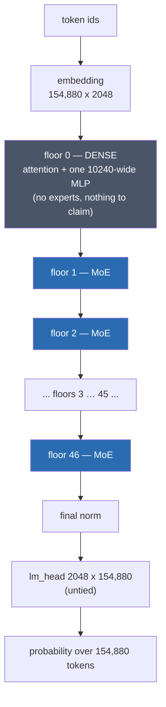
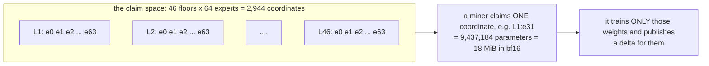
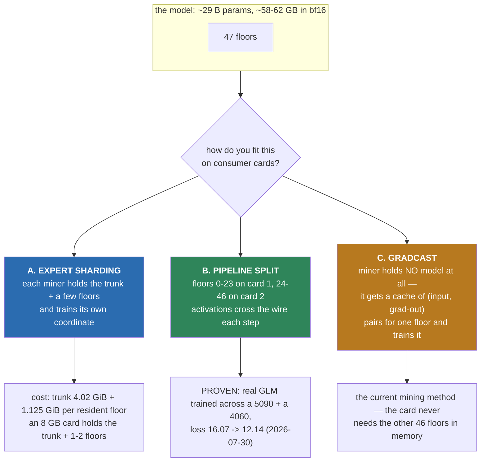
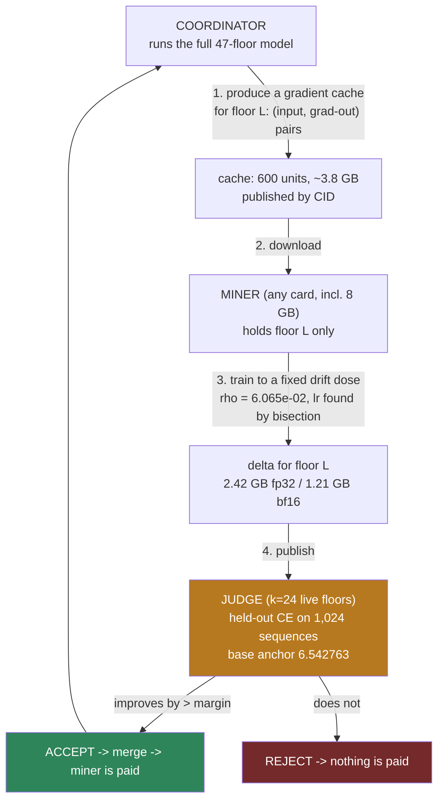

# NeuraHash Miner

The **miner client** for NeuraHash — a proof-of-useful-work network where the "work" is training a
shared Mixture-of-Experts model. Your GPU trains its assigned expert slots (compact LoRA deltas on
a frozen GLM trunk), signs each delta with your own locally-generated key, and publishes it —
**all-outbound** (works behind NAT, nothing to port-forward) and **decoupled** (fast GPUs never
wait for slow ones). What earns credit is not "the work ran": it is **measured improvement on a
secret, rotated held-out set** — a contribution that does not make the shared model better pays
zero, and on the trustless lane the payout itself is co-signed by a staked M-of-N validator quorum
rather than trusted to any single coordinator. (An earlier round-based pool lane, where the
coordinator recompute-verified each training step bit-for-bit, was the network's original design —
deprecated 2026-07-24; see the deprecation notice below.)

This repository is the **client half only**. It does not contain the coordinator, the consensus /
verdict logic, the ledger, or the emission/reward economics — you point it at a coordinator someone
else runs (or that you run from the full node package).

---

## ⚠️ Honest status — read this before you rely on it

- **This is the MINER CLIENT only.** It trains its assigned expert slot and publishes signed
  deltas outbound; it does not settle money on its own, does not run the coordinator role, and
  ships none of the reward/ledger/consensus server core.
- **No economic-security guarantees.** This is a working prototype for a testnet. Do not treat any
  balance it shows as real, redeemable value. The reward accounting lives on the
  coordinator/full-node side, which is not part of this repo.
- **The store write token is a PUBLIC demo credential.** It opens the shared content store but
  secures nothing (and doesn't need to): integrity comes from content-addressing + signatures, and
  the model is protected by the held-out gate. **Corrected 2026-07-28:** that protection held for
  *garbage* (random/forged deltas pay zero and are not folded) but it did **not** hold for
  *subtly harmful* work — run 5's accepted deltas passed the gate and damaged the model. See
  "What we found in run 5" below; the product-shaped judge is the fix.
- **Your wallet key is yours, generated locally.** The miner creates a per-node secp256k1 identity on
  your machine (gitignored, never uploaded). Back it up; losing it loses the address your work
  credits. No private key ships in this repo.
- **No fragile determinism requirement.** The GLM lane gates on measured held-out improvement, not
  bit-exact recompute across different GPU architectures — your card's ~1-ULP numeric quirks cannot
  false-reject honest work.

---

## 🔬 What we found in run 5, and what changes for you (2026-07-28)

**Read this if you mined run 5.** We measured, on a real benchmark, that run 5's *accepted* work
made the model **worse**: ARC-Easy accuracy fell **0.8107 → 0.6940 (−11.7 points**, McNemar
p=1.25e-40) and the full model's held-out cross-entropy worsened **+13.4%** — while the pool's
accept gate reported a 15.9% *improvement* and paid for it.

**No miner did anything wrong, and no miner could have noticed.** The cause was ours: the gate
scored a stand-in network with **1 of 46 expert layers switched on**, and that network is not the
model we ship. Every number visible from a miner's seat improved the entire time it was damaging
the real model — we reproduced that on a second GPU to be sure. This is the same lesson this
project learned once before (verified work ≠ useful work), reproduced against the very gate built
to prevent it.

### What is changing before the next campaign

1. **The gate now judges a product-shaped network.** We measured where a stand-in starts agreeing
   with the real 47-layer model: the verdict flips at **19 resident layers** and is stable above
   it, so the new judge runs **24 layers resident** (~36 s per accept check) and **fails closed** —
   if the judge cannot run, work is not accepted rather than waved through.
2. **The unit of work grows from one expert to one whole LAYER.** Training a single expert with a
   low-rank adapter turned out to be too small to be payable: its best honest yield was ~1/6 of the
   accept margin, and it was fragile (half the dose flipped the sign). Training **all 64 experts of
   one layer** (604 M parameters, full-rank) against **true gradients from the real model** measured
   **15.3× the accept margin** — and **93×** the per-expert yield at the same weight movement.
3. **Still 8 GB-friendly.** A layer claim needs the trunk (4.02 GiB) + one layer (1.125 GiB) — a
   consumer 8 GB card remains a first-class miner. That is a hard requirement here, not a
   nice-to-have.
4. **Doses will be specified as a drift target, not a learning rate.** We measured a razor-thin
   stability window: **+6.9% learning rate → 10× the weight movement; +14.4% → divergence (NaN)**.
   So the coordinator will hand out a target and your client will find the rate by local bisection,
   reporting the movement it achieved. This protects your GPU hours; the judge would reject a
   diverged dose anyway.

### What you should do

- **Expect a new signed release before the next campaign (run 6).** `3.5.2` predates all of the
  above; do not point it at the new campaign.
- **Keep your clone clean.** Self-update applies releases with a clean checkout — local edits make
  an update **silently do nothing** while the miner still looks healthy. If you patched files by
  hand, revert them before updating.
- **Nothing about your wallet, keys, or earned credit changes.**

### What we have NOT proven yet

The layer result above is measured on the **gate metric** (held-out cross-entropy). The
capability benchmark on that same dose is **still running**, and given this project already
measured one case where cross-entropy and capability disagreed, **the new trainer does not ship
until that benchmark confirms it.** We will publish the number either way, including if it kills
the approach.

### Where the science stands, and what remains (updated 2026-07-30)

Promised: publish either way. Here is the full ledger.

**Proven, with numbers:** a single miner-style contribution measurably improves the real 62 GB
model at three different step sizes, with **zero loss on a capability benchmark** — useful work
exists, is measurable, and is what gets paid. The judge rejects the damage class the old gate
paid for. The signed release chain is field-proven on real fleet hardware. An 8 GB card trains
as a first-class participant (measured, not claimed).

**Refuted, pre-registered, published here as promised:** combining *separately-trained* updates —
at every step size, in every order. A literature survey confirmed no published system anywhere
composes different parts of one model by summing; the field routes or stacks instead. Our next
architecture (the fleet-hosted pipeline: one live model chained across miners, everyone
contributing to the *same* training trajectory) has nothing to combine, so this failure mode
cannot exist there by construction.

**The remaining proof ladder, in order — each a measurable public gate:**
1. One real training step of the big model across two real machines (the pipeline's backward pass
   was built and independently verified bit-exact this week; the live two-box step is next).
   *First milestone landed 2026-07-30: a training step crossed between two real machines for the
   first time — small model, one step, total wire payload 2,500 bytes, and the result matched the
   single-machine answer to within one floating-point ULP. The tiny residual was traced to the two
   machines' different math libraries — measured proof of why this pool verifies* **outcomes**
   *rather than demanding bit-identical computation from heterogeneous hardware.*
   ***GATE 1 PASSED later the same day: the real model trained across two real machines.*** *Three
   optimizer steps of the actual 62 GB-class GLM (a 2-layer span — the honest current scope),
   split across an RTX 4060 (front) and an RTX 5090 (MoE layer + head), real corpus tokens, loss
   falling 16.07 → 13.29 → 12.14, and after one step the two-machine answer differed from the
   single-machine answer by exactly one bf16 bit. Also measured: the drift between different GPUs
   compounds step over step — which is why the design re-syncs weights periodically and pays on
   measured outcomes, never on bit-matching. Useful traffic: ~2 MiB per training step.*
2. Activation compression to the measured requirement (~19–37× on a 1.2 Mbps uplink; published
   systems measure 100×, and our wire is currently uncompressed — the headroom is real).
3. A chain that survives a miner leaving mid-run.
4. **The gate that matters:** a multi-step fleet training run where the full model's held-out
   score improves *and* the capability benchmark does not drop — the same double gate the
   single-contribution result already passed, now through the fleet.

One honest sentence on ambition: no published project has trained a model this size over
residential internet connections. There is no recipe to copy — and no incumbent to catch.

### The first LONG two-machine run -- 50 steps, and what it means for your disk (2026-07-30, night)

Gate 1 passed on 3 steps. Later the same day the same setup ran **50 optimizer steps** of the real
model across the two machines (RTX 4060 = front: embeddings + the dense layer, held under a **6.0 of
8.0 GiB** VRAM cap; RTX 5090 = the 64-expert MoE layer + the driver). **Training loss fell 15.993 ->
8.446.** A single-machine reference arm on the identical batches finished at **8.347**.

**The scope, before anything else:** this is **2 layers of 47**, bf16, plain SGD at **learning rate
1e-2 with no gradient clipping**, **128 tokens per step**, and the number quoted is **training loss
on that 2-layer slice -- not held-out cross-entropy, and not a capability benchmark.** It is a
transport-and-optimizer proof, not a "the model got smarter" claim. The double gate at the bottom of
the ladder above is still the one that decides that.

**The result that matters to you: your card does not have to agree with anyone else's.** We measured
how far the two machines' weights drift apart from the single-machine reference, step by step:

| step | front stage | MoE stage |
|---|---|---|
| 1 | 6.188e-04 | 7.042e-03 |
| 2 | 6.803e-03 | 7.042e-03 |
| 3 | 2.724e-02 | 1.961e-02 |
| 5 | 6.863e-01 | 1.462e-01 |
| 10 / 20 / 35 / 50 | 0.674 / 0.668 / 0.651 / 0.651 | 0.143 / 0.143 / 0.143 / 0.143 |

Three things follow, all measured:
1. **A 1-in-1000 agreement bar is already broken after ONE step.** So a coordinator can never check
   your work by re-running your steps and comparing weights -- which is exactly why this pool pays on
   **measured outcomes** (the judge) and never on bit-matching. Your card's quirks cannot
   false-reject you.
2. **The drift stops growing.** It **saturates** instead of exploding -- bounded, not chaotic -- and
   the plateau sits at the bf16 rounding floor. The MoE stage's worst absolute difference is
   **bit-identical (2.891e-01) at steps 10, 20, 35 and 50**.
3. **Even at ~65% divergence on the worst tensor, both arms are functionally the same model**
   (**8.446 vs 8.347 -- 1.2% apart**). Mismatched consumer GPUs training one model together is not a
   compromise we tolerate; it is measured to work.

**About the "30 GB" number, because it would scare the wrong people.** A 21-step run did write
**30.4 GB** and fill a disk -- that was the **coordinator's** content store on our own box, caused by
a **measurement-only** setting that ships every stage's full weights each step so we could compute
the table above. **It was never miner disk.** During the whole run the 4060 acting as a miner had
about **2.6 GB free** on its system drive and wrote **nothing per step**. **Your disk requirement is
fixed** -- your segment (**4.02 GiB trunk + 1.125 GiB per resident layer**) plus optimizer state -- and
does **not grow with how long the run lasts**. Two fixes are filed off the back of it: production
lanes never ship per-step weights, and pipeline traffic becomes ephemeral in the store with
disk-full failing **loudly** instead of quietly dropping your connection.

**Also measured, and useful to know:**
- **The GPU was bored, not busy.** Single-machine throughput went **128 tokens/step -> 55 tokens/s
  at 2.31 s/step; 512 -> 249 tokens/s at 2.06 s/step; 2048 -> 1054 tokens/s at 1.943 s/step**.
  Sixteen times the work per step made each step **faster** -- the card was idling at **2-3%
  utilisation**. The per-step handshake was shipping **1.44 GB/step against ~2 MiB/step of useful
  traffic (99.85% overhead)**; capping it cut about **30% of per-step wall time (6.0 -> 4.2
  s/step)**. Expect throughput work, not new science, to be the next visible win.
- **bf16 alone is now a correctness problem, not just a speed choice.** At the weight sizes seen
  here (**|w| 1.1 to 3.5**) one bf16 step of precision is **3.9e-03 to 7.8e-03**, while actual
  per-step updates measured **0.5 to 1** of those -- so most updates are smaller than half a rounding
  step and **round away to nothing**. Keeping full-precision master weights moves from "nice
  optimisation" to "required for long runs".
- **One spike, and what it cost.** At step 4 the loss jumped **11.716 -> 35.495** (a single weight
  moved **3.303**, about **845** rounding steps), recovered by step 6, and descended cleanly
  afterwards -- but the drift plateau was set **exactly across that one step** (**2.724e-02 ->
  6.863e-01**). Per-stage gradient clipping now exists, **default OFF**, and whether it collapses
  the plateau is under test.
- **Restart-reproducible.** The two-machine arm was restarted three times that day and reproduced
  its losses **bit-identically** every time (steps 13/14/15 = **9.285496 / 10.463924 / 9.246750**).

**What it does and does not say about the full model.** All 47 layers need about **57 GiB of weights
against 29 GiB of usable VRAM** on these two cards -- so the full model needs **layer streaming or
roughly 10 cards**, which is a provisioning problem, not a physics one. Pipeline parallelism is what
makes the model **fit** across small cards; **data-parallel replicas with DiLoCo-style averaging**
are what make training **faster** as more of you join. And to be unambiguous, since older sections
below are kept as history and some predate this: **adding up separately-trained per-layer updates
stays refuted at every step size we tested.** Those sections remain the record of what we tried, not
a description of where the project is going.

### How many miners can win at once? We measured it: about 8 per layer (2026-07-31)

A fair question if you are thinking of joining: **Bitcoin hands every miner a lottery ticket — can
NeuraHash pay 10,000 of us at once?** We tested it properly, and the answer has two halves.

**Half one: yes, your single piece can genuinely improve the model.** We took one layer, split it into
its 60 expert pieces, and scored each piece **on its own** against a frozen held-out set your miner
never sees. **20 of the 60 pieces made the model measurably better.** The best single piece improved
it by **0.133** — and that one piece was worth *more than all 60 pieces combined*. So "one miner, one
piece, real progress" is not marketing here; it is measured.

**Half two: those improvements do not simply add up.** Merge all 60 and you keep **−0.088** out of a
possible **−0.636** — about **14%**. The other 86% is lost in the merge, because pieces trained
separately interfere with one another.

The useful part is *where* it breaks:

| pieces merged | how much of the improvement survives |
|---|---|
| 8 | **100%** (all of it) |
| 16 | 11% |
| 60 | 14% |

**Up to about 8 pieces, merging is essentially free.** Past that it falls off a cliff. That number is
our version of Bitcoin's difficulty: it sets how many miners can be paid for the same layer in the
same round. It is roughly **8 — not 64, and not 10,000.**

> **⚠️ CORRECTED the same day (2026-07-31): the real number is about 1–2, not 8.** We are leaving the
> table above in place because we said it publicly and you deserve to see what changed. Here is the
> mistake. In that first test we picked the 8 pieces by **how much traffic** they get, and it turned
> out only **one** of those 8 was actually a piece that helps. So "8 pieces keeps 100%" really meant
> *"one good piece survived being mixed with seven that do nothing"* — not "eight pieces combine
> well". When we redid it using the 8 pieces that **actually improve the model**, it looks like this:
>
> | pieces merged (the good ones) | result |
> |---|---|
> | 1 (best piece alone) | −0.133 |
> | **2** | **−0.134 — the best result we got** |
> | 4 | −0.112 |
> | 8 | −0.088 |
> | 20 | −0.089 |
>
> **Merging more good pieces makes the model worse, not better.** Two is the sweet spot, and two is
> barely better than one. The honest summary: **a layer only absorbs about one good piece's worth of
> improvement per round, no matter how many miners work on it.**
>
> **What this means for you, plainly.** It does *not* reduce who can mine — slots stay unlimited and
> anyone may join. It means the pool works like Bitcoin more literally than we first described:
> **most submitted work will not make it into the model**, exactly as most Bitcoin hashes never
> become a block. You get paid in **shares** for work we can verify you did, and the piece that
> actually lands each round earns the bonus. We would rather tell you that now than design a reward
> system on a number we already know is wrong.
>
> Still to come: we are re-checking this on the full 47-layer model (the numbers above come from our
> fast 24-layer judge). We will publish that result whichever way it goes.
>
> **✅ CONFIRMED on the full 47-layer model, later the same day.** It went the way the correction
> said, and it is sharper on the real model than on the fast judge:
>
> | on the real model | held-out score | vs untrained |
> |---|---|---|
> | the model as-is | 4.816991 | — |
> | **all 64 pieces of the layer** | 4.721827 | **−0.095165** |
> | **the single best piece alone** | 4.722758 | **−0.094233** |
> | the two best pieces merged | 4.722549 | −0.094442 |
>
> **One piece delivers 99.0% of what the whole layer delivers.** The other 63 pieces are worth one
> percentage point between them. So a layer really does contain **about one payable unit per round** —
> which, to be fair to the original idea, is exactly Bitcoin's shape: one block, one winner, and the
> rest of the work paid in shares.
>
> Two other things worth stating because they make the numbers trustworthy. The untrained baseline
> reproduced its published value to **0.0000003**, so this is the real product model and not a proxy.
> And our fast 24-layer judge predicted the merge ratio as 0.509 where the real model gives 0.5047 —
> agreement to **0.85%** — so the cheap check we use day to day is honest, which means we can keep
> testing quickly and only spend the slow one on the results that matter.

### Why the pieces don't add up — we may have blamed the wrong thing (2026-07-31, evening)

We told you above that pieces "interfere" — that miners' work cancels out. **Looking harder at the
same numbers, we think that may be wrong, and the real answer is more hopeful.**

Merging the two best pieces gave **−0.094442**, which is slightly *better* than the best piece alone
(**−0.094233**), and all 64 together is better still. If the pieces were genuinely fighting each
other, merging would come out **worse** than the best single piece. It doesn't. It comes out at the
best single piece **plus 0.2%**.

That points at something different, and simpler: **every miner is learning the same thing.** Not
cancelling each other — just all finding the same one improvement, over and over.

**Why that would be our fault, not yours.** Right now every miner trains on the same corpus and is
graded against the same held-out test, which is about **78% arXiv abstracts**. Same reading material,
same exam. Of course everyone arrives at the same answer.

**Why this is the better problem to have.** "Miners cancel each other" would be a deep architectural
flaw. "Miners are all given the same homework" is a fixable assignment problem — and we already know
the fix is available, because we previously measured that **different kinds of text genuinely route
to different experts** inside the model (0.148 overlap across subject areas vs 0.678 within). The
machinery to give different miners different work exists; we simply haven't been using it.

**What we're doing about it, right now:**
1. A measurement that settles it properly — scoring each piece sentence by sentence to see whether
   two miners improve the *same* sentences (everyone learning the same thing) or *different* ones
   (genuinely cancelling). We wrote down the rule for deciding before running it.
2. Building the fix on the assumption it's the first: split the training material into distinct
   subject areas and give different miners different slices, with each expert assigned by what the
   model's router actually sends it — not by a hash of your wallet.
3. Likely also needed: **different exams, not just different homework.** If everyone is still graded
   on the same arXiv test, they may converge on the same answer no matter what they trained on.

We are publishing this before we know the answer, including the part where we may have told you
something wrong this morning. If the measurement says "cancelling" after all, we will say so and the
fix becomes a different one.

> **✅ THE MEASUREMENT CAME BACK: everyone IS learning the same thing.** We scored every piece
> sentence by sentence. Result: **all of the improvement lives in about 10% of the test sentences,
> and two different miners improve those same sentences by almost exactly the same amounts** —
> correlation **0.9987**. The bottom half of the test set moves by nothing at all. The merged result
> sits 6× closer to "the best single piece" than to "both pieces added up". So it is redundancy, not
> cancelling, and the "pieces interfere" wording earlier on this page is retracted.
>
> **We were also wrong about the reason, and that one is on us.** We guessed the cause was our test
> set being ~78% academic abstracts, funnelling everyone toward the same subject. The data says no:
> the sentences that improve are **not** concentrated by subject (z = 1.35 against our own
> significance bar of 2). So the concentration is real, but it is not about topic. The likeliest
> explanation is plainer — at this point in training there is **one big available improvement**, and
> every miner's maths finds it.
>
> **This is not a NeuraHash defect, and that matters for trusting the number.** Published research
> measures the same ceiling. The closest study to our setup merged **58–72** independently trained
> models and beat the best single one by **0.22%** and **0.65%**; a 2026 study across many models
> found gains "generally less than 1%"; and a fitted curve puts **85% of everything you can gain at
> just 5 contributors.** Our result is the field's own number. Blunt version: "merging the two best
> gives what one gives" is a known effect with a known name — the merge is *rejecting* the second
> contributor because it has nothing new to add.
>
> **So what actually helps?** Where merging genuinely works in the research, it works by keeping
> **several different skills alive at once** — which points at giving different miners different
> material rather than a cleverer merge formula. That experiment is built and gated, and we will
> publish it either way.

### 2026-08-02 — **Different data does NOT make miners add up. Different COORDINATES do.** And an 8 GB card is proven — the real floor is 3.60 GiB.

Two overnight campaigns, roughly 15 GPU-hours across the 5090 (3.6 h of judged arms) and the 4060 (an ~11 h training campaign). One hypothesis died, one
replaced it, and the hardware floor for joining dropped by half.

#### 1. The hypothesis that died: "give each miner different data"

The idea was that if two miners train the same layer on *different* corpora, their contributions
should point in different directions and therefore add up. We measured it properly: four corpora
(`arxiv_abstracts`, `arxiv_papers`, `gutenberg`, and a deliberately mixed `mixed_control`), one
full-rank layer-1 delta each, **all trained to the same frozen drift dose** (rho 6.065e-02, learning
rate found by bisection), scored on the k=24 judge against base CE 6.542763. Every pairing was run
twice: **CROSS** (two different corpora) and **CONTROL** (one corpus, two different expert rows).

**The control is what saved us from publishing a false positive.** The first cross pair came back at
R = 1.0003 — against a same-corpus baseline of 0.5090 — which looks like a decisive win. Its own
control scored **1.0060**, i.e. *higher*.

The reason is a flaw in the statistic itself. `R = d_merged / (d_A + d_B)` is a monotone function of
the **ratio between the two contributions**, not of where the data came from:

| d_a : d_b | R | corpora |
|---|---|---|
| 1.00 | 0.5025 | **same** |
| 1.01 | 0.5013 | different |
| 4.26 | 1.0081 | different |
| 4.28 | 1.0003 | different |
| 7.87 | 1.0060 | **same** |

Sorted by that ratio, cross and control interleave perfectly. When `d_B << d_A` and B does not
interfere, `d_merged ≈ d_A + d_B` so R → 1. When the two are comparable and redundant,
`d_merged ≈ d_A` so R → 0.5. **The "R ≥ 0.80 → non-redundant, N miners approach N× gain" verdict
fires on any lopsided pair, including a same-corpus one where nothing was decorrelated at all.**

We now report the un-gameable number instead: the merged gain as a multiple of the **best single**
contributor. At the frozen settings that is **1.00× to 1.26×**. Two miners never bought close to two
miners' worth.

#### 2. What actually decides whether two miners add up

Looking at the six pairings, the structure is unmistakable:

| pairing | d_A | d_B | merged | vs best single |
|---|---|---|---|---|
| abstracts + gutenberg | 0.1338 | 0.1324 | **0.1335** | 1.00× |
| gutenberg + mixed_control | 0.1330 | 0.1293 | **0.1335** | 1.00× |
| abstracts + mixed_control | 0.1338 | 0.1293 | **0.1354** | 1.01× |
| abstracts + arxiv_papers | 0.1338 | 0.0313 | **0.1651** | 1.23× |
| arxiv_papers + gutenberg | 0.0313 | 0.1330 | **0.1656** | 1.24× |

Every **strong + strong** pair merges to ~0.1335 — *less than the better miner achieved alone*. Three
different corpus combinations, same answer. They are fully redundant because they all converge on
the **same best coordinate**, and averaging two attempts at the same thing gains nothing.

The pairs that do add are the ones where the two miners were pushed onto **genuinely different
coordinates**. That is not a property of the data — it is a property of the assignment.

#### 3. The lever that works: give miners more coordinates to try

We re-ran the whole experiment probing 16 candidate rows per corpus instead of 6. **Exactly one
number changed**: `arxiv_papers`, the weak corpus, found a row worth 0.0772 instead of 0.0313. Every
other corpus's contribution was byte-identical.

| merged gain | 6 candidates | 16 candidates | change |
|---|---|---|---|
| abstracts + arxiv_papers | 0.1651 | **0.2113** | +28% |
| arxiv_papers + gutenberg | 0.1656 | **0.2115** | +28% |
| arxiv_papers + mixed_control | 0.1633 | **0.2089** | +28% |
| *(pairs not involving arxiv_papers)* | 0.1335 | 0.1335 | unchanged |

**A wider search rescued the weak miner, and every merge involving it gained ~28%.** Best single
contribution: unchanged at 0.1338. So the gain came entirely from the *second* miner finding a
better coordinate — not from more training, not from better data.

The practical reading: a miner's value is capped by how many coordinates it gets to try, and the
fleet's value is capped by how well miners are *spread* across coordinates. Both are scheduling
decisions we control.

One more measured caution: **equal drift is not equal quality.** The four corpora needed learning
rates spanning 11× to reach the same drift, and the outcomes diverged wildly — gutenberg improved
6 of 6 probed rows, `arxiv_abstracts` 5 of 6, `arxiv_papers` only **1 of 6**, with a worst row that
cost +0.639 CE. A corpus can pass the drift gate and still be actively harmful.

#### 4. An 8 GB card produces the payable unit — and the floor is really 3.60 GiB

Until now the only working trainer built the whole 47-layer model, which needs a 24 GiB cap and
excluded every 8 GB volunteer. It turns out that was never necessary: a gradient-cache unit already
contains the layer's inputs and grad-outputs, so training a layer needs the layer and its cache and
nothing else.

The 4060 trained the full-rank layer-1 unit, and the result is numerically indistinguishable from
the 5090's 24 GiB reference:

| | |
|---|---|
| cosine (gate_up / down) | 0.9999999999999971 / 0.9999999999999978 |
| max abs difference | **5.96e-07** (= 2⁻²⁴, fp32 epsilon) |
| achieved rho | 0.06038559627 vs reference 0.06038559325 |

That is **436× tighter** than this project's own cross-architecture precedent (2.6e-4).

**Then the floor turned out to be far lower than 8 GB, and what was holding it up was not training
at all.** The `assert_finite_delta` guard evaluates `torch.isfinite(t).all()` over all 402,653,184
elements at once — allocating a 384 MiB boolean mask (plus 192 MiB for the second tensor) on *every*
bisection pass. The chunk-size knob governs a ~300 MiB working set, so shrinking it could never
help; a first sweep at chunk 4, 2 and 1 hit the identical wall every time.

Evaluating that check in chunks — mathematically identical, since `all()` over a tensor is the AND of
`all()` over any partition of its rows — walks the cap down to **3.60 GiB (peak 3.59)**, versus
6.25 GiB with the stock guard. All nine cap steps produced the *identical* drift, and the 3.60 GiB
delta is **bit-identical** to the 7.0 GiB one (max |dw| = 0.0). The small-chunk setting costs nothing
in throughput (0.10 s/unit).

~3.4 GiB is a hard floor no knob goes under (1.125 GiB expert slab + 2.25 GiB fp32 delta). **This is
the difference between "8 GB cards can mine" and "4 GB cards can mine"** — for a fix on the
validation path that cannot alter any result. Not yet applied to the shipping code; it is queued as
a reviewed change rather than something that happened unattended.

#### What this changes

- **Do not** build a per-miner web-scraping data pipeline to decorrelate contributions. Measured: it
  does not decorrelate them.
- **Do** spread miners across coordinates and let each one probe more candidates before committing.
  That is where the measured 28% sat.
- **Do** lower the VRAM floor — it roughly doubles the population of eligible cards.
- Still unsolved, and stated plainly: merging N miners does not yet buy N miners' worth of
  improvement, and 0 of 10,752 accepted deltas in the live pool ever improved held-out.

### Your miner will no longer die on an out-of-memory error (2026-08-01)

This one is for you rather than for the science. Your miner already capped how much VRAM it would
take and already recognised an out-of-memory error. Three things were still wrong, and all three
are fixed:

**1. It used to retry the exact same thing.** After an OOM the miner freed memory and tried again
next round — with the same batch size. If your card genuinely could not fit that batch, it would
fail identically, forever. Your miner never crashed and never earned anything, which is the worst
of both worlds: from the outside it looks perfectly healthy. It now **halves the batch size**, then
the step count, and **refuses to retry a configuration that just failed**. If it runs out of things
to shrink it says so loudly instead of quietly skipping every round.

**2. The VRAM cap was never checked.** The miner set a hard ceiling on how much of your card it
would use and printed a confident message — without ever confirming the ceiling worked. We had
already been bitten by this: an earlier test ran out of memory *twice while supposedly capped*. An
unenforced cap is worse than none, because instead of failing cleanly it spills into your system
RAM and can hang the whole machine. The miner now **proves the cap works before using it** — it
briefly sets a deliberately tiny 64 MB ceiling, asks for 256 MB, and requires that request to fail.
If it succeeds, the cap is not real on your setup and **the miner refuses to start** rather than
risk your desktop. Verified on a real RTX 5090.

**3. "Pause instead of spill" was switched off for almost everyone.** The design promised that a
starved card would wait rather than push into system memory. That behaviour lived behind an opt-in
flag nobody set, so in practice the miner walked straight back into the allocation that had just
failed. It now waits for memory to come back by default.

**What this means for you:** on an 8 GB card the miner should now degrade to a smaller batch and
keep contributing, instead of either crashing or silently idling. 11 new tests cover it; 3730 tests
pass overall.

### We found the math expert. There is no science expert. (2026-08-01)

Inside the model are thousands of small sub-networks called experts, and a router decides which
ones see which text. If different miners are going to do genuinely *different* work, we need to
know who handles what. So we measured it — we fed the router grade-school maths problems, science
questions, research papers, educational web text, code and literature, and recorded which experts
lit up.

**Maths has its own experts.** Arithmetic word problems route to experts that **no other kind of
text touches at all** — zero overlap with the other five categories, at three separate layers.

**Science does not.** Science questions land almost exactly where general educational web text
lands — 23 to 31 times more overlap than chance. At one layer, research papers and educational web
text are *identical*, and science is entirely contained in both. The model never learned a
"science" division. It learned a **maths** division, and files science under "educated prose".

The comparison is fair in a way our earlier one was not: both the maths and science sets are short
exam-style question-and-answer items, so the *format* is identical and only the *subject* differs.
Our previous test compared research papers against code against novels — which differ in
punctuation, vocabulary and topic all at once, so it could not tell whether the router was sorting
by meaning or just by surface appearance.

**Why it matters for mining:** it tells us the model's real internal divisions are about **four**,
not one per category — maths, code, general prose, and literary. It also names a mistake we were
about to make: giving one miner "science" and another "web text" would hand them **the same
experts**, which is exactly the duplicated work we are trying to avoid.

**What we are NOT claiming.** This shows where text *goes*, not that training there *helps*. This
project has already paid out ~900 rounds of work that passed every mechanical check while the
model's real score got worse, so we are treating this as an input to the next experiment, not a
result. It also covers only 6 of the model's 47 layers.

### We audited our own result, and it held (2026-08-01)

Before building anything on the number above, we checked whether it was real or a rounding artifact.
Model weights are stored in a compact 16-bit format, and small updates can vanish into it — so the
worry was that miners' contributions were being *silently discarded by the maths* rather than
genuinely failing to add up.

**They weren't.** Measuring how much of an intended update actually lands, at the dose we really
use: **95% to 100%**. The result stands. Contributions are being applied faithfully; they just
overlap with each other.

Two things worth telling you honestly:

**We corrected ourselves again — that's four times now on this page.** We previously wrote that a
scaled-down update lost "86%" of itself. That was the wrong measurement: 86% of the individual
*numbers* stopped moving, but roughly *half* the actual step still landed, and only in a
small-dose test we no longer plan to use. Two separate expert reviews of our own data disagreed
with each other about this, so we settled it by measuring rather than arguing.

**We tested fp8 — a smaller number format that would let the whole model fit in one graphics card —
and ruled it out.** Two reasons: every serious training system keeps its master copy of the weights
in a *larger* format anyway, so fp8 saves nothing on storage; and fp8 is so coarse it would retain
**0%** of a contribution like ours. There is a format that works (NF4), which would shrink the model
from 55.8 GB to **14.4 GB** — enough to fit entirely in one card and stop the constant disk reading
that currently leaves the GPU idle 96% of the time. We already have the code for it, and an earlier
test measured it within **0.02%** of the full-precision model.

**And a hypothesis of ours died cleanly.** We thought keeping each miner's contribution as a
separate "adapter" instead of merging it might let contributions stack. It cannot — the algebra is
identical to adding them, and the one published experiment that tried it with 20 contributions
scored *worse* than using a single one. Carrying them separately also costs memory that grows with
every miner, which is incompatible with unlimited slots.

**Pool status.** The coordinator now runs with a proper noise guard on the accept gate for the first
time, and a fix that stops slow connections being dropped mid-transfer — since applying it, model
transfers to the miner complete instead of restarting. A corpus mismatch that was silently rejecting
*every* contribution has been fixed at the source. **If you are joining: do not use `--sync-corpus`
right now** — our content store is serving a different corpus version than the coordinator expects,
and syncing to it will get your work rejected. We are fixing the store separately.

### Two machines really did train together over the internet (2026-07-31)

Separately from the above, and good news: an RTX 5090 and an RTX 4060 trained one model **across the
public internet**, loss **15.638980 → 14.243052**, both halves moving. That is the lane meant to let
small cards hold a model no single card can fit.

It is slow — about 11 minutes per step — and honestly **we do not yet know why**. Bandwidth accounts
for ~16 seconds and network round-trips for ~1 second, so **97% of that time is unexplained and is
not the network.** An earlier explanation we gave ourselves ("too many round trips") was wrong and we
have retracted it rather than guess again. We are timing each individual exchange to find the truth.

One thing we did find: our two machines currently talk to each other by routing through a server in
**Singapore** — even though they sit in the same room — because a home connection has no public
address for a miner to dial. That is a real design flaw for a global network, and fixing it (direct
peer-to-peer, with the server used only for introductions) is now queued.

**What this means for you.** We are not going to pretend a round can pay unlimited winners when the
measurement says otherwise. Expect work to be organised as **small coalitions** — a handful of miners
finishing one layer together and sharing what that layer actually gained — rather than thousands of
miners merging into the same model and quietly cancelling each other out. To be clear about the thing
people ask next: **slots stay unlimited and anyone may join.** What this bounds is how many pieces
merge *per round*, not how many people can mine.

**What we have not proven.** One layer, one step size, scored on our fast 24-layer judge — which we
checked inside the same run against the full 47-layer model and found pointing the same direction at
93% of the size. We have **not** yet tried merging *only* the 20 pieces that improved; that could push
the number up, and it is the next test. We will publish it either way.

---

## Which sections below are still current? (status guide, 2026-07-28)

This README keeps its full dated history (nothing is deleted), so here is what still applies after
the run-5 findings above. **Current** = works as described. **Changing at run 6** = the feature
stays, its granularity or inputs change. **Historical** = kept as the record, not a roadmap item.

| Feature | Status at 2026-07-28 |
|---|---|
| shardDiLoCo lane (per-slot sharding, all-outbound, signed deltas) | **Changing at run 6** — a claim becomes one *layer* instead of one expert; transport, records and lineage unchanged |
| Shard Claim (claim / advance / evict / cooldown) | **Changing at run 6** — same mechanism, coarser coordinate; cooldowns and the walk cursor carry over |
| Truly-decoupled per-slot event clocks | **Current** — matters more, not less (cache refresh and training are asynchronous) |
| Corpus automation (daily extract + auto-resync, no restart) | **Current** — proven live; the 2.01 B-token corpus builds on it |
| VRAM cap guard / elastic good-neighbour | **Current** — now structural; every measurement this week ran under a per-process cap |
| `NEURAHASH_CAPACITY_AWARE` | **Current, gaining a job** — it will also classify your node: gradient-cache producer (~20 GB VRAM) vs layer trainer (~5 GB) |
| Trustless coordinator (staked M-of-N quorum) | **Current** — unchanged as the settlement trust root |
| Auto-resume / OOM self-heal | **Current** |
| Signed self-update | **Current, with a known gap** — a hand-modified clone makes an update silently do nothing; keep your clone clean until the loud-failure fix ships |
| Zero-config defaults | **Current** — a few gaps still being closed |
| Fleet-hosted pipeline (v3.3.0, bit-exact fleet forward) | **Current and promoted** — it is the working half of the endgame where miners pass activations and no card waits |
| G1 / RLVR post-training | **Deferred, not dropped** — re-sequenced behind the gate redesign |
| DMoE capacity experiment | **Historical** — measured negative (wins on recall, never moved the plateau); kept as a record |
| Rung B fleet training (OLMoE) | **Historical** — achieved 2026-07-16, superseded by the GLM lane |

---

### The architecture in full — every number, and where mining plugs in

*(Added 2026-08-01. Every figure below is read from the live `config.json` or computed from it and
cross-checked against a real file on disk — the arithmetic is reproduced at the end so you can
verify it yourself. This is the reference version of the three-picture tour above.)*

#### 1. The spec sheet

| Field (`config.json`) | Value | What it means |
|---|---|---|
| `model_type` | `glm4_moe_lite` | GLM-5.2 family, MoE variant |
| `num_hidden_layers` | **47** | the 47 floors |
| `first_k_dense_replace` | **1** | floor 0 is a plain dense layer — so **46** floors are MoE |
| `hidden_size` | 2048 | width of the signal passed between floors (`H`) |
| `n_routed_experts` | **64** | specialists per MoE floor (`E`) |
| `num_experts_per_tok` | **4** | how many wake per token (`top-k`) |
| `n_shared_experts` | **1** | the always-on generalist |
| `moe_intermediate_size` | 1536 | each expert's inner width (`I`) |
| `intermediate_size` | 10240 | the *dense* floor-0 MLP's inner width |
| `topk_method` | `noaux_tc` | router scoring rule |
| `routed_scaling_factor` | 1.8 | routed output is scaled by this before it is added back |
| `norm_topk_prob` | true | the 4 chosen gate weights are renormalised to sum to 1 |
| `vocab_size` | 154,880 | tokens in the vocabulary |
| `num_attention_heads` / `num_key_value_heads` | 20 / 20 | attention shape |
| `q_lora_rank` / `kv_lora_rank` | 768 / 512 | MLA-style compressed attention |
| `dtype` | bfloat16 | 2 bytes per weight as shipped |

#### 2. The whole tower



**Floor 0 is the one that is not like the others.** `first_k_dense_replace: 1` means the first
floor keeps a single fat MLP instead of experts. That is why the model has 47 layers but only
**46 × 64 = 2,944** claimable coordinates — and why a miner can never claim `L0:*`. (This is the
same 2,944 that appears throughout our logs as the coordinate space, and the reason the piece
manifest lists 2,944 trainable of 3,008 nominal slots.)

#### 3. Inside one MoE floor — with real tensor shapes


The two weight tensors per floor are exactly what our packs hold, and you can see these shapes
printed in every experiment log:

```
gate_up_proj : [64, 3072, 2048]      # [E, 2I, H] — gate and up fused, split at row I
down_proj    : [64, 2048, 1536]      # [E, H, I]
```

`gate_up` is fused: rows `0..1535` are the **gate**, rows `1536..3071` are the **up**. Our wire
format splits it back into `{gate, up, down}` per expert, which is why one coordinate's payload
has three tensors.

> **Sleeping is free in compute, not in memory.** Only 4 of 64 experts run per token, so the model
> costs a ~2 B-parameter model to *run*. But all 64 must be *resident* for the router to be able to
> choose any of them. That single sentence is why decentralised training of this model is hard, and
> it is the reason for everything in section 6.

#### 4. The coordinate grid — what a miner actually claims



- **One expert** = 9,437,184 params = **18.0 MiB** bf16.
- **One whole floor** (all 64) = 603,979,776 params = **1.125 GiB** bf16 — this is the "1.125 GiB
  per resident layer" figure that governs how many floors a card can hold.
- **A full-rank floor delta in fp32** = **2,415,919,104 bytes ≈ 2.42 GB**. That is not a
  projection: `delta_gutenberg_L1_rho6.0650e-02.pt` on disk is 2,415,921,645 bytes — the extra
  2,541 bytes are the file header.

#### 5. The parameter budget

| Component | Parameters | Notes |
|---|---:|---|
| Routed experts, 46 floors × 64 | **27,783,069,696** | ~27.8 B — the overwhelming majority of the model |
| Shared experts, 46 × 1 | 434,110,464 | always active |
| Floor 0 dense MLP | 62,914,560 | not claimable |
| Embedding + lm_head (untied) | 634,388,480 | 2 × 154,880 × 2048 |
| Attention, norms, router | remainder | MLA-compressed; small next to the experts |
| **Active per token** | **~2.17 B** in the MoE path | (4 routed + 1 shared) × 9,437,184 × 46 |

**The ratio that makes this whole project possible: ~27.8 B parameters stored, ~2.17 B used per
token.** A model that is enormous to *hold* but cheap to *run* is exactly the model you would want
to train on a fleet of small, cheap cards — if you can solve the holding problem.

#### 6. Sharding — how the model is split across cards

MoE makes the model **splittable**; sharding actually **splits** it. Two different axes:



The memory arithmetic every operator needs:

```
trunk (embeddings + attention + norms + router)   4.02 GiB   measured
each resident MoE floor                         + 1.125 GiB   = 64 experts, bf16
-----------------------------------------------------------------
8 GB card   -> trunk + 1 floor, with ~2.8 GiB headroom
24 GB card  -> trunk + ~17 floors
the full 47 -> ~10 cards, composed
```

Note what this says: **experts inside a floor you already hold are free.** The cost is per
*floor*, not per *expert*. Claiming 1 expert and claiming all 64 on the same floor cost the same
memory — which is why the payable unit moved from one expert to one full floor.

#### 7. The mining loop, end to end



**Why the judge runs 24 floors and not 1.** In run 5 the judge graded inside a model where 45 of
the 46 expert floors were zeroed. Deltas that looked good in that empty building were **11.7 ARC
points worse** in the real one, while every internal check stayed green — the pool paid for
damage. Grading with **k=24** floors live is the measured fix: at that width the judge's verdict
matches the full model's, at ~31 s per check.

#### 8. Where the open questions sit on this map

| Question | Status |
|---|---|
| Can one card train one floor and improve the real model? | **PROVEN** — held-out CE 10.5 → 8.3 on a live 5090 miner |
| Can two machines train one model across the internet? | **PROVEN** — 5090 + 4060, loss 16.07 → 12.14 |
| Do two floors' deltas *add* when merged? | **REFUTED at every dose** — weight-space accumulation across floors does not compose |
| Do many miners on *the same* floor add up? | **NO — merge saturates at ~1.** One coordinate delivers 99% of what its floor's whole merged set delivers |
| Does giving miners **different data** make their work add up? | **BEING MEASURED RIGHT NOW** — this is the `R_cross` vs `R_same = 0.5090` experiment |
| Has the live pool's gate ever paid for a real improvement? | **NO — 0 of 10,752 accepted deltas ever improved held-out.** This is the central unsolved problem |

That last row is the honest headline: the mechanics all work — cards train, deltas ship, machines
cooperate over WAN — but **making N miners produce N miners' worth of improvement is not yet
solved**, and we publish the negative results as firmly as the positive ones.

#### 9. Verify the arithmetic yourself

```python
E, H, I, V, MOE = 64, 2048, 1536, 154880, 46
per_expert = 2*I*H + H*I              # gate_up [2I,H] + down [H,I]
assert per_expert == 9_437_184
assert E * per_expert == 603_979_776               # one floor
assert E * per_expert * 2 == 1_207_959_552         # 1.125 GiB bf16
assert E * per_expert * 4 == 2_415_919_104         # 2.42 GB fp32 delta
assert MOE * E * per_expert == 27_783_069_696      # 27.8 B routed params
assert MOE * E == 2944                             # the coordinate space
```

## Glossary — every name we use, in plain English (2026-07-29)

Every term this project uses, what it means for **you as a miner**, and its honest status. Nothing
here is marketing: where something is unproven or measured negative, it says so.

### The method your GPU will run

**GradCast** — the training method for the next campaign, named 2026-07-29. In one line:
**shardDiLoCo splits the model; GradCast splits the gradient.** The coordinator runs *one* full
backward pass over the frozen model and harvests it into per-layer "gradient caches". You download
the cache for the layer you claimed and train that whole layer directly from it — **your card never
runs a forward pass, never holds the 4 GB trunk, and never sees the other 46 layers.** The expensive
computation happens once and is shared by every miner who asks. *Status: proven for a single layer
(the real model measurably improved, with no loss on a capability benchmark); NOT yet proven with
many layers training at once — see "the interference tax".*

**Multi-tap harvest** — how one backward pass yields caches for many layers at once, bit-identical
to doing each alone (zero rounding difference). This is what makes the economics work: one
expensive pass serves many miners instead of one. *Status: proven.*

**Drift dosing** — you are never told "use this learning rate". You are told **how far you may move
the model** (a drift target), and your miner finds its own setting to land exactly there; naming a
raw learning rate is refused outright. Why: the safe window is razor-thin and differs per card —
6.9% too hot means 10× the intended movement, 14.4% means a blow-up. A drift target is
hardware-independent, so a 4060's work and a 5090's work are genuinely comparable — which is what
makes the reward fair. *Status: proven.*

**Dose ladder** — what happens when your work is rejected. Your miner retries the **same** layer at
one-third of the dose, then one-tenth, and only gives the layer up after the smallest dose also
fails (the layer then cools down locally and your miner claims another). Why not just drop the
layer? Because we measured that even *good* layers spoil each other in company — smaller steps, not
different layers, is the fix. *Status: built 2026-07-29, shipping with the next release.*

**Product judge** — the accept gate that decides whether your delta gets paid. It scores your work
against the **real model** (24 resident layers), not a small stand-in. It exists because the old
gate was caught **paying for damage**: its stand-in said "better" while the actual model got worse
on a real benchmark. *Status: proven on the real model; a damaging delta is rejected, a zero delta
scores exactly 0.*

**The interference tax** — the project's current #1 open problem, measured 2026-07-29: two layers
that each *individually improve* the model kept only **1.8%** of their combined promise when
applied together, and three at once actively damaged it. Training many layers in parallel is
therefore not yet safe, and the pool will not pretend otherwise. We promised to publish the test of
the first candidate fix either way — here it is: **it failed.** Making everyone take smaller steps
(a shared "drift budget") did not shrink the interference — cutting the dose 3× left it essentially
unchanged, and a pair of two correctly-dosed *improving* layers was the worst combination measured.
The tax comes from *combining separately-trained trajectories*, not from step size. Both remaining
designs were then put to the test, and we publish the result either way: **sequential failed too.**
Folding one layer's finished gain and then training the next layer against the *updated* model — a
clean, pre-registered experiment with every check bit-exact — made the model dramatically worse,
not better: one layer's fold had effectively *replaced* the next layer's training signal. So
combining separately-trained layer updates does not work at this step size in any ordering, and the
pool will not launch a campaign pretending it does. **The road forward is the fleet-hosted
pipeline** — miners chained per layer segment, one live model, nothing to combine at all — whose
forward pass is already proven bit-exact across real mixed cards. *Status: open — this is the
honest reason the next campaign has not launched, and the pipeline's backward pass is now the build
target.*

*Status update (2026-07-30): the small-dose escape hatch was tested too — pre-registered, every
check bit-exact — and it failed **harder**: at one tenth the step size, stacking two
individually-good layer updates did more damage than at full size, while each update alone still
helps. Combining separately-trained updates is now refuted at every step size we measured, in
every order. The pipeline's backward pass is the build target, and that build is underway.*

**A finding worth knowing as a miner (2026-07-29 evening):** "good layer" and "bad layer" are not
fixed labels. The layer that *damaged* the model at full dose became the **best contributor
measured** at a tenth of the dose, and the best full-dose layer *damaged* at a third. This is
exactly why your miner shrinks the dose on a rejection instead of abandoning the layer — an
auto-drop rule would have blacklisted the strongest layer in the model.

### The transport and the pool

**shardDiLoCo** — the lane your miner already runs: *DiLoCo* (train locally, sync rarely — the
network carries almost nothing) fused with *expert sharding* (you hold only your slice of the
model). All-outbound: no inbound ports, no router setup, works behind any home NAT. *Status: proven
over real WAN; deltas compressed 67.7× on the wire.*

**shardDiLoCo truly decoupled** — each claimed slot advances on its own clock, so a slow miner
never stalls a fast one. *Status: proven; matters even more under GradCast, where cache production
and training are naturally out of step.*

**Shard Claim** — how work is assigned without anyone assigning it: your miner *claims* a
coordinate, works it, and *advances* to another when progress stalls; recently-failed coordinates
cool down locally before being retried. Claims are unlimited — the pool never turns a miner away.
*Status: proven; at the next campaign a claim simply becomes one layer instead of one expert.*

**Trustless coordinator** — the coordinator is a replaceable role, not a trusted party: a staked
M-of-N validator quorum is the settlement trust root and can veto a bad accept. *Status: proven
over real WAN, including a 3-machine agreed failover.*

**Fleet-hosted pipeline** — the endgame architecture: one model held by many miners *in a chain*,
each holding a segment of layers and passing activations to the next. The forward pass is already
bit-exact across miners. *Status: forward proven; training through the chain is future work. This
is the one design with no cache to download and no card left waiting.*

### Safety and everyday operation

**VRAM cap guard** — a hard ceiling on how much GPU memory the miner may take, applied before the
model loads, so mining never starves your desktop. *Status: proven — and structural; every
measurement we publish runs under it.*

**`NEURAHASH_CAPACITY_AWARE`** — the miner sizes work to your card, and at the next campaign it
also picks your **role**: big cards (~20 GB) produce gradient caches, small cards (~5 GB) train
layers from them. That tiering is exactly how an 8 GB card participates as a first-class miner.
*Status: current, gaining the role job.*

**Zero-config default** — download, run, mine: no environment variables, no flags. *Status:
current; a few gaps still being closed.*

**Self-update test** — releases are signed against a pinned key and every miner verifies the
signature before applying. *Known gap, disclosed 2026-07-28: on a hand-modified clone an update
silently does nothing while the miner still looks healthy. Keep your clone clean until the
loud-failure fix ships.*

**Auto-resume path** — a recoverable error (like an out-of-memory) no longer kills the miner: it
self-heals and rejoins, and your claim state (cooldowns, walk position) survives a restart.
*Status: proven.*

### Data

**Corpus automation / daily corpus extraction + auto-update** — one subsystem, two names: every
day the training corpus is extracted, published, and every running miner picks it up **without a
restart**. *Status: proven live, including a mid-run re-publish absorbed at a round boundary; it
carried the corpus to 2.01 B tokens.*

### Measured negatives — kept on purpose

**DMoE capacity experiment** — tested whether adding dynamic expert capacity buys general
capability. It wins on recall/storage but never moved the general-capability plateau. *Status:
retired as a measured negative; recorded so nobody re-spends the GPU hours.*

**G1 real test** — RLVR (reinforcement learning from verifiable rewards) post-training on real
models. *Status: deferred, not dropped — re-sequenced behind the gate redesign.*

---

## One lane: GLM shardDiLoCo (deprecation notice, 2026-07-24)

This repo now ships **exactly one way to contribute**: the GLM shardDiLoCo lane — your GPU trains
one expert slot of GLM-4.7-Flash and publishes compact LoRA deltas, all-outbound, corpus
self-syncing. Everything the Alpha 2.0 / 3.0 sections below describe *is* this lane.

The three earlier lanes — the Qwen open-base turnkey miner (`tools/run_miner.py`), the Rung B
OLMoE fleet worker (`fleet/esh_worker.py`), and the original round-based pool client
(`run_miner_client.py`) — are **deprecated as of 2026-07-24** and their code has moved to the
private full-node repo (it remains in this repo's git history). They were how the network proved
its transport, verification, and economics; the GLM lane is where all of that now lives. Their
dated result sections below are kept as the project's historical record.

---

## The road to a smarter model — G1, pre-registered (2026-07-24)

Honesty first: today's lane proves the **network** (trustless training, verified payouts, living
corpus) — it does not make the base model smarter on standard benchmarks, and we won't pretend
otherwise. The path that does is **verifiable-reward post-training (RLVR)**, and it is coming as
a **real open training campaign — G1** — whose one goal is a measurably smarter GLM, where every
joining miner does real training work (generating and verifying reasoning rollouts is the
compute-dominant part of RLVR) and more miners means the verdict arrives sooner.

- **The protocol is frozen and public**:
  [docs/G1_PREREGISTRATION_2026-07-24.md](docs/G1_PREREGISTRATION_2026-07-24.md) — held-out
  LiveCodeBench / competition-math / MMLU-Pro, McNemar significance, outcome-based stopping
  (stable success, or an honest published negative), the eval sets never shipped to miners.
  Published *before* any training so nobody — including us — can move the goalposts.
- **The training engine is built and tested**: verifiable math tasks distributed like the corpus,
  an un-gameable reward checker, the rollout worker (the miner "train" role), and the GRPO
  learner — all landing after final on-GPU verification. The campaign opens on this same keyless
  client; joining it will be the same one command.
- **The trained model belongs to everyone and cannot be lost**: every accepted training result is
  mirrored to HuggingFace (`neurahash-data/glm_ckpt`) with a `best.json` naming the
  best-so-far checkpoint — verified reconstructable from HF alone, with the operator's
  infrastructure switched off.

If G1's recipe fails its own gate, we say so publicly and rethink; miners' time is never spent on
a recipe the gate has not passed.

---

## Install

```bash
pip install -r requirements.txt
```

Install a **torch** build that matches your machine (CPU-only or a CUDA version) from the PyTorch
site — `requirements.txt` leaves torch unpinned on purpose.

Then run the client test suite once — it covers the GLM lane, the delta codec, the signed
self-update chain, and the VRAM manager:

```bash
python -m pytest tests/ -q
```

(The GLM lane does not require bit-exact recompute across GPU architectures — it gates on
held-out improvement, so there is no fragile torch/BLAS determinism requirement to satisfy.)

---

## Mine — join the GLM shardDiLoCo lane

**No key, no signup, no account.** Your machine creates its own wallet identity on first run
(`~/.neurahash/glm_miner_key` — back it up, it owns your payouts), signs every contribution with
it, and the network admits you on your first valid signed contribution. Your miner name *is* your
address (`glm-<addr[2:10]>`), so nobody can impersonate you and no operator can gate you:

Two commands, no placeholders to fill in. Step 1 downloads and verifies the model pieces; step 2
mines:

```bash
python tools/fetch_glm_base.py --dest ~/glm_base --pieces 0-11
```

```bash
python tools/sharddiloco_glm_contributor.py --mode glm --device cuda --shard-dir ~/glm_base --config-dir ~/glm_base/config
```

Nothing else is required: `--url` and `--token` default to the public anchor lane, `--data-dir`
downloads and sha256-verifies the corpus into place by itself, and `--expert` auto-claims a free
coordinate. Add `--domains daily` only if you want to pin the domain set explicitly.

**Why `--pieces 0-11` in step 1.** Those twelve pieces are every expert of one MoE layer, and the
miner defaults to keeping that whole layer resident — **60 trainable coordinates instead of 5**, at a
*measured byte-identical* parameter count, because the loader allocates all 64 expert rows whether you
fill them or not. Fetching fewer just means fewer coordinates to mine, not less memory. Piece 12 is
deliberately excluded: it straddles into the next layer, which costs a real +1.126 GiB for one extra
coordinate — pass `--pieces` yourself if you want to buy it.

<details><summary>Older placeholder form (kept for reference — no longer needed)</summary>

```bash
python tools/sharddiloco_glm_contributor.py --mode glm \
  --shard-dir <glm-shards> --config-dir <glm-config> \
  --data-dir <empty-dir> --domains daily \
  --url <content-store-url> --token <store-token> --device cuda
```
</details>

**You do not pick a slot number any more.** Omit the expert entirely and the miner derives its
starting coordinate from a hash of its own wallet address, so independent miners spread across the
expert space with no registry and no coordination. To choose one yourself, name the GLM
**coordinate** — layer and expert — rather than a position in somebody's list:

```bash
  --expert 1:3          # GLM layer 1, expert 3
```

Which coordinates you can claim is decided by `--piece` (each piece holds 5 experts). Ask for one
your GPU does not hold and the miner refuses at startup and prints the ones it can host — see
[Alpha 3.4.0](#alpha-340-2026-07-25--shard-claim-pick-an-expert-finish-it-move-to-the-next) for why
that check exists.

Everything heavy is fetched and verified for you: the GLM base shards come from the public bundle
(see [BUNDLE.md](BUNDLE.md)), an **empty `--data-dir` self-fills** with the advertised corpus
(sha256-verified, fail-closed), with `NEURAHASH_GLM_DATA_RESYNC=1` your running miner picks up
each newly published daily corpus with no restart — and if VRAM gets tight on a shared GPU, the
miner **pauses instead of crashing** and resumes when memory returns. All traffic is outbound;
NAT is fine. Payouts settle **to your wallet address** through the staked validator quorum —
proven live the day this shipped: keyless strangers' mints settled as
`settled miner=0xc47c93…` with quorum co-signatures. To pull a newly signed client release, run
`python tools/self_update.py` (signature-verified against the pinned release key).

(`--miner`/`--key` remain supported for operator-rostered miners; they are no longer required.)

### Useful environment variables

| Variable | Purpose |
|---|---|
| `NEURAHASH_GLM_DATA_RESYNC=1` | v3: a running miner picks up a newly published corpus with no restart (fail-closed) |
| `NEURAHASH_VRAM_MANAGER=on` | elastic VRAM: shed/grow training layers around whatever else uses your GPU |
| `NEURAHASH_VRAM_CAP_GB` / `NEURAHASH_VRAM_CAP_FRAC` | hard per-process GPU memory ceiling |
| `NEURAHASH_SD_COORD=L:E` | v3.4: the expert COORDINATE to claim (same as `--expert`). Unset = derive it from your wallet address |
| `NEURAHASH_SD_ADVANCE_AFTER=N` | v3.4: consecutive gate rejects before releasing the expert and claiming the next (default 3; `0` never advances) |

### G1 train-role — RLVR rollouts (v3.2, capacity-gated)

The [G1 campaign](docs/G1_PREREGISTRATION_2026-07-24.md)'s rollout worker ships in the client:

```bash
python tools/glm_rollout_worker.py --url <content-store-url> --token <store-token> \
  --shard-dir <glm-shards> --config-dir <glm-config>
```

It samples candidate solutions to verifiable math tasks, scores them with the in-repo reward
(`tools/glm_reward.py` — auditable), and publishes signed rollout sets the GRPO learner trains
on. **Honest note:** the full rollout policy is 59 GiB bf16, so today this role needs
`--full-model` on a big-RAM box (slow, VRAM-capped, box-safe) — the worker refuses
truncated-stack rollouts because a partial policy measured reward 0.0 (no training signal). The
full-speed engine is fleet-hosted pipeline rollouts across many 8 GiB cards as the fleet grows;
until your card can take rollout duty, the CE lane above is real training and real earning.

---

## What is (and isn't) in this repo

**Included (the client):** the GLM shardDiLoCo contributor stack
(`tools/sharddiloco_glm_contributor.py`, `tools/sharddiloco_glm_expert.py`,
`tools/sharddiloco_harness.py`, `tools/piece_loader.py`, `tools/diloco_contributor.py`), the base
bundle fetchers (`tools/fetch_glm_base.py`, `tools/bundle_pointer.py` + the kubo/IPFS fallback),
the signed self-update chain (`tools/self_update.py`, `tools/sign_release.py`, `release.json`),
the G1 train-role (`tools/glm_rollout_worker.py` + the verifiable reward `tools/glm_reward.py`),
elastic-VRAM management, wallet/identity, and — for auditability of the trust root — the staked
M-of-N settlement/quorum verification code and its tests.

**Not included (the private core):** the coordinator, the committee/verdict logic, trustverify, the
ledger, emission/reward economics, stake gates, and the settlement chain's server side. The
deprecated lanes (Qwen turnkey, Rung B fleet, legacy pool client) also now live there.

---

## Rung B — fleet-wide MoE training (historical; lane deprecated 2026-07-24)

*(This lane's code moved to the private full-node repo on 2026-07-24; the results below stand as
the project's historical record — Rung B was the first proof that per-expert sharding works on
strangers' hardware, the idea the GLM lane now carries.)* Your GPU trained **only its own disjoint
slice of experts** of a real Mixture-of-Experts model (`allenai/OLMoE-1B-7B-0924`, 64 experts × 16
layers) — no machine, including yours, ever held or trained the whole thing.

**Status (2026-07-08):** proven live, over the real internet (not LAN), on 3 independently-owned
machines:

| Node | Machine | Result |
|---|---|---|
| 0 | RTX 5090 (operator's rig; also runs the coordinator) | trunk node; 10h/949-round solo soak completed clean (88.7% held-out, best 89.7%) |
| 1 | RTX 4060 (separate box, WAN-relayed through the content store) | 76.4MB delta relayed and sha256-verified round-trip |
| 2 | Google Colab (free T4, zero setup, fresh `git clone`) | 38.9MB delta relayed, sha256-verified, structurally validated |

Each node was proven independently reachable and contributing over WAN. **Not yet done (as of
2026-07-08):** a single aligned gather combining fresh contributions from all 3 at once.
**UPDATE (2026-07-16): done and exceeded** — a 10-hour Rung-B run with **5 miners** completed 89
rounds in 7.45 h and took the base model from **51% → 100%** on its held-out gate.

---

## shardDiLoCo — training a model no single miner holds (proven over real WAN)

**Status (2026-07-20).** shardDiLoCo is the per-expert, async-DiLoCo training mode: each miner trains
only its own expert-shard, the model is *composed* and never fully resident on any one machine — the
mechanism behind the north-star goal of a consumer-GPU fleet training a model too big for a single
card. It completed a **full multi-round run over the real internet**: a coordinator and two per-expert
contributors, running as independent processes on **separate machines** (an RTX 5090 and an RTX 4060),
coordinating only over a remote content lane. Result: **both experts credited every round, zero
stalls, held-out cross-entropy fell 4.54 → 2.94, and the sharded-vs-synchronous compute ratio stayed
≈ 1.03** (the redundancy tax stays small). *(The coordinator/merge side lives in the full node package,
not this client repo.)*

How to join this lane: see **"Mine — join the GLM shardDiLoCo lane"** above.

## Trustless coordinator — the pool no longer runs on trust

**Status (2026-07-20).** The coordinator used to be a single trusted signer. It isn't any more: an
independent replayer now accepts a block **only if a genuine M-of-N quorum of staked validators signed
its exact mint** — a coordinator that tries to inflate, strip, or forge a payout is rejected. And a
second coordinator can take over on failure via a **signed, majority-agreed view-change**: proven live
across **three physically separate machines** (a 5090, a 4060, and a cloud datacenter node) — when the
elected leader was crashed, the two survivors formed a real 2-of-3 quorum and one took over with **no
chain fork**. This means the operator running the pool cannot silently cheat miners on payouts. Full
production activation (a real on-chain validator set + an external audit) is still gated on the
operator.

**Corrected 2026-07-25 — read this before relying on the quorum.** Two things this section used to
get wrong:

- It is **not default-off any more.** `NEURAHASH_GLM_QUORUM` defaults to `"1"`, so the quorum is
  **ACTIVE** on a default coordinator and mints settle M-of-N or are withheld.
- **But no validator can currently refuse.** The live wiring passes `authorize=None`, so the
  validators co-sign whatever they are handed; the forged-mint veto only passes in tests because the
  test injects a refusing validator. The "trust root" is also 3 private keys in one local JSON file
  read by the coordinator process itself — so today it proves the coordinator did not *silently alter*
  a mint after the fact, and does **not** yet prove an independent party could have *stopped* one.

Treat it as tamper-evidence, not tamper-prevention, until a real external validator set exists.

## Being a good GPU neighbor — elastic VRAM (2026-07-22)

**Status (2026-07-22, landing in the miner now).** The miner is being made safe to run on the same GPU
you game or work on. It detects how much VRAM is actually free (accounting for everything else on the
card — the pool, your apps, anything), reserves a headroom for **you**, and re-checks every ~20 seconds:
if you launch something that needs the GPU, the miner **immediately sheds training layers** to give the
memory back, and only grows again once the memory stays free for a while (so it never thrashes or fights
you for the card). If not even one layer fits, it **pauses** instead of spilling into system RAM and
hanging your machine. The static VRAM cap (`NEURAHASH_VRAM_CAP_GB` / `NEURAHASH_VRAM_CAP_FRAC`) was also
hardened to work on multi-GPU boxes (`cuda:1`) and to size from *free* memory rather than total. Opt-in,
and unified with the capacity-aware work assignment so the coordinator only ever hands you work that
fits what you can currently spare.

## Alpha 3.6.0 (2026-07-29) — GradCast ships: the client that trains a layer without holding the model

Signed release `3f03797` (VERSION 3.6.0, signer `0x5168…DC66`). **Updating is safe and changes
nothing today** — every new feature is default-OFF or opt-in, and with the flags off this client is
byte-identical to what you are running now (proven by mutation-tested suites; 609 tests pass from
this exact tree). The features arm at the next campaign.

What is in the box:

- **GradCast layer-claim training** (`NEURAHASH_SD_LAYER_CLAIMS`, default OFF) — your miner claims
  a whole layer, downloads its gradient cache, and trains it at a drift target. No forward pass, no
  trunk, no copy of the model. See the glossary above for the full plain-English tour.
- **The dose ladder** — a rejected delta retries the *same* layer at one-third, then one-tenth of
  the dose before the layer is ever given up; an accepted delta resets it. Built the same day we
  measured that "good layer / bad layer" are not fixed labels (the full-dose damager became the
  best contributor at a tenth of the dose).
- **Trunk-free mode** (`NEURAHASH_SD_TRUNK_FREE=1`, opt-in) — drops the 4.0 GB trunk at build
  time. **Measured on a real RTX 4060: a full layer dose completed at 6.0 GiB peak, no OOM.** This
  is what makes an 8 GB card a first-class trainer. Trade-off, stated plainly: in this mode the
  miner cannot run its local own-slot re-check (no trunk = no forward pass), and it says so loudly
  in the log rather than pretending — leave the flag off unless the campaign asks for it.
- **The k=24 product judge** (`tools/glm_product_judge.py`) — the accept gate that scores deltas
  against the real model, shipped here so future validators can re-run the exact judge the
  coordinator uses. Miners do not run it; its coordinator-integration tests stay server-side.
- **Two fixes without which none of the above works:** the learning-rate search now backs off
  instead of dying on its first step (the defect that stopped every dose in the last campaign),
  and cache names now resolve through the store manifest (the defect that made a miner silently
  train nothing).

**Field-proven on real hardware (2026-07-30).** This release's signed update chain was exercised
end-to-end on a real fleet miner (an RTX 4060 box): the signature verified against the pinned key,
the update applied, the resulting checkout matched the signed commit exactly, and the release's own
test suite ran green on that machine (96 passed). We also reproduced the disclosed dirty-clone gap
live, and learned it is slightly *worse* than documented: the blocker can be an **untracked** local
file that the new release starts tracking — a case reverting your edits does not fix. Practical
guidance stands, sharpened: **keep your clone fully clean (no extra files in `tools/`), or delete
the offending file the updater names.** A louder failure mode and an untruncated error message are
queued for the next release.

## Alpha 3.4.0 (2026-07-25) — Shard Claim: pick an expert, finish it, move to the next

Until this release the miner needed `--slot <n>`: a **positional index** into a list of experts the
coordinator fixed when it started. Two consequences, both fatal for anyone joining from outside. A
stranger had no way to know which `n` was free — and the claimable set could never be larger than
whatever the operator declared at launch. The effect was not subtle: our own campaign ran **445
events across exactly two experts** — the two the operator happened to name at startup — while five
different miner identities came and went, every one of them competing for those same two slots.

Work is now addressed by **coordinate** — a GLM `layer:expert` pair — and the coordinator registers a
coordinate **on your first valid contribution, whether or not it has ever seen it before.** There is
no list to be admitted to.

- **Finish one, move to the next.** After `--advance-after` consecutive gate rejects (default 3) the
  miner calls that expert plateaued, releases it, and claims the next coordinate it holds. Each
  expert's LoRA trains against a frozen trunk with no cross-expert dependency, so sweeping the space
  is just: claim, work, plateau, release, claim next.
- **Spreading needs no coordination.** With no `--expert`, your starting coordinate is a hash of your
  own wallet address. Two miners landing on the same expert is wasteful, not incorrect — both deltas
  are gated and the better one wins.
- **A claim you cannot host is refused at startup**, with the list of coordinates you can. This check
  matters more than it reads: a non-resident expert row is *writable and silently inert* — zero
  weights with the router pinned to `-inf` — so claiming one would have trained happily and been
  rejected forever, with nothing in any log to explain why.
- **The coordinator is bounded.** `--max-active-slots` caps how many coordinates are live at once;
  over the cap a claim is deferred and retried, never silently dropped.
- `--slot <n>` still works, unchanged, for existing setups. It is deprecated.

**What this does not claim.** It does not make the model smarter. The training shard is currently
2,048 tokens against a 32,768-token held-out pool, and *that* — not the number of experts — is why
held-out CE has been flat at 7.66078. Removing the joining blocker is the structural fix; growing the
corpus is the next lever for quality, and we would rather say so than let a release note imply a
result we have not measured.

## Alpha 3.3.2 (2026-07-25) — a recoverable error no longer kills the miner

**Everyone should upgrade.** Every release up to and including v3.3.1 had a fault that turned any
*recoverable* training error into a permanent shutdown. Measured on our own 5090 the same day:

```
[glm-contrib] round SKIPPED: CUDA OOM under memory pressure -- freeing cache + pausing,
              will retry next round
[glm-contrib] VRAM recovered (1 unit(s)) -- resuming after 4 wait(s)
...next round...
AttributeError: 'LoRAExperts' object has no attribute 'hidden_dim'
```

The self-heal worked exactly as designed — paused, waited for VRAM, resumed — and then the miner
died anyway and stayed dead for ~18 hours, earning nothing. Cause: the local trainer swaps a LoRA
wrapper into the layer it is training and only swapped it back **on success**, so an escaping error
left the wrapper installed; the next round tried to wrap the wrapper. The swap-back is now in a
`finally`, and a model that arrives already wrapped (from an older build) is unwrapped instead of
crashing. Four regression tests reproduce the exact live failure and fail on the old code.

If you run a card you also game or work on, this is the difference between a miner that survives
your GPU usage and one that quietly stops paying you.

**Coordinator resume is now on by default** (operators only — the miner side shipped in v3.3.1).
A restart continues the campaign instead of silently resetting it to the frozen base; measured on
one lane minutes apart, held-out CE 10.40 resumed to 8.64. Opt out with `--no-resume`.

## Alpha 3.3.1 (2026-07-25) — the pipeline actually generates, and miners can rejoin a resumed run

**If you ran v3.3.0's pipeline, upgrade.** Its stages loaded the frozen trunk but **zero experts**,
so a full-depth run emitted `!!!!!!!!` and every reward read 0.0 — with no error anywhere. Three
causes, all fixed here and each now covered by a regression test:

- The expert-piece selector read `p["name"]`; manifest records carry `p["piece"]` with inline
  `experts` pairs. It matched nothing, so every stage ran trunk-only.
- Hand-rolled weight placement could never work: GLM's experts are **fused**
  (`Glm4MoeLiteNaiveMoe`), so there is no per-expert submodule to assign into. Stages now load
  through `piece_loader.build_partial_model` — the same loader the CE lane trains on.
- The rollout backend returned `text`/`token_ids` while the worker reads
  `completion_text`/`completion_ids` **via `.get()` defaults** — a silent rename that discarded
  every generation. Key names are now a tested contract.

A stage also **refuses to serve** if any MoE layer it owns is non-resident or any owned parameter
is still on meta, because an unfilled expert produces fluent-looking garbage silently. Per-token
latency was poll-bound rather than compute-bound: the store backoff is now tunable
(`NEURAHASH_PIPE_POLL_S` / `_POLL_MAX_S`), which measured **6.8 s/token → ~2.5 s/token**.

**Rejoining a resumed run.** When a coordinator restarts and continues a previous campaign, its
advertised base is no longer the frozen one. A miner now replays to reach that exact root and, if
it cannot, rolls **every** slot back to the frozen base rather than train on a half-folded state.
Without this a resumed coordinator rejects everything a miner produces.

**Defaults that were quietly off are now on** — trustless quorum settlement, the truly-decoupled
async cadence, daily-corpus auto-update, and keyless admission. Previously a plain clone got none
of them unless you set environment variables. Opt out individually if you need the old behaviour.

## Alpha 3.3 (2026-07-24) — the fleet-hosted pipeline: one live model, held by miners together

The missing half of G1 rollouts. The CE lane proved miners can each hold ~5 GB of GLM for
*training*; the pipeline makes the same economics work for *generation*: the fleet holds **one
live copy of the full 47-layer model together**, split into layer-range stages
(`tools/glm_pipe_stage.py`, ~1.1 GiB/layer — the same VRAM class as CE mining), and only the
**4 KB per-token hidden-state vector** crosses machines. Stages never talk to each other: every
hop is a content-store PUT + poll (all-outbound, NAT-safe — the same rule as everything here).
The rollout worker drives it (`--pipeline <run> --pipe-stages N`): it keeps just the tokenizer +
final norm + lm-head (~0.7 GB) and **samples locally** — the paid entity keeps the sampling seed
and signs what it sampled.

- **Fidelity proven bit-exact:** chained stages reproduce the native transformers forward with
  `maxdiff = 0.0` (prefill and decode) against a ground-truth model in the same process. (Two
  real quirks found on the way, both documented in code: `DynamicCache` reads its sequence length
  from slot 0, so stage layers are remapped to dense per-stage cache slots; and the *un-cached*
  native prefill path emits NaN on CPU bf16 — the pipeline always uses caches.)
- **Same capacity honesty as v3.2:** the worker refuses a pipeline whose stages don't cover the
  full depth (`--pipe-span`, truncated policy = reward 0.0 measured) unless explicitly smoking.
- **Throughput scales with miners:** one sample pays hops × store-RTT per token, but many samples
  ride the pipeline concurrently — more stage miners = more layers hosted *and* more tokens/s.
  A direct low-latency stage-to-stage path is the planned optimization; the store path works
  everywhere today.

## Alpha 3.2 (2026-07-24) — the G1 train-role ships in the client

The G1 campaign's **rollout worker and its reward function are now part of the miner**
(`tools/glm_rollout_worker.py`, `tools/glm_reward.py`). In RLVR the rollout-generation step *is*
the compute-dominant training work: the worker fetches math tasks from the lane
(sha256-verified, fail-closed), samples N candidate solutions from the current policy, scores
each with the **verifiable reward** (final-answer match against gold — the exact function that
decides pay is in this repo, auditable line by line), and signs + publishes the rollout set over
the same content lane the training deltas ride. Same keyless wallet identity as the CE lane.

**Capacity honesty, so nobody burns GPU for nothing:**

- The full rollout policy is the whole 47-layer GLM — **59 GiB in bf16**. No consumer card holds
  it, and 4-bit does not rescue it (measured: bnb quantizes only `nn.Linear`; GLM's fused expert
  modules stay bf16). The worker therefore **refuses truncated-stack rollouts by default**: a
  partial policy measured reward 0.0 — zero learning signal — so generating from it would be
  waste dressed up as work (`--allow-partial` exists for smoke tests only).
- `--full-model` loads plain bf16 under a **hard VRAM cap** with CPU/disk offload — box-safe,
  slow: a bootstrap path for big-RAM operators, not the real engine.
- The real engine is the same answer as everything else here: **fleet-hosted pipeline rollouts**,
  ~57 GiB of layers spread across many ordinary 8 GiB cards (the proven cross-card generation
  pattern). Meaning: the G1 rollout engine is literally *made of miners* — every card that joins
  brings it closer to running at full speed.
- Every load path in the worker now sets the per-process VRAM cap **before** the first CUDA
  allocation, so a rollout worker can never starve your desktop or a co-resident CE miner.

CE-lane mining is unchanged — small cards keep training and earning exactly as in v3.1.0.

**v3.2.1 — auto-update is now actually wired in.** Honest finding from release day: the signed
updater (`tools/self_update.py`) was fully built, but nothing in the GLM-only client ever *called*
it — the automatic checks lived in the deprecated legacy client, so a running miner sat on old
code forever. As of v3.2.1 the contributor checks **at startup and every ~6h at a safe
between-rounds boundary** (the rollout worker checks at startup): signature verified against the
pinned release key, forward-only, fail-closed (any error → keep mining on current code), and
rate-limit-stamped *before* each attempt so a broken release can never re-exec-loop. Opt out with
`NEURAHASH_AUTOUPDATE=off`. From this release on, every signed release reaches every running
miner within ~6h with no action from anyone.

## Alpha 3.1 (2026-07-24) — keyless mining, and a crash that can't happen again

**Status (2026-07-24, SHIPPED as the owner-signed `v3.1.0`** — the update chain was re-proven on
release day: a stale v3.0.0 clone verified the signature against the pinned key and applied
`v3.1.0` with no re-exec loop, and a brand-new user (fresh clone of the signed release, no key,
empty data dir) booted straight into mining: wallet auto-created → corpus self-fetched and
verified → training, first try.**)

- **Keyless open admission — nobody issues you anything.** Run the contributor with no `--key`
  and no `--miner`: your machine makes its own secp256k1 wallet, your name derives from your
  address (spoof-proof by construction), the coordinator admits you on your first valid signed
  contribution, and your mints settle **to your wallet address** through the staked M-of-N
  quorum. Proven live before shipping: two stranger machines joined with nothing but a fresh
  clone, trained real GLM (held-out CE 7.71 → 7.45), and their payouts settled to their
  self-made addresses with quorum co-signatures.
- **VRAM resilience.** The elastic-VRAM "pause instead of crash" promise is now real: at 0
  sustainable capacity the miner pauses and re-checks (never enters a doomed train/eval), and a
  CUDA OOM mid-round now costs one skipped round, not the miner. This was the exact crash a
  stranger on a busy shared GPU hit during the keyless live test — found and fixed the same day.
- **One lane** (see the deprecation notice above), and **the G1 pre-registration is published**
  ([docs/G1_PREREGISTRATION_2026-07-24.md](docs/G1_PREREGISTRATION_2026-07-24.md)): the frozen
  protocol for the real open training campaign — the run whose goal is a **measurably smarter
  model**, where every joining miner does real training work and makes the verdict arrive
  sooner. Published before any training so the goalposts cannot move.

## Alpha 3.0 (2026-07-24) — daily corpus, auto-updated to every running miner

**Status (2026-07-24, shipping as `v3.0.0`).** Alpha 3.0 makes the training data a living thing:

- **Daily corpus, zero effort.** The coordinator now publishes a fresh, license-clean daily corpus
  (arXiv abstracts / Wikipedia summaries / Hacker News) with a signed sha256 manifest. A miner with an
  **empty** data dir fills it by itself; nothing to download or configure.
- **Auto-update while running.** With `NEURAHASH_GLM_DATA_RESYNC=1`, a *running* miner re-checks the
  advertised corpus at every round boundary and, when a new version is published, re-fetches + verifies
  and trains on it with **no restart**. Fail-closed: an unverifiable corpus is refused and the
  known-good one kept. Proven live on two stranger machines (RTX 5090 + RTX 4060 over the real WAN) —
  both picked up a mid-run v2 re-publish (`corpus resync: manifest a5c6f0be..->9648c756..`).
- **Restart-proof lineage.** A coordinator restarting on a content store that still holds an old run's
  records can no longer strand miners: it publishes a genesis pointer at boot, and the miner-side
  catch-up now verifies every folded record against the advertised lineage (fail-closed rollback +
  frontier clamp), covered by new regression tests.
- **Research honesty note (why alpha-3 ships few features):** we spent the cycle answering the question
  the training plateau demanded. Verdict: the plateau is a base-model *capability* ceiling, not a
  data/storage one — so the roadmap now points at verifiable-reward post-training (alpha-4). Details
  land with the alpha-4 release.
  - **RETRACTED 2026-07-25 by measurement.** That verdict was wrong, and it was wrong in the
    expensive direction: it told the roadmap to stop looking at the data. The plateau was
    **corpus-shaped**. Growing the `daily` train split 128x (262,144 -> 33,554,432 tokens) against a
    **frozen, byte-identical** probe/held-out yardstick moved held-out CE **7.66078 -> 6.44438**. A
    control run on the *same* grown corpus but with expert claiming disabled reached only 6.68232,
    and was worse at all five matched checkpoints — so of the 1.21640 total gain, roughly **80%
    is the corpus and 20% is Shard Claim**. The old sentence was written from a single plateaued
    run, which is exactly the sample size that cannot distinguish "the model can't" from "the data
    ran out".

## Alpha 2.0 (2026-07-24) — truly decoupled, self-syncing corpus, trustless-settled

**Status (2026-07-24, shipped as the signed `v2.0.0` auto-update — you are reading this because your
client can pull it).** Three things landed on the shardDiLoCo lane, all proven live on an RTX 5090 +
RTX 4060 training over the real internet as fresh stranger clones, then a 12-hour soak that settled
141 real mints through the quorum with zero withheld and zero errors:

- **Truly decoupled (#146).** The lane no longer makes a fast GPU wait for a slow one: each expert
  slot advances on **its own event clock** (DeepMind Decoupled-DiLoCo style, quorum K=1). Measured on
  the pair, the 5090 went from ~33 rounds/hr (old lock-step) to **~60**, while the 4060 ran free at its
  own ~36 — the fast card is never barriered on the slow one again. Behind `NEURAHASH_SD_ASYNC`;
  default-off and byte-identical on today's synchronous lanes.
  - **Corrected 2026-07-25: this is now default-ON, not default-off.** `NEURAHASH_SD_ASYNC` defaults
    to `"1"`, so a default coordinator publishes a v2 pointer and runs the decoupled event loop; the
    miner follows a v2 pointer into the async cadence automatically. It is an **opt-OUT** flag now —
    set `NEURAHASH_SD_ASYNC=0` to force the old synchronous lane.
- **Corpus auto-sync.** You no longer stage the corpus by hand: the coordinator advertises a **sha256
  manifest**, and the miner auto-downloads any missing/mismatched file (HuggingFace CDN first) and
  **verifies it fail-closed** before training. Proven: both boxes started with empty data dirs and
  self-filled over WAN. The coordinator's secret probe/held-out splits are structurally excluded.
- **Trustless settlement on the training lane.** Every training payout now settles through the same
  **staked M-of-N quorum trust root** — a mint is credited only if a majority of staked validators
  co-sign it, else it is withheld. Proven live: real GPU-trained mints settled with a quorum hash, and
  a **forged (inflated) mint was refused by the validator majority and left no ledger entry.**
  Default-off (`NEURAHASH_GLM_QUORUM`); the coordinator/settlement side lives in the full node package.

Together with the signed self-update the miner already had: **auto-update + auto-corpus + decoupled
GPU/WAN training + trustless settlement**, all in one lane.

*Alpha 1.0 (`v1.0.0`, 2026-07-21) is the baseline this builds on:* proven signed self-update against
the pinned release key, the then-current **zero-config public miner** (safe defaults — a bare
`run_miner.py --once` earned with no env vars; that lane was deprecated 2026-07-24), and the
shardDiLoCo + trustless-coordinator + elastic-VRAM work above.
